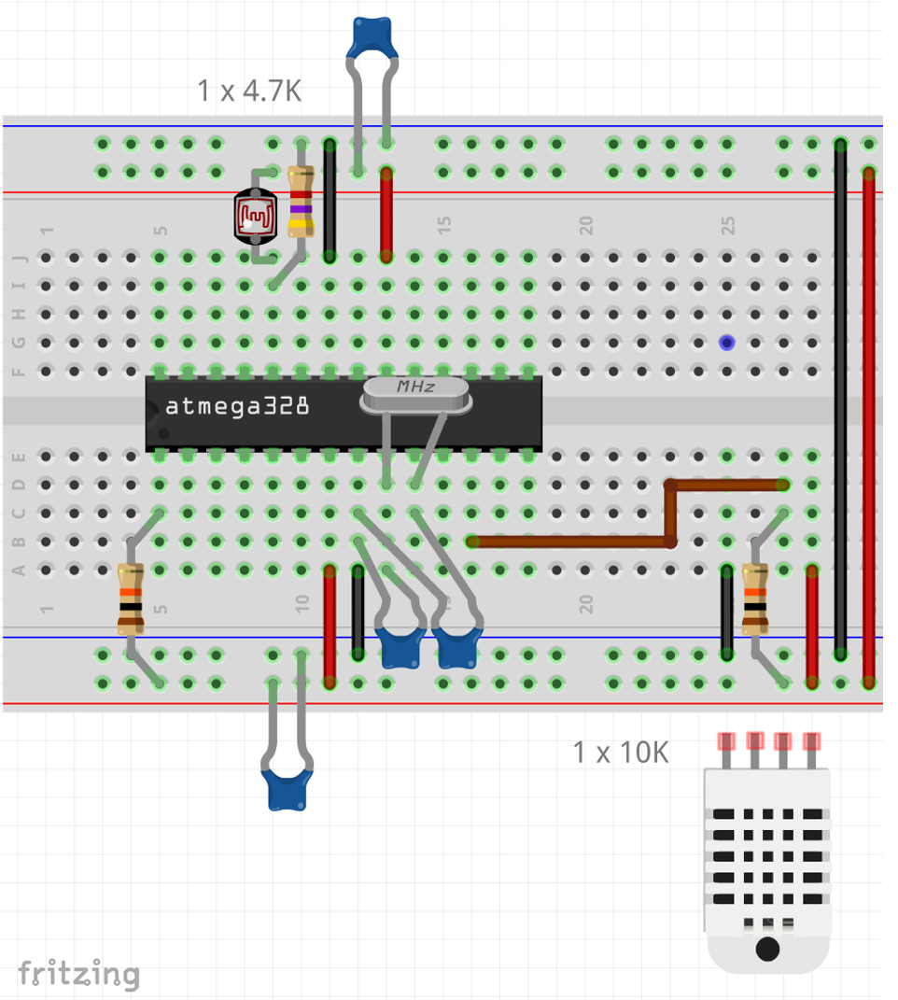
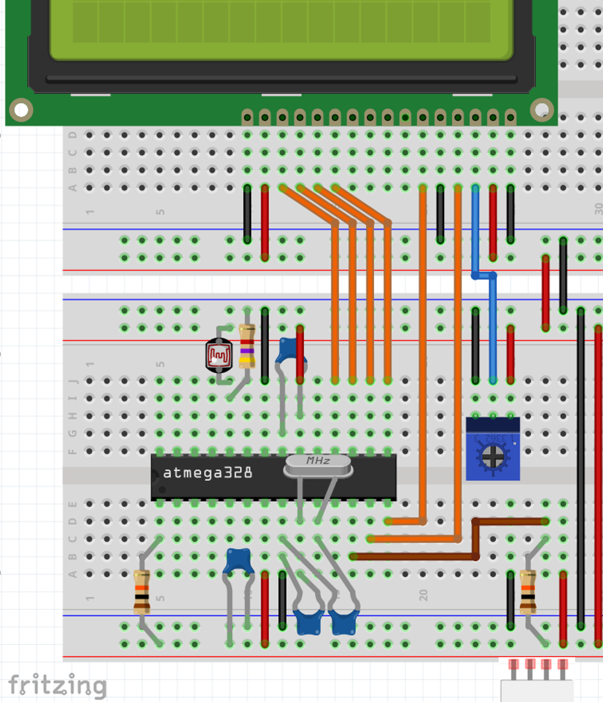
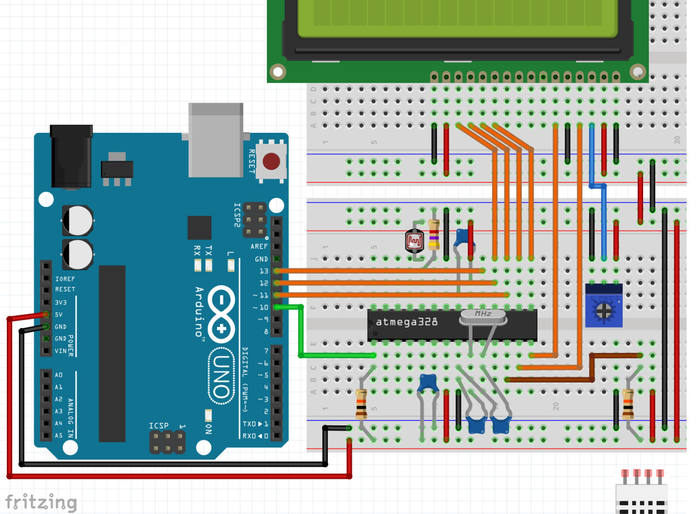

# Adding sensors and LCD Screen 

This page has references on how to add sensors to the basic Arduino Bare Metal. 


Please note: 

1. Before start with this part, remove the LED and the 220ohms resistor as they won't be needed anymore.
2. The image shows the DHT11 outside of the breadboard, but this is only for clarity purposes. It should actually be mounted in the breadboard pins 25, 26, 27 and 28 (in the lower part of the breadboard). 



## Adding LCD Screen

Once you have the sensors, you can proceed and add the LCD screen. 

The image below shows how the LCD screen adn trim-pot parts need to be arranged in the breadboard.



## Programming the Bare Metal + Sensors + LCD

Once you finish assembling the bare metal breadboard it is time to load sketches to it.

The image below shows how to connect your Arduino Uno board to the breadboard.



Using an Arduino Uno board as programmer requires you to first load some code into the programmer (Arduino Uno board) before it can program the Target device (breadboard). 

To program the board follow these steps:

- Connect your Arduino Uno board to your computer
- Open Arduino IDE
- Load the Arduino ISP (from File/Examples)
- Select Your Arduino Uno board (Tools/Board/Arduino AVR Boards/Arduino Uno
- Select your COM port
- Make sure you have selected Tools/Programmer/AVR ISP
- Load the code to your Arduino

Now this Arduino Uno is ready to be used as a programmer device. 

- Load Blink (from File/Examples/LiquidCrystal/Hello World)
- Find, in the sample code a line that shows:


```c++
//find and comment the line that shows:

LiquidCrystal lcd(rs, en, d4, d5, d6, d7);

//then add a new line with code below:

LiquidCrystal lcd(7, 8, 9, 10, 11, 12);
```

- Select Tools/Programmer/Arduino as ISP
- Select Sketch/Upload using programmer	
- **Important**: If you, by mistake or habit, press "upload" instead of "upload using programmer", you'll have to go back to the first step.  

If it all worked well so far, you should see the "hello, world!" message on the LCD display.

## Showing sensor data on the LCD

Add the following libraries to your Arduino (Sketch/include library/manage libraries):

1. DHT sensor - look for `DHT sensor library` by Adafruit (if it asks to install additional libraries, click yes to all).
1. Adafruit Sensor - if it didn't install along with the DHT library, look for `Adafruit Unified Sensor` by Adafruit and install it. 

Open the sample called `Sensor-data.ino` and follow the steps you did before to load it to your board using the Arduino Uno as the programmer. 

**If you can see temperature, humidity and light information on the screen, then your circuit works fine!**