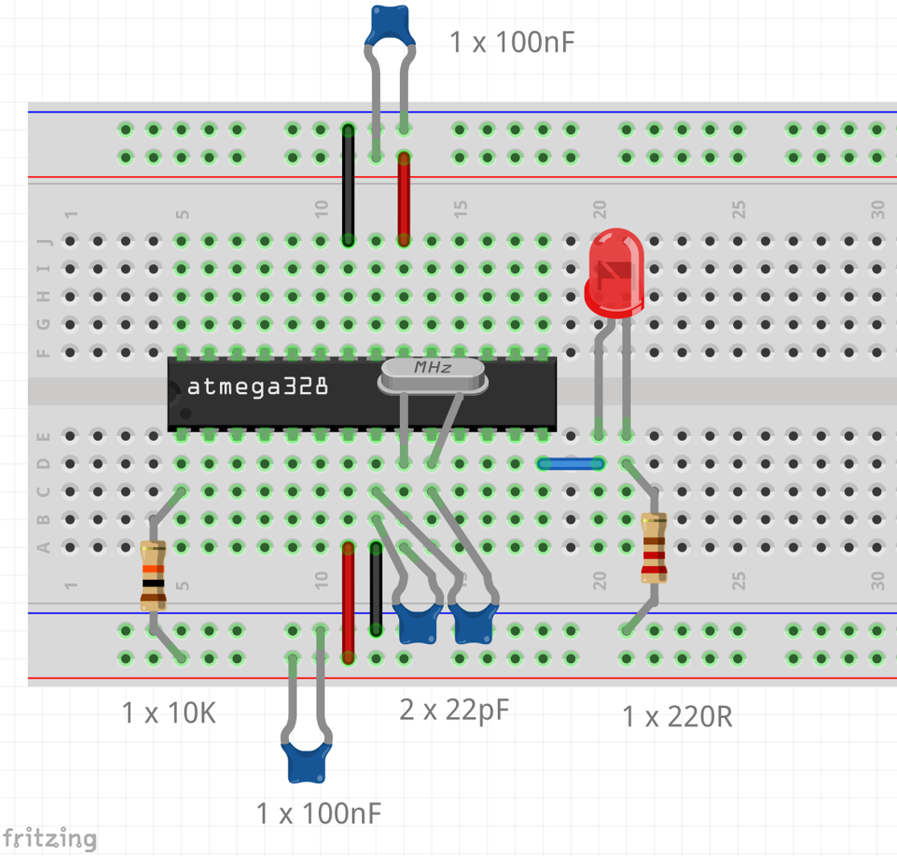
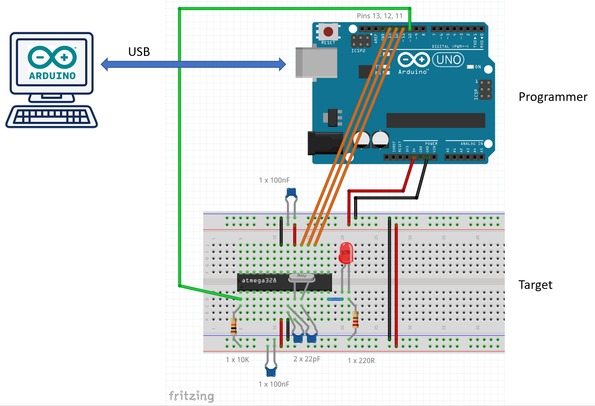
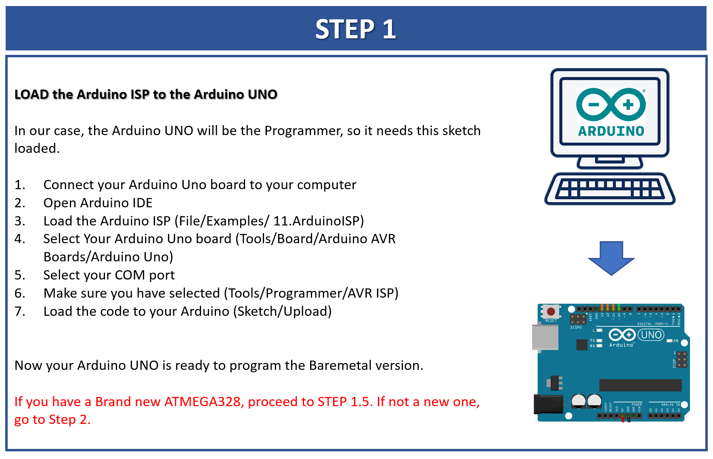
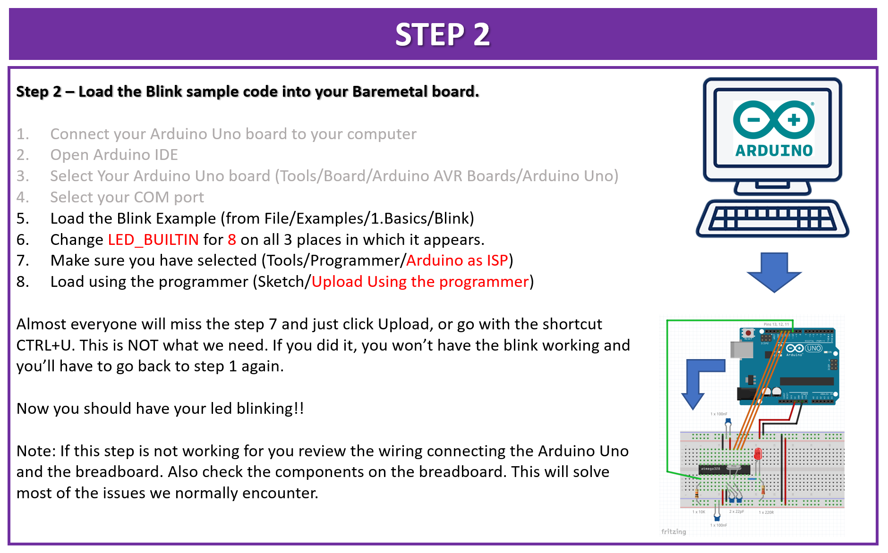
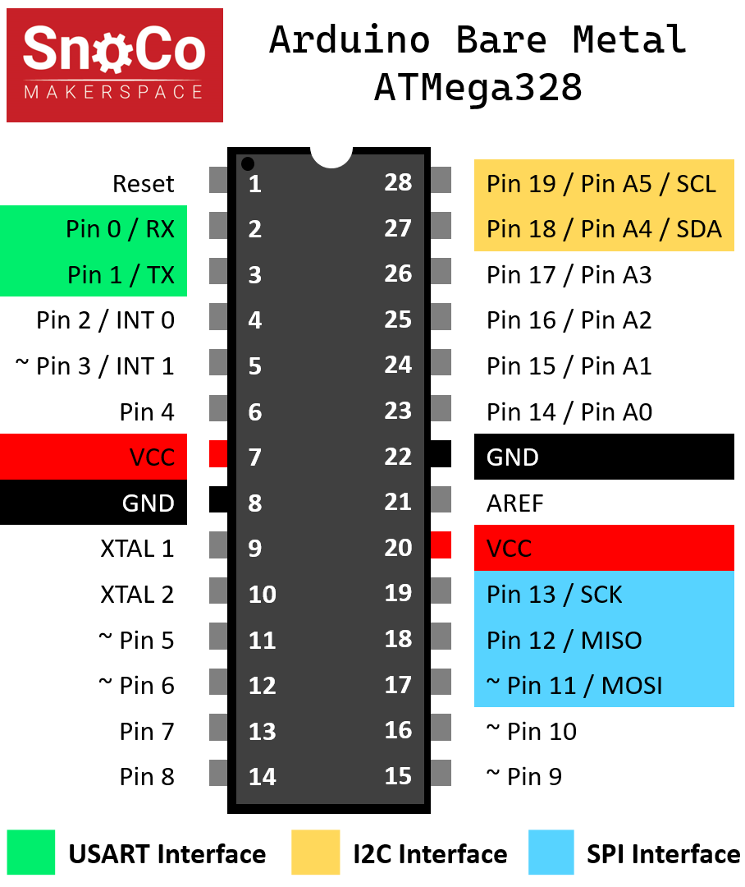

# Arduino Bare Metal

This page has references on how to assemble the basic Arduino Bare Metal. 

**Important**: To insert the AtMega328 to the breadboard, first align all the pins to the breadboard (you might need to tighten them up a little) and then slowly push it against the breadboard. Apply force evenly to both sides of the chip and do it slowly. If you bent any pins remove it and fix the pin with a plyer. Pins are very delicate and **won't stand** being bent more than once. They'll break. If this happens you'll need to get another microcontroller before moving with the assembly.
 
The image below shows how the components need to be arranged in the breadboard.

## Programming the Bare Metal

Once you finish assembling the bare metal breadboard it is time to load sketches to it.

The image below shows how to connect your Arduino Uno board to the breadboard.

Using an Arduino Uno board as programmer requires you to first load some code into the programmer (Arduino Uno board) before it can program the Target device (breadboard). 

**If everything went well, you should see the LED blinking on your breadboard!!**

## AtMega328 Pinout

Knowing the functionality of each pin of the AtMega328 is crucial for building any circuit. The image below shows all pins and they multiple functionalities. 

Note that pins are shown both as physical pins (in white within the boundaries of the microcontroller) and in the logical pins on the outside (Pin x). 

