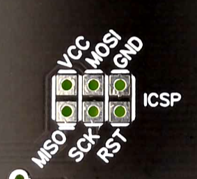
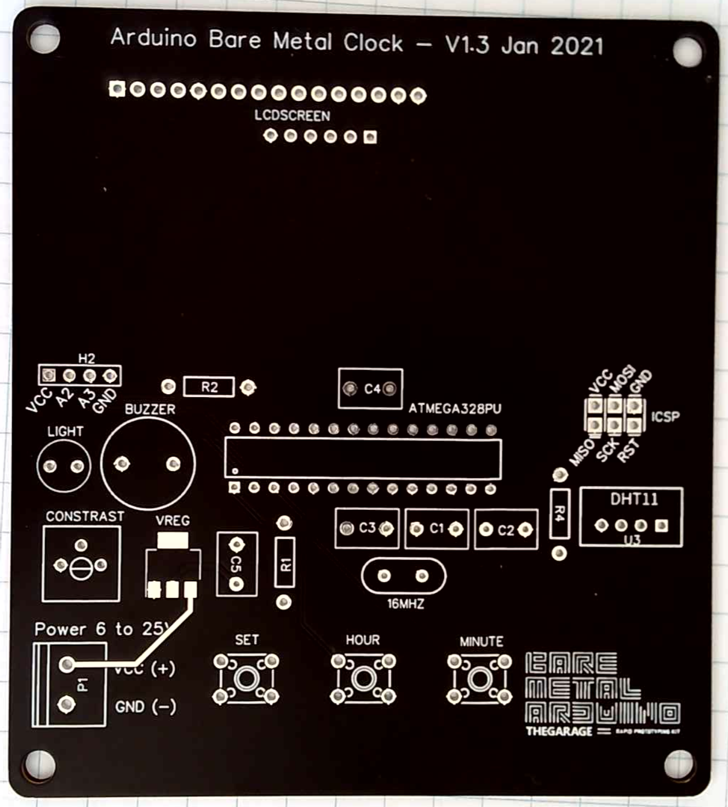
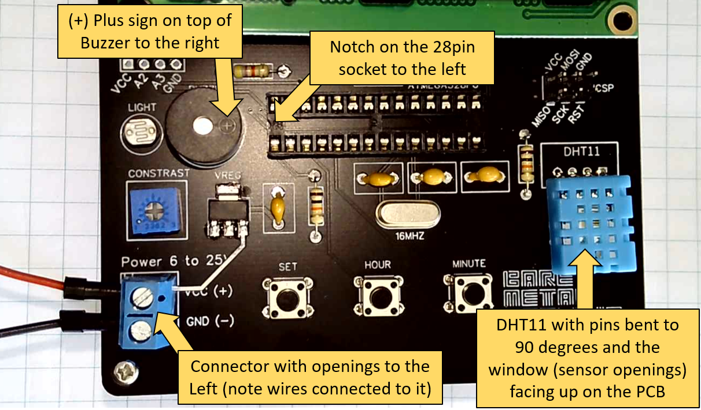

# PCB Assembly

In this step, we'll get to know the PCB, remove the components from the breadboard and solder them to the PCB.

## Step 1 - Load the Clock Sketch

- Load the final sketch to the microcontroller **before** removing it from the breadboard
  - Get the `LCD-temp-V3-rtc` code from the Samples directory and load it to the Arduino.
  - It will require an additional library: RTCLib by Adafruit
  - Once the sample code is loaded, you're ready to start with the PCB!
  
    **Q.** Why loading the clock sketch now and not later?

    **A.** At this moment, you should have a bare metal base on a breadboard, and you know how to do it. So it is easier to do it now. 

    **Q.** Can I load new sketches to my Clock once it is completed?

    **A.** Yes! You can use the ICSP (in circuit serial programmer) which follows the standard pinout of the Arduino Dev boards. Your PCB has the function of each pin described to make your life simpler. 

## Step 2 - Get the parts and tools

Beyond the parts you already have on your breadboard, these are the additional parts you'll need (also provided on your Kit):

  - Connector for power
  - Voltage regulator AMS1117 5V (SOT223)
  - One additional 100nF decoupling capacitor
  - 3 tactile push buttons 6x6mm
  - 5V Buzzer
  - 6 pin (2x3) male header for programming
  - 28 pin (14x2) IC socket (reduces risk of frying your ATMega while soldering)
  - 16 pin (16x1) female header for LCD
  - 16 pin (16x1) male header for LCD (some suppliers include this)
  - 6 pin (6x1) female header for RTC
  - RTC (real time clock) module

Tools you'll need (not provided on the Kit):

  - Soldering iron
  - Solder
  - Wire snips

## Step 3 - PCB Details

The picture below shows the details of the PCB Version 2: 

(if you have the green board, version 1 the pinout is basically the same with **one exception**: the position of the DHT 11 is reversed)  

### Identifying parts and placement

There is no specific order to solder your components into the PCB, with one exception: The AMS1117 LDO (low-dropout voltage regulator) - since it is the only SMD part you should solder it first.

**Soldering parts:**

* The AMS1117 5.0V is labeled VREG in the PCB. You should place it with the label up.

All the following parts can be placed one way or another, since there is no correct polarity for them.

* C1 and C2 are the 22pF capacitors (reading 220 or 22 in the part)
* C3, C4 and C5 are 100nF capacitors (reading 104 on the part)
* R1 and R4 are 10K resistors (brown, black, orange)
* R2 is the 4.7K resistor (yellow, purple, red)
* Oscillator crystal is labeled 16MHz on the PCB.
* 6 pin male header (2x3) is labeled ICSP on the PCB.
* LDR is labeled Light on the PCB.
* The 3 push buttons should be placed at SET, HOUR and MINUTE on the PCB.
* 16x1 female header is labeled LCD screen on the PCB.

All the following parts NEED to be placed in the correct position, since their polarity (or correct placement) matters.

1. Power Terminal should be soldered with the opening for wires pointing to the outside of the board.
1. Buzzer is labeled ICSP on the PCB and, while there is no clear indication of the correct polarity (something to fix in the next review of the PCB), it should have the positive side (longer leg) on the pin to the right of the board.
1. Trim-pot is labeled CONTRAST and you should follow its placement by looking at the 3 pins on the PCB.
1. The 28 pin socket has a curved mark in one of its sides. that curve indicates where pin 1 should be. Align this curved side to the left of the board.
1. DHT11 is **the most critical** component in this PCB: you should be able to bend it pins to 90 degrees and position its window (openings in the component) facing up.

**Special case:**

6x1 female header is labeled RTC screen on the **back side** of the PCB. This header has to be placed on the back of the PCB so that we can fit the RTC on it (there is no space to do so at the top of the PCB because of the LCD).

### ATMega328

Once you have completed soldering the parts, it is time to place the ATMega 328 on the socket. The pin 1 or the notch on the MCU has to be aligned with the notch on the socket.

Tip: You should be able to read the ATMEGA 328 label if it is placed correctly. It the label on the MCU is upside down, fix it.

## First Power Up

Before powering this circuit up is is **crucial** to follow as many of the steps below as possible:

1. **Visual inspection**: Carefully inspect your PCB for correct parts placement and for any short circuits (when a pin has too much solder on it and it touches an adjacent pin)
1. **Check for short circuits with a multimeter** [if you have one]: test both the power terminals and the VCC/GND on the ICSP pins for a short circuit. You should read 10M ohms or more between the power terminals and a little over 1K ohm between the VCC/GND terminals on the ICSP header.

**Alternatives for powering the clock:**

1. Get the 4XAA battery case included in your kit (which will provide 6 Volts), flip the power switch on it OFF, add the 4xAA batteries, connect the black wire to GND and the red one to VCC on the power terminal. Flip the switch on to test if the clock works. 
1. Get a bench power supply and adjust voltage output to **6 Volts** and current to **40mA**. Connect to the power terminals of the clock and test it.
1. Get a pair of Jumper Wires (Male to Female) and your Arduino Uno board (unplugged from the computer).
    1. Connect the male pin of the first one to 5V on the Arduino Uno, and the female pin to VCC on the ISCP pin of the Clock. 
    1. Connect the male pin of the second one to GND on the Arduino Uno, and the female pin to GND on the ISCP pin of the Clock. 
    2. Plug the Arduino Uno to your computer.

**Please note:** If you're using the power terminals you need to provide at least **6 volts** DC as input. This is needed because the LDO (Voltage Regulator) creates a small drop in the voltage output of about 0.8 Volts.

**Troubleshooting**

If nothing happens when you plug power (any of the alternatives above) to your clock, carefully check all the parts once again.

Change the power method form one to another, experiment multiple approaches as shown above.

Try reprogramming the ATMEGA328 once again, by connecting male-to-female jumper wires between the Arduino Uno and your clock.

## Adjusting time on your clock

The RTC module is the part on your circuit responsible for keeping track of time. The clock code reads time from this RTC once every second.

To adjust your clock simply click the Button **SET**. It will trigger an interrupt that will halt the clock and allow you to set **Hour** and **Minute** by clicking on the respective buttons.

Click **SET** again once finished to resume the clock. It will always resume at the zero second on the time and minute you set. 

The backlight of the LCD is now connected to one of the digital pins on the ATMEGA328 and controlled via code. Current code turns the backlight off when the light on the sensor is below the threshold. You can adjust that or just turn the backlight on all the time if you wish.

## Future Enhancements 

The code for this clock at its current stage is very basic with **plenty** space for improvements. Some of the changes you might consider doing as an exercise:

1. Change the light threshold to the environment where the clock is
1. Display temperature in Fahrenheit (instead of Celsius)
1. Show the Date on the display (the RTC provides not only the time, but also the date). In this case you'll have to figure out how to provide an interface for date adjustment with the current 3 buttons.
1. Play a bip or a little song with the buzzer at the top of the hours
1. Make it an alarm clock. 

All these changes can be performed with the current hardware available, but if you need to add more sensors and other outputs to your clock you can use the Header H2 which has GND, VCC and 2 analog pins (A2 and A3) you can use on your extended projects.

**Good Luck!   Boa sorte!!　 がんばってください！！**
