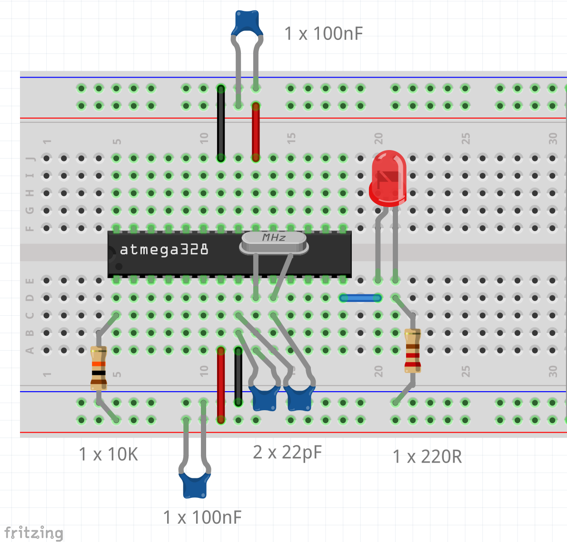
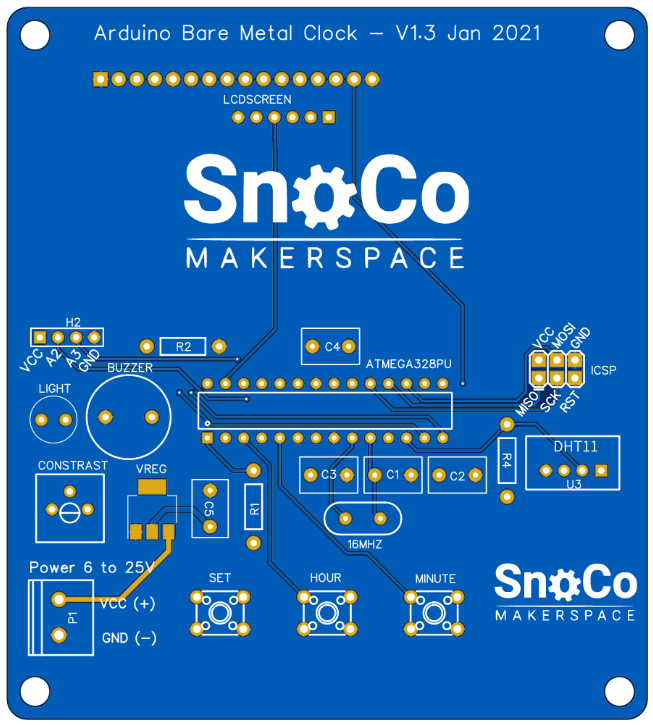
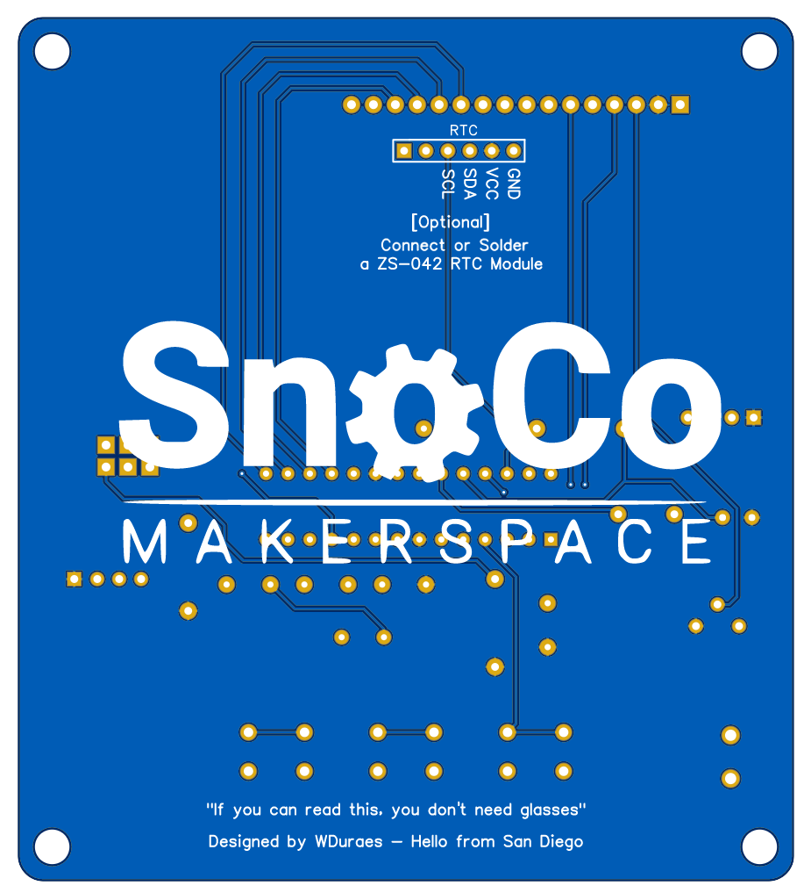
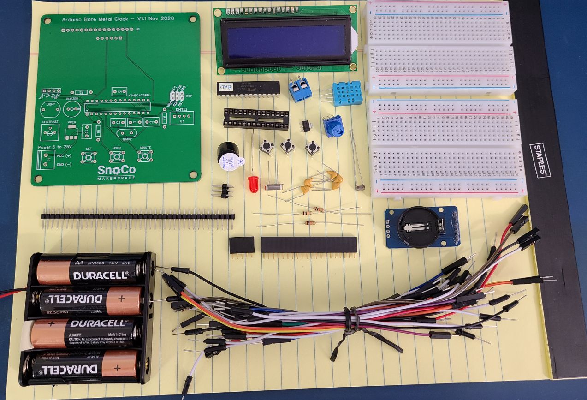
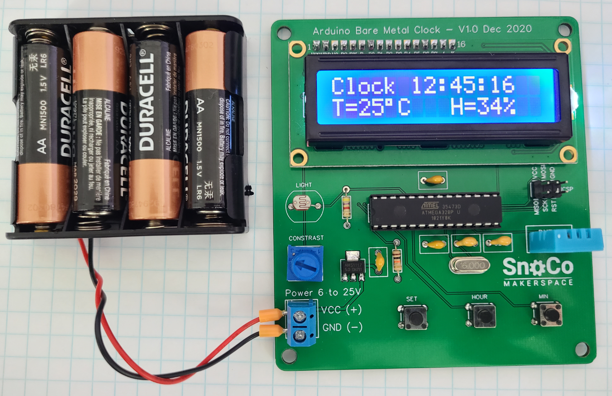

## Arduino Bare Metal Workshop

Have you ever wanted to create your own electronic device using a microcontroller (like the one in the arduino Uno board) but without having to rely on the Uno board?

This Arduino Bare Metal workshop is all about taking an ATMega328P microcontroller (Arduino Uno brain), a breadboard and adding the bare minimum set of components to get it working just like an Arduino.

This will allow you to better understand how a microcontroller works and will give you the confidence to create your own circuits!

In this 3 part workshop we will cover:

### Part 1 - Bare Metal

In the first workshop, we will:

- Assemble a bare metal circuit using a breadboard (like the one in the picture above)
- Loading the bootloader into the microcontroller 
- Understand the difference between SPI and UART interfaces (when to use each when interfacing with microcontrollers to load your sketch)
- Load sketches to your board
- Alternatives for powering your bare metal circuit and tradeoffs
- Debug the circuit and common troubleshooting scenarios

Parts needed:

- Microcontroller ATMEGA 328PU - [link to Digikey](https://www.digikey.com/product-detail/en/microchip-technology/ATMEGA328P-PU/ATMEGA328P-PU-ND/1914589)
- 2 x 22pF capacitor
- 3 x 100nF capacitor
- 1 x 16Mhz Crystal Oscillator 
- 1 x Red LED 5mm
- 1 x 330R resistor
- 1 x 10K resistor
- 1 x Half size breadboard
- Breadboard wire kit
- Arduino Uno Board (you need one to program your bare metal version)

Knowledge required:

- Before jumping into this workshop, you need to know the basics or Arduino programming (Arduino 101), have the Arduino IDE installed on your computer and have the knowledge to run basic sketches. 

[Part 1 - Files and references](Bare_Metal/readme.md)

### Part 2 - Adding Sensors and More

In the second workshop, we will:

- Add a light sensor to the breadboard
- Add a temperature and humidity sensor to the breadboard
- Add an LCD display
- Add the needed libraries and get the device working with these additional parts. 

Additional parts needed:

- 1 x LCD Screen 16x2
- 1x 10K Trim Pot
- 1 x DHT11 Sensor
- 1 x 10K resistor
- 1 x 4K7 resistor
- 1 x LDR (light dependant resistor)

Knowledge required:

- Before jumping into this second workshop, you need to have your breadboard version working properly. 

[Part 2 - Files and references](Additional_Parts/readme.md)

### Part 3 - PCB Design

In the third workshop, we will:

- Create a schematic to represent the circuit we have on the breadboard
- Add additional parts to the circuit like:
    - Connector for power
    - Voltage regulator
    - One additional decoupling capacitor
    - Buzzer
    - 2x3 header for programming
    - 3 tactile push buttons
- Design a PCB for the circuit
- Get the board fabricated. 

In this workshop we'll be using:

1. [Easy EDA](https://easyeda.com/) - a free, online PCB tool very user friendly yet very powerful. 
1. [JLCPCB](https://jlcpcb.com/) - a PCB fabrication service that works very well with Easy EDA. 

**Note**: Neither me or Snoco Makerspace are affiliated in any way to these services. We're using them just for the ease of use, quality and cost benefit. Feel free to use any other service. 

[PCB Design](https://oshwlab.com/wduraes/arduino-baremetal-garage_copy): the PCB below was created based on this file. Feel free to open it on the designer and make a copy for your use.

The image below shows the final PCB (front):

The image below shows the final PCB (back):

### Part 4 - PCB Assembly

In the fourth and final workshop, we will:

- Load the final sketch to the microcontroller **before** removing it from the breadboard
  -  Get the `LCD-temp-V3-rtc` code from the Samples directory and load it to the Arduino.
- Remove the parts from the breadboard
- Place and solder them into the final PCB

Parts you'll need:

  - Connector for power
  - Voltage regulator AMS1117 5V (SOT223)
  - One additional 100nF decoupling capacitor
  - 5V Buzzer
  - 2x3 header for programming
  - 3 tactile push buttons 6x6mm
  - 28 pin socket
  - 16 pin (16x1) female header
  - 6 pin (6x1) female header
  - RTC real time clock

Tools you'll need:

  - Soldering Iron
  - Solder
  - Cutting plyer

Once you're finished with the assembly, you'll should see the clock in all its glory!

To set the right time, click the SET button, then HOUR and MINUTE as needed. 

