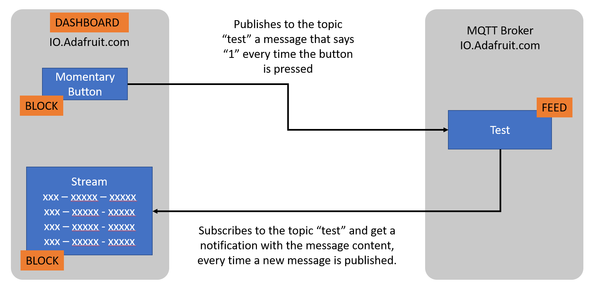
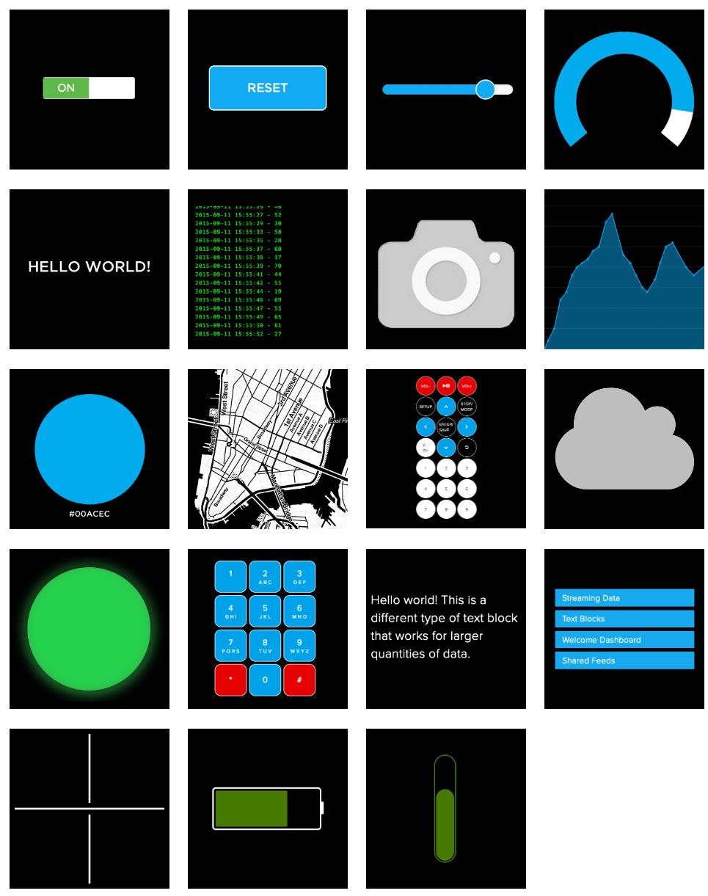

## Basic MQTT with Adafruit IO

Adafruit IO implements a MQTT broker which can be used for tests and learning purposes. While nothing prevents us from using it for more advanced scenarios and professional use, this platform lacks more advanced resources like scalability, longer term storage, device identity, provisioning and etc. 

### Step 1 - Create your account

Visit https://io.adafruit.com and create your account. It is free. there is a paid version as well and, as per Oct 2022 the paid version costs $10 per month for double the datapoints and days of storage.

### Step 2 - Create a topic

We need topics (Adafruit call them feeds) so we can publish data to. You can create up to 10 topics/feeds with a free subscription.

1. Navigate to Feeds
2. Click on the `New Feed` button
3. Add a name `Test`
4. There is no need for description, but feel free to add one
5. Your new topic should show in the topic list

### Step 3 - Create a Dashboard

Dashboards organize MQTT topics and its information in a visual way allowing you to interact with the topics/feeds by either reading or writing values to them.

1. Navigate to Dashboards
2. Click on the `New Dashboard` button
3. Add a name `Test`
4. There is no need for description, but feel free to add one
5. Your new topic should show in the topic list
6. Click on the feed name and you should see the empty Dashboard you just created

### Step 4 - Connect it all

In this step you'll create blocks in the dashboard to interact with your `test` topic/feed. The diagram below shows this interaction:

#### Create a button

1. Open Dashboard Settings (the cogwheel icon at the top right)
1. Create a new Block
1. Select Momentary Button
1. Select the topic “Test” and click “Next Step”
1. Add “Test” to the Button Text
1. Leave “Press Value” as 1
1. Leave “Release Value” as 0
1. Click Create block

Now, every time you hit the button `test` in the dashboard a message will be published to the topic name Test.

#### Create a Stream to test your Topic

1. Open Dashboard Settings (the cogwheel icon at the top right)
1. Create a new Block
1. Select Stream
1. Select the topic “Test” and click “Next Step”
1. Add “Test Feed” to the Block Title
1. Select NO for “Show group name”
1. Select NO for “Show feed name”
1. Click Create block

Now, you’ll see the messages you previously published to your topic. Also, every time you hit the button a new message will show on the feed.

#### More to explore

Feel free to explore all 19 types of blocks available, I'm sure you'll find something interesting or something you can use in a future project!

Almost all of them can be used to either read from a topic/feed or to write to a topic/feed.

