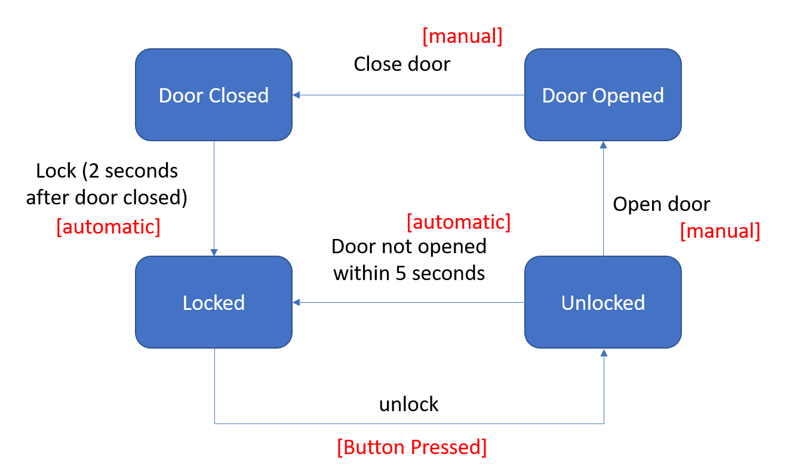
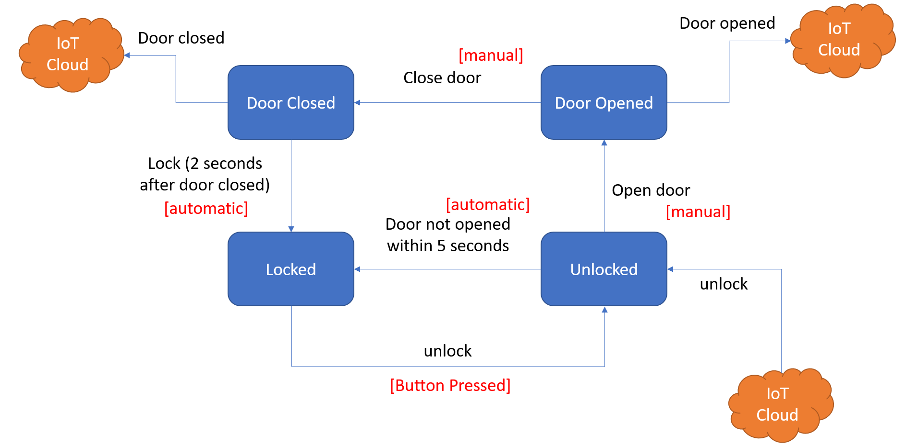

# IoT Door

This sample show ho to use a servo motor and a reed switch sensor to control a simple door lock.

It also uses the Wi-Fi Manager library for simplified experience with different Wi-Fi SSIDs. More about the Wi-Fi manager [here](https://randomnerdtutorials.com/wifimanager-with-esp8266-autoconnect-custom-parameter-and-manage-your-ssid-and-password/).

## Door state machine

The diagram below represents the 4 states for the sample door. This door is not IoT-enabled quite yet. First we'll see how the states change for a non-connected door, then we'll add connectivity to it.

Note I added in red the source for each event triggering a state change:

1. If the door is Locked, the event "button Pressed" will change it to Unlocked.
1. If no one opens the door, while unlocked, for 5 seconds, the door will lock again.
1. The door can be manually (physically) opened once unlocked, changing its state to opened.
1. Once the door is closed, an event is triggered automatically after 2 seconds to lock it, getting back to the original state.

## IoT Door state machine

The diagram below represents the sme door, however this also represent the events related to the IoT automation:

1. If the door is Locked, one of the two events need to happen to change it to Unlocked:
    1. Event "button Pressed"
    1. Message "unlock" coming from the cloud
1. If no one opens the door, while unlocked, for 5 seconds, the door will lock again.
1. The door can be manually (physically) opened once unlocked, changing its state to opened. This will also send a "door opened" message to the cloud.
1. Once the door is closed, an event is triggered automatically after 2 seconds to lock it, getting back to the original state. This will also send a "door closed" message to the cloud.

