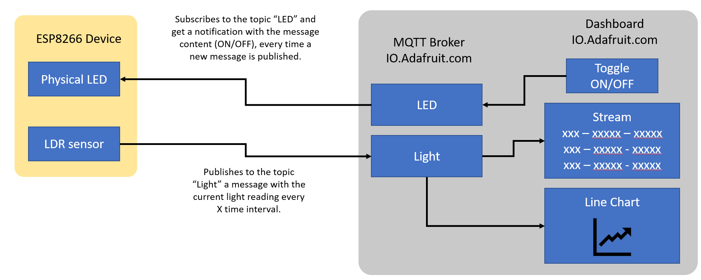
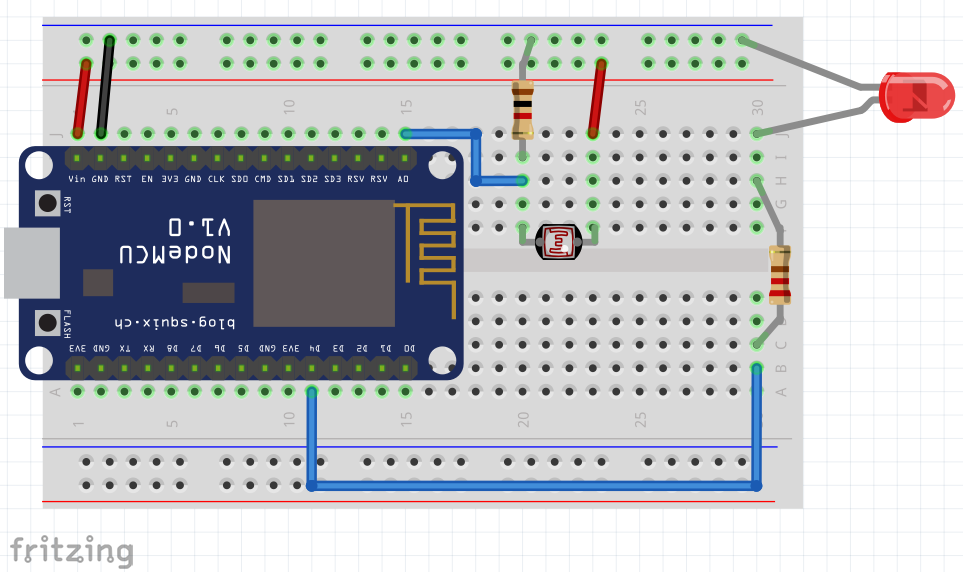
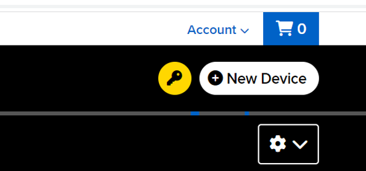

# Real Device test with an LED and a Light Sensor

In this sample we'll add a LED and a Light Sensor to the Node MCU ESP8266. The device will:

1. Connect to the specified Wi-Fi network
1. Connect to the MQTT Broker (in this case to your Adafruit.IO account)
1. Subscribe to the LED topic and turn the LED on/off according to the messages received
1. Publish the current light value read from the LDR to the light topic.

**Pre-requirement**: Have your free [Adafruit.IO](https://io.adafruit.com) account created.

The illustration below shows the device, the topics and the dashboard blocks needed:



## Adafruit.IO: Create the Topics/Feeds and Dashboard elements

Visit https://io.adafruit.com log in with your account and click on the top menu Feeds:

1. Create a new feed/topic: led
1. Click on Dashboards and create a new Dashboard: LED Control
1. Add a toggle ON/OFF connected to the led topic
1. Create a new topic: light
1. Add a stream connected to this topic
1. Add a line chart connected to this topic

## Breadboard Setup

For this sample you'll need:

1. Node MCU ESP8266 dev Kit
1. Jumper Wires
1. LDR (Light sensor)
1. LED (any color)
1. Resistor 220 Omhs (red, red, brown) or 330 Ohms (orange, orange, brown) to connect the LED
1. Resistor 1K Omhs (brown, black, red) to connect the LDR
1. USB **data** cable.

The illustration below shows the connections:



## Libraries needed

On the Arduino IDE go to menu `Sketch/Include Library/Manage Libraries`

Type Adafruit MQTT, wait to see the results, click on `Adafruit MQTT` by **Adafruit**, select the version 2.8.0 in the “Select Version” dropdown list, and then click Install.

Type SSD1306, wait to see the results, click on `Adafruit SSD31306` by **Adafruit**, select the version 2.5.7 in the “Select Version” dropdown list, and then click Install. If it prompts you for additional libraries, please select “Install ALL” - see picture below.


## Get your credentials

Visit https://io.adafruit.com log in with your account and click on the yellow icon with a key in the top right part of the page.

It will show you your Username and Active Key. You need to copy both since we'll add these credentials to the sample code.



## Get Sample code

Use the [led-light.ino](led-light/led-light.ino) sample code in this directory.

Find the definitions for Wi-Fi and Adafruit Credentials and replace them with your own:

```C
#define WLAN_SSID       "SSID"
#define WLAN_PASS       "password"
#define AIO_SERVER      "io.adafruit.com" //stays as it is
#define AIO_USERNAME    "adafruit_username"
#define AIO_KEY         "adafruit_key"
```

1. Save your code.
1. Upload it to the dev kit.
1. Using the Arduino IDE open the serial monitor window

Your device should be publishing light values and getting led commands now.


