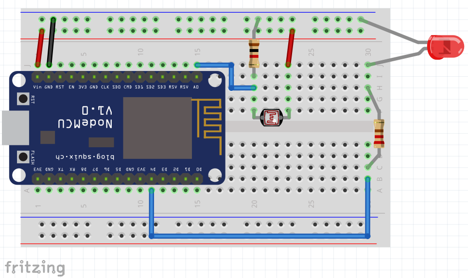

# Real Device test with a Light Sensor

In this sample we'll add a Light Sensor to the Node MCU ESP8266. The device will:

1. Connect to the specified Wi-Fi network
1. Connect to the MQTT Broker (in this case to your Adafruit.IO account)
1. Publish the current light value read from the LDR to the `light` topic.

**Pre-requirement**: Have your free [Adafruit.IO](https://io.adafruit.com) account created.

The illustration below shows the device, the topics and the dashboard blocks needed:


## Adafruit.IO: Create the Topics/Feeds and Dashboard elements

Visit https://io.adafruit.com log in with your account and click on the top menu Feeds:

1. Create a new feed/topic: `light`
1. Click on Dashboards and create a new Dashboard: LED Control
1. Add a stream connected to the `light` topic
1. Add a line chart connected to the `light` topic

## Breadboard Setup

For this sample you'll need (LED was already in the breadboard from the Blinky experiment, you can keep it there):

1. Node MCU ESP8266 dev Kit
1. Jumper Wires
1. LDR (Light sensor)
1. LED (any color)
1. Resistor 220 Ohms (red, red, brown) or 330 Ohms (orange, orange, brown) to connect the LED
1. Resistor 1K Ohms (brown, black, red) or 2K2 (red, red, red) to connect the LDR
1. USB **data** cable.

The illustration below shows the connections:



## Libraries needed

On the Arduino IDE go to menu `Sketch/Include Library/Manage Libraries`

Type Adafruit MQTT, wait to see the results, click on `Adafruit MQTT` by **Adafruit**, select the version 2.5.2 in the “Select Version” dropdown list, and then click Install. If it prompts you for additional libraries, please select “Install ALL”.

## Get your credentials

Visit https://io.adafruit.com log in with your account and click on the yellow icon with a key in the top right part of the page.

It will show you your Username and Active Key. You need to copy both since we'll add these credentials to the sample code.


## Get Light Sensor sample code

Use the [light-sensor.ino](light-sensor/light-sensor.ino) sample code in this directory and click on the "Copy raw Contents" button at the top right of the code window.

Find the definitions for Wi-Fi and Adafruit Credentials and replace them with your own:

```C
#define WLAN_SSID       "SSID"
#define WLAN_PASS       "password"
#define AIO_SERVER      "io.adafruit.com" //stays as it is
#define AIO_USERNAME    "adafruit_username"
#define AIO_KEY         "adafruit_key"
```

1. Save your code.
1. Upload it to the dev kit.
1. Open the serial monitor window to see the connection progress:

```C
...........
WiFi connected
IP address:
10.127.12.7
Connecting to MQTT... MQTT Connected!
Sending light val 129...
```

Once you see this message in the Serial monitor, go to https://io.Adafruit.com, open your `Led Control` dashboard to see the data being published showing up on your stream block.

Your device should be publishing light values now.

**Attention** please note your Adafruit account only allows for 30 data points per minute, which means if you flip your led on and off more than 30 times you'll get your service throttled. 

## Get Light Sensor + LED control sample code

Use the [led-light.ino](led-light/led-light.ino) sample code below.

```c
#include <ESP8266WiFi.h>
#include "Adafruit_MQTT.h"
#include "Adafruit_MQTT_Client.h"

#define WLAN_SSID       "SSID"
#define WLAN_PASS       "password"
#define AIO_SERVER      "io.adafruit.com"
#define AIO_USERNAME    "adafruit_username"
#define AIO_KEY         "adafruit_key"
#define AIO_SERVERPORT  1883                   
WiFiClient client;

Adafruit_MQTT_Client mqtt(&client, AIO_SERVER, AIO_SERVERPORT, AIO_USERNAME, AIO_KEY);
Adafruit_MQTT_Publish light= Adafruit_MQTT_Publish(&mqtt, AIO_USERNAME "/feeds/light");
  
void MQTT_connect();

#define ldrPin A0
   
void setup() {
    
  Serial.begin(115200);
  pinMode(ldrPin,INPUT);
     
    // Connect to WiFi access point.
    Serial.println(); Serial.println();
    Serial.print("Connecting to ");
    Serial.println(WLAN_SSID);
  
    WiFi.begin(WLAN_SSID, WLAN_PASS);
    while (WiFi.status() != WL_CONNECTED) {
      delay(500);
      Serial.print(".");
      }
    Serial.println();
    Serial.println("WiFi connected");
    Serial.println("IP address: "); Serial.println(WiFi.localIP());
  
  }
     
  void loop() {
  
    MQTT_connect();
   
    float Light = analogRead(ldrPin);
    if (light.publish(Light)) 
    {
        Serial.print("Sending light val ");
        Serial.print(Light);
        Serial.println("...");
    }
    delay(3000);
}

  // Function to connect and reconnect as necessary to the MQTT server.
  // Should be called in the loop function and it will take care if connecting.
  void MQTT_connect() {
    
    int8_t ret;
    if (mqtt.connected()) {      // Stop if already connected.
      return;
      }
    Serial.print("Connecting to MQTT... ");
    uint8_t retries = 3;
    while ((ret = mqtt.connect()) != 0) { // connect will return 0 for connected
         Serial.println(mqtt.connectErrorString(ret));
         Serial.println("Retrying MQTT connection in 5 seconds...");
         mqtt.disconnect();
         delay(5000);  // wait 5 seconds
         retries--;
         if (retries == 0) {
           // basically die and wait for WDT to reset me
           while (1);
         }
    }
    Serial.println("MQTT Connected!");
  }

```

Find the definitions for Wi-Fi and Adafruit Credentials and replace them with your own:

```C
#define WLAN_SSID       "SSID"              //Replace with your SSID
#define WLAN_PASS       "password"          //Replace with your password
#define AIO_SERVER      "io.adafruit.com"   //stays as it is
#define AIO_USERNAME    "adafruit_username" //replace with your username
#define AIO_KEY         "adafruit_key"      //replace with your key
```

1. Save your code.
1. Plug your ESP8266 using an USB **DATA cable**
1. Select the correct COM port under `Tools/Port`.
1. Select the `NODE MCU 1.0` under EP8266 `Tools/Board/ESP8266 Boards/Node MCU 1.0 (ESP-12E module)`
1. Under `Tools/Upload Speed` select `256000` for faster uploads.
1. Upload your code to the board.
1. Open the serial monitor window to see the connection progress. You should see something like this:

```C
...........
WiFi connected
IP address:
10.127.12.7
Connecting to MQTT... MQTT Connected!
Sending light val 129...
```

Once you see this message in the Serial monitor, go to https://io.Adafruit.com, open your `Led Control` dashboard to see the data being published showing up on your stream block.

Your device should be publishing light values to the Adafruit service every 3 seconds.