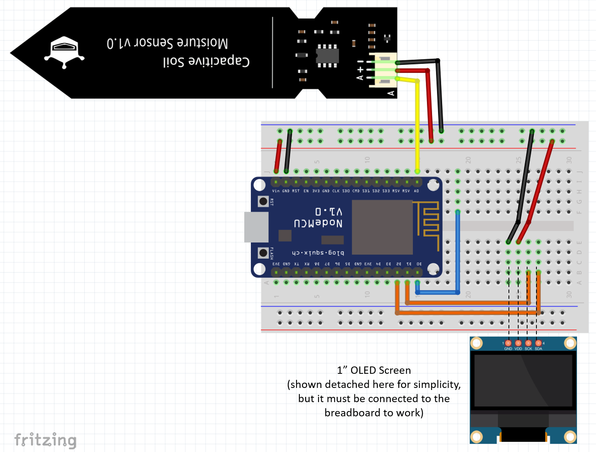
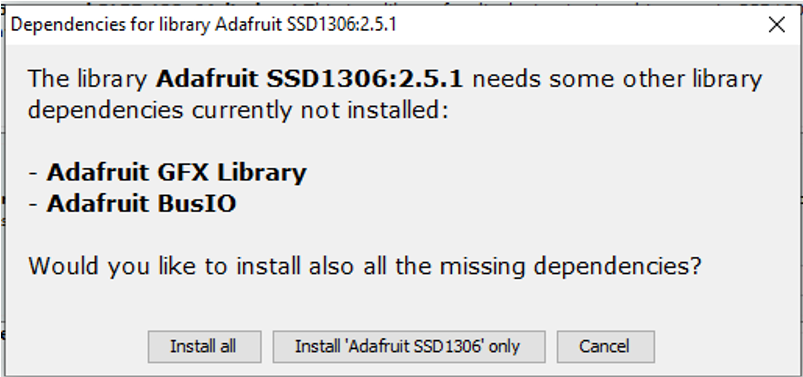
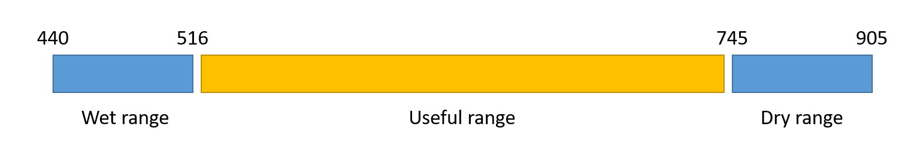

## Using the Moisture sensor with the OLED Screen

Before we move to the full WaterBuddy sample, which include the IoT commands, we need to build and validate usage of the OLED screen and the moisture sensor. 

We also need to calibrate the sensor readings for Dry x Wet as we show below. 

## Breadboard Setup

For this sample you'll need:

1. Node MCU ESP8266 dev Kit
1. Jumper Wires
1. Moisture sensor
1. OLED Screen
1. USB **data** cable.

The illustration below shows the connections:



## Libraries needed

On the Arduino IDE go to menu `Sketch/Include Library/Manage Libraries`

Type SSD1306, wait to see the results, click on `Adafruit SSD1306` by **Adafruit**, select the version 2.5.7 in the “Select Version” dropdown list, and then click Install. If it prompts you for additional libraries, please select “Install ALL” - see picture below.



## Sample code

Use the [soilmoisture.ino](soilmoisture/soilmoisture.ino) sample code below:

```c
#include <ESP8266WiFi.h>
#include <Wire.h>
#include <SPI.h>
#include <Adafruit_GFX.h>
#include <Adafruit_SSD1306.h>

#define SCREEN_WIDTH 128 // OLED display width, in pixels
#define SCREEN_HEIGHT 32 // OLED display height, in pixels
#define OLED_RESET  -1 // ESP32  4 // Reset pin # (or -1 if sharing Arduino reset pin)
#define SCREEN_ADDRESS 0x3C ///< See datasheet for Address; 0x3D for 128x64, 0x3C for 128x32
#define WET 520
#define DRY 740

Adafruit_SSD1306 display(SCREEN_WIDTH, SCREEN_HEIGHT, &Wire, OLED_RESET);

#define SOIL_PIN    A0  // pin connected to the soil moisture sensor


int getSoil(){
  int soil = analogRead(SOIL_PIN);
  //while the Analog Read varies from 0 to 1028, the sensor never gets
  //to extremes. So we need to manually setup the sensor with a complete
  //DRY sensor and another read with it under water
  if(soil<WET) soil=WET;
  if(soil>DRY) soil=DRY;
  int soilMapped = map(soil,WET,DRY,100,0);
  return(soilMapped); 
}

int getSoilRaw(){
  return(analogRead(SOIL_PIN));
}

void displayInitialMsg(){
  display.clearDisplay();
  display.setTextSize(2); // Draw 2X-scale text
  display.setTextColor(SSD1306_WHITE);
  
  display.setCursor(10, 0);
  display.println("Automatic");
  display.setCursor(10, 17);
  display.println("  Garden");

  display.display();      // Show initial text
}

void displaySoilValue(){
  display.clearDisplay();
  display.setTextSize(1); // Draw 2X-scale text
  display.setTextColor(SSD1306_WHITE);
  
  /*
  display.setCursor(10, 0); //set the cursor at column 10, line 0
  display.println("Soil :");
  display.setCursor(70, 0);
  display.println(getSoil());
  display.setCursor(100, 0);
  display.println("%");
  */

  display.setCursor(10, 17);
  display.println("Sensor:");
  display.setCursor(70, 17);
  display.println(getSoilRaw());

  display.display();
}

void setup(){
  Serial.begin(115200);

  if(!display.begin(SSD1306_SWITCHCAPVCC, SCREEN_ADDRESS)) {
    Serial.println(F("SSD1306 allocation failed"));
    for(;;); // Don't proceed, loop forever
  }

  displayInitialMsg();
  delay(2000);
}

void loop(){

  displaySoilValue();
  delay(800);
     
}

```

This sample will be used to validate if your OLED screen and your Soil Moisture are working properly.

It will display the reading from the moisture sensor once every 800ms.

## Testing

Once you get the code into your ESP8266, with the Moisture Sensor still dry, make a note of the lowest and highest readings in the screen.

Dip the sensor into water carefully until the water hits the white horizontal line. You're not supposed to get the sensor components wet. Once again, make a note of the lowest and highest readings in the screen.

The table below show the results of my test:



These readings will vary according to your ESP8266 sensitivity, the sensor quality, and even the air humidity, reason why we need to do this calibration.

After that we'll setup a function to transform the sensor reading into a number between 0 and 100% moisture scale.

We'll consider any reading below 520 as 100% moisture and any reading above 740 as 0%.

The activation of the water pump is not part of this sample, and it will vary according to the type of soil, climate, and plant you're monitoring. (I know close to zero about gardening...)

Go back to your code, and replace the values at lines 11 and 12 for the values you got.

Uncomment lines 52 and 59 by removing the comments opening `/*`and the comments closing `*/` then test your code again to see the values in a percentile scale.