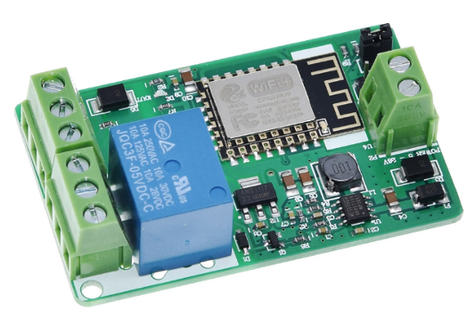

# ESP8266 Relay Board

Samples here are based on the ESP8266 Relay board which comes with the ESP8266 and a single 10A relay, as shown in the picture below.

There is a nice tutorial about this module [here](https://ucexperiment.wordpress.com/2016/12/18/yunshan-esp8266-250v-15a-acdc-network-wifi-relay-module/) which is what I used to create the samples.

Please notice this module comes in different versions, and I only tested the samples with the board above.

#### How to get one?

You can find this board and similar ones by searching for `esp8266 wifi relay` in sites like ebay, Amazon, AliExpress and others.

Please note you also need an UART programmer for this module (since it doesn't have one), so consider buying also some programmer based on the FT232RL, CP2102 or even the CH340G. Any of these will work, if you have the proper driver on your PC.

Follow the tutorial linked above for more details and one of these samples to get your relay board working:

#### Samples

1. [Sample 1](./relay-board/relay-board.ino): Working sample with Adafruit and relay board
2. [Sample 2](./relay-board-wifiManager/relay-board.ino): Working sample with Adafruit and relay board + WiFi manager
