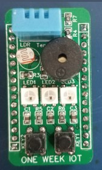

# IoT Sensor Board

This sample uses a sensor board with a temperature and humidity sensor Bosch BME280 and a light sensor TEMT6000.

It also has 3 WS2812B Neopixels, a buzzer, 2 LEDs and 1 button for use.

