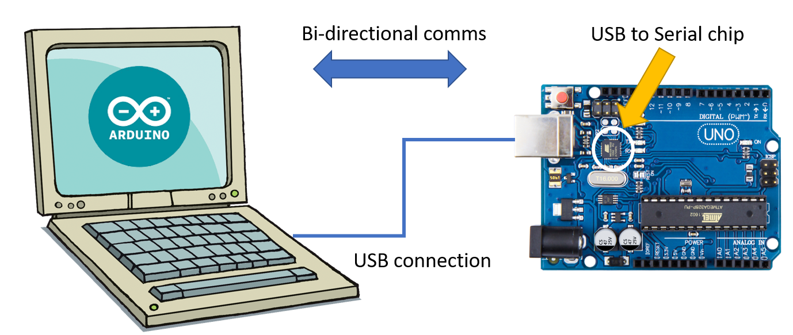
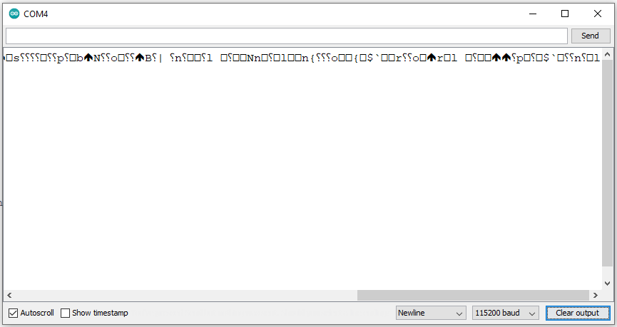

## Serial Monitor and the Arduino IDE

Serial communication is one of the most common ways to check what is happening with your microcontroller (Arduino UNO, ESP8266 and pretty much any other MCU).

It comes handy specially when you don't have a screen attached to your project.

Your computer will need some Serial Communication software like the Arduino IDE (also Tera Term, Termite, Putty, etc.) a connection to your board (like a USB cable) and a serial to USB chip to allow communication.

In the illustration below, we have the Arduino Uno board which has a USB-to-Serial chip.



Use this modified version of Blink to see it in action:

```c
void setup(){
    pinMode(2,OUTPUT);
    Serial.begin(9600);
}
void loop(){
    digitalWrite(2,HIGH);
    Serial.println("Turned LED ON");
    delay(1000);
    digitalWrite(2,LOW);
    Serial.println("Turned LED OFF");
    delay(1000);
}
```

Load this sample to your ESP8266, then click `Tools\Serial Monitor`

The speed of 9600 BPS (baud per second) is one of the most common for the Arduino UNO, but for the ESP8266 and other faster MCUs the speed of 115200 is far more common.

You can select the serial communication speed in the Serial Monitor window in the dropdown at bottom right.



If all you see in the Serial Monitor is some sort of gibberish data like in the screen above, it is **very likely** you have the wrong speed settings. Note in this case the Serial Monitor is set to `115200 baud` but the code is set to 9600, in the `Serial.begin(9600);` line.

## Quick reference guide to Serial

A full reference set can be found in the [Arduino reference](https://www.arduino.cc/reference/en/language/functions/communication/serial/) but we're presenting some of the most basic commands here as well:

1. **Serial.begin(speed)**: Sets the data rate in bits per second (baud) for serial data transmission. For communicating with Serial Monitor, make sure to use one of the baud rates listed in the menu at the bottom right corner of its screen. In most Arduino samples you'll find this speed set to either 9600(for slower MCUs) and 115200 (for faster ones).
2. **Serial.print()**: Prints data to the serial port as human-readable ASCII text. This command can take many forms. Numbers are printed using an ASCII character for each digit. Floats are similarly printed as ASCII digits, defaulting to two decimal places. Bytes are sent as a single character. Characters and strings are sent as is. Examples:
   1. `Serial.print(78)` gives "78"
   2. `Serial.print(1.23456)` gives "1.23"
   3. `Serial.print('N')` gives "N"
   4. `Serial.print("Hello world.")` gives "Hello world."

    An optional second parameter specifies the base (format) to use; permitted values are BIN(binary, or base 2), OCT(octal, or base 8), DEC(decimal, or base 10), HEX(hexadecimal, or base 16). For floating point numbers, this parameter specifies the number of decimal places to use. For example:

    1. `Serial.print(78, BIN)` gives "1001110"
    2. `Serial.print(78, OCT)` gives "116"
    3. `Serial.print(78, DEC)` gives "78"
    4. `Serial.print(78, HEX)` gives "4E"
    5. `Serial.print(1.23456, 0)` gives "1"
    6. `Serial.print(1.23456, 2)` gives "1.23"
    7. `Serial.print(1.23456, 4)` gives "1.2346"

3. **Serial.println()**: Works like the `Serial.print` command, but adds a carriage return (ASCII 13 or `\r`) and a new line (ASCII 10 or `n`).
4. **F function**: Used when we wish to save SRAM memory space by moving the string to FLASH emory instead. Since FLASH memory is normally way larger than SRAM it makes sense to use is especially with lower spec MCUs. You can find more information [here](https://arduinogetstarted.com/faq/what-is-serial.println-f).
   1. Example of normal usage consuming SRAM: `Serial.println("ArduinoGetStarted.com");`
   2. Example of normal usage consuming SRAM: `Serial.println(F("ArduinoGetStarted.com")));`