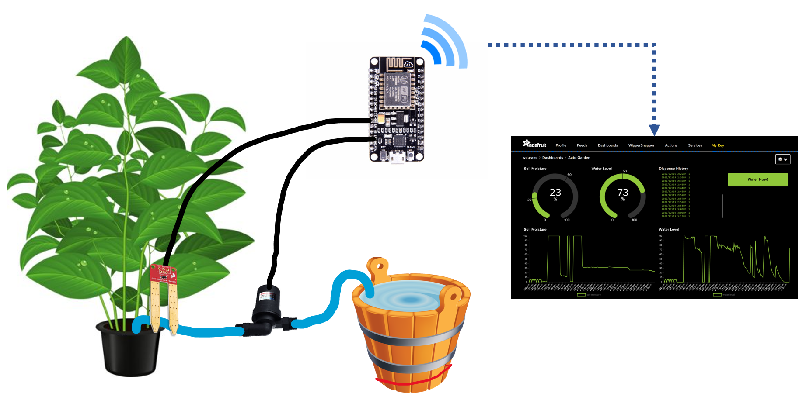
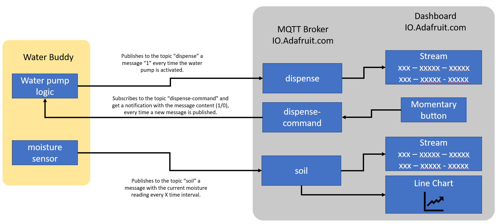
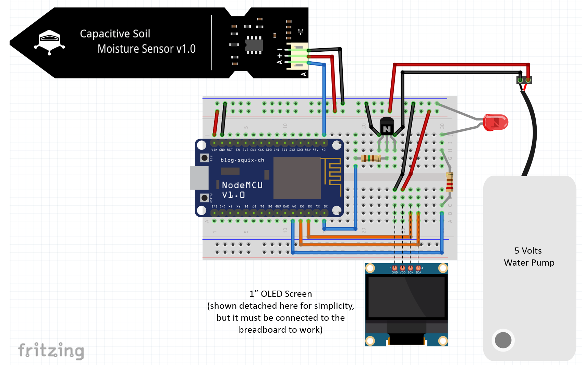

# Water Buddy

This sample shows the Water Buddy complete with IoT connection.

It uses the kit you received which includes:

1. ESP8266 microcontroller
1. Breadboard
1. 1" OLED Screen
1. Soil Moisture sensor
1. 5V Water Pump



## WaterBuddy Flow

The illustration below shows the device (WaterBuddy) and the needed MQTT Broker topics/feeds, as well as the Dashboard blocks.



## Adafruit.IO: Create the Topics/Feeds and Dashboard elements

Visit https://io.adafruit.com log in with your account and click on the top menu Feeds:

1. Create a new feed/topic: dispense
1. Click on Dashboards and create a new Dashboard: WaterBuddy
1. Add a stream connected to the dispense topic
1. Create a new feed/topic: dispense-command
1. Add a momentary button connected to this topic
1. Create a new topic: soil
1. Add a stream connected to this topic
1. Add a line chart connected to this topic

## Breadboard Setup

For this sample you'll need:

1. Node MCU ESP8266 dev Kit
1. Jumper Wires
1. LED (any color)
1. Resistor 220 Ohms (red, red, brown) or 330 Ohms (orange, orange, brown) to connect the LED
1. Resistor 330 Ohms (orange, orange, brown) connected to the base of the transistor
1. 5V DC Water Pump.
2. 2N3904 NPN transistor
3. OLED Screen.
4. USB **data** cable.

The illustration below shows the connections:



## Libraries needed

On the Arduino IDE go to menu `Sketch/Include Library/Manage Libraries`

Type **PubSubClient**, wait to see the results, click on `PubSubClient` by **Nick O'Leary**, select the version 2.8.0 in the “Select Version” dropdown list, and then click Install.

## Get Sample code

Use the [led-light.ino](Water-Buddy.ino) sample code in this directory.

Find the definitions for Wi-Fi and Adafruit Credentials and replace them with your own:

```C
#define WLAN_SSID       "SSID"
#define WLAN_PASS       "password"
#define AIO_SERVER      "io.adafruit.com" //stays as it is
#define AIO_USERNAME    "adafruit_username"
#define AIO_KEY         "adafruit_key"
```

1. Save your code.
1. Upload it to the dev kit.
1. Using the Arduino IDE open the serial monitor window

Your device should be publishing light values and getting led commands now.