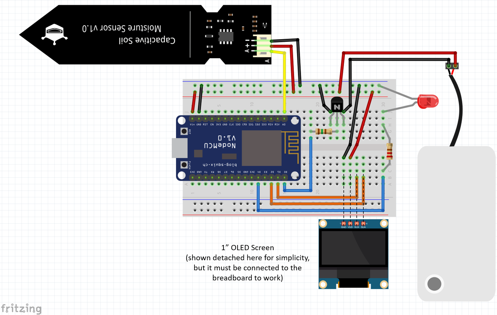

# Water Buddy

This sample shows the Water Buddy complete with IoT connection.

It uses the kit you received which includes:

1. ESP8266 microcontroller
1. Breadboard
1. 1" OLED Screen
1. Soil Moisture sensor
1. 5V Water Pump

## WaterBuddy Flow

The illustration below shows the device (WaterBuddy) and the needed MQTT Broker topics/feeds, as well as the Dashboard blocks.

## Adafruit.IO: Create the Topics/Feeds and Dashboard elements

Visit https://io.adafruit.com log in with your account.

Click on the top menu `Feeds`:

1. Create a new feed/topic: `dispense`
1. Create a new feed/topic: `dispense-command`
1. Create a new topic: `soil-moisture`

Click on the top menu `Dashboards`:

1. Create a new Dashboard `WaterBuddy`, and then click on `WaterBuddy` to access this dashboard
1. Click on the top right cogwheel icon, then `create a new block` to:
   1. Add a stream connected to the `dispense` topic
   2. Add a momentary button connected to the `dispense-command` topic
   3. Add a stream connected to the `soil-moisture` topic
   4. Add a line chart connected to the `soil-moisture` topic

## Breadboard Setup

For this sample you'll need:

1. Node MCU ESP8266 dev Kit
1. Jumper Wires
1. LED (any color)
1. Resistor 220 Ohms (red, red, brown) or 330 Ohms (orange, orange, brown) to connect the LED
1. Resistor 330 Ohms (orange, orange, brown) connected to the base of the transistor
1. 5V DC Water Pump.
2. 2N3904 NPN transistor
3. OLED Screen.
4. USB **data** cable.

The illustration below shows the connections:

## Libraries needed

On the Arduino IDE go to menu `Sketch/Include Library/Manage Libraries`

Type **PubSubClient**, wait to see the results, click on `PubSubClient` by **Nick O'Leary**, select the version 2.8.0 in the “Select Version” dropdown list, and then click Install.

## Get Sample code

Use the [Water-Buddy.ino](Water-Buddy/Water-Buddy.ino) sample code in this directory.

Find the definitions for Wi-Fi and Adafruit Credentials and replace them with your own.

Following Wi-Fi and Adafruit credentials, there are several `#define` which might need your attention:

1. `TELEMETRY_FREQUENCY_MILLISECS` Initially adjusted for 5000 milliseconds (5 seconds). You can adjust it to any value, but remember that a free Adafruit account only allows for 30 data points per minute.
1. `DISPENSE_TIME_MILLISECS` Initially set for 1 second, it defines for how long will the water pump be on every time the sensor detects the soil is under the specified threshold.
1. `MINIMUM_MOISTURE` Initially set for 20%, defines the minimum bar for soil moisture before turning the water pump on. It will vary greatly depending on the type of the plant you have.
1. `WATER_FREQUENCY_MILLISECS` Defined initially to 30 seconds, it defines for how long will the water pump wait for the water to spread, before turning on again.

Get the code here: [Water-Buddy.ino](Water-Buddy/Water-Buddy.ino)

1. Add your own credentials to it.
2. Save your code.
3. Upload it to the dev kit.
4. Using the Arduino IDE open the serial monitor window

Your device should be publishing light values and getting led commands now.