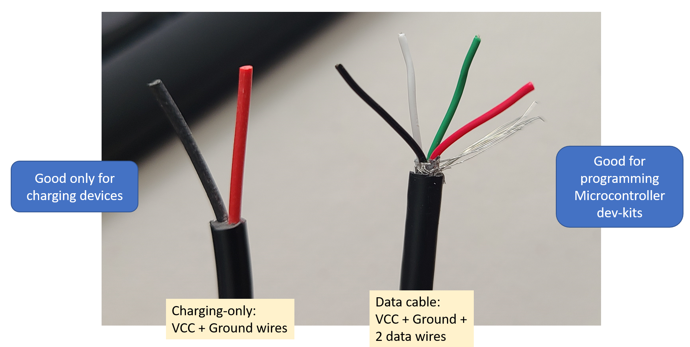
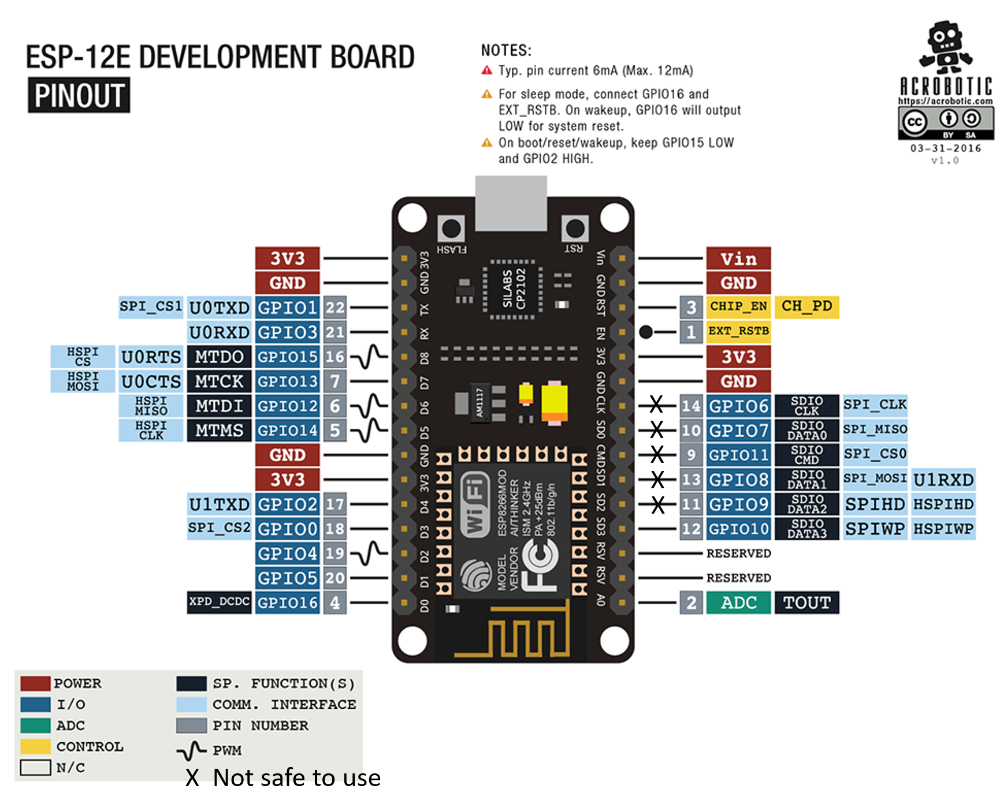

# Embedded Development IoT - Setup Instructions

## Poway Adult School class

These pages were created to support the Internet of Things class at the [Poway Adult School](https://www.powayusd.com/en-US/Departments/CareerTechnicalAdultEd/PAS/Home). They're not intended for self-study but feel free to use it and any of its resources to learn.

## Add ESP8266 board support to the Arduino IDE

1. Open Arduino IDE: `File/Preferences`
1. Find a text box called `Additional board manager URLs`. Copy and paste the string below:
```
http://arduino.esp8266.com/stable/package_esp8266com_index.json

```
1. Click OK
1. Go to menu `Tools/Board/Boards Manager`
1. Type `ESP8266` in the search box and wait until the board manager finds `esp8266 by ESP8266 Community`
1. Select the latest version (currently 3.0.2)
1. Click “Install”
1. Be patient, this process can take several minutes under slower connections

## Breadboard setup

Parts needed:

1. Node-MCU ESP8266
1. Jumper Wires
1. LED
1. Resistor 220 Ohms (red, red, brown) or 330 Ohms (orange, orange, brown)
1. USB **data** cable.

Picture below shows the connections for the first test:


## Testing the IDE support

1. Go to Arduino IDE
2. Open the blink example `file/examples/basic/blink`
3. Replace the `LED_BUILTIN` for the GPIO pin 2 (just type `2`) you'll replace it 3 times in the blink code.
4. Plug your ESP8266 using an USB **DATA cable**
5. Select the correct COM port under Tools/Port. See section below to find out which COM port is the correct one.
6. Select the NODE MCU 1.0 under EP8266 `Tools/Board/ESP8266 Boards/Node MCU 1.0 (ESP-12E module)`
7. Under `Tools/Upload Speed` select `256000` for faster uploads.
8. Upload your code to the board.
9. Did the LED blink? GREAT! Your development environment is correctly setup for the next hand-on labs.

## How to find the right COM port?

1. On Windows, open the Device manager and expand Ports (COM & LPT)
1. If you have the driver correctly installed, you should see the `CP210x` showing up.
1. Use the COM port assigned to your device.
1. Remember to check this often because Windows might assign different COM Port numbers when you plug and unplug the device.

## CP2102 x CH340G (and why should you care)

Both parts refer to the USB to Serial chip onboard on your Node MCU Dev Kit.

It works as a bridge between the ESP8266 (which has NO native USB support) and your computer, so you can program it.


Board to the left has the **CP2102** (square chip), and normally its driver is installed with the Arduino IDE so you probably won’t need to do anything for it to work.S

Board to the right has the **CH340G** (rectangular chip) which requires an additional driver, so don’t throw away your device if it doesn't work. It might not be defective: it only misses the proper driver.

**How to install the CH340G driver** The team at Sparkfun created an amazing tutorial explaining the details here: https://learn.sparkfun.com/tutorials/how-to-install-ch340-drivers/all

## USB Data Cable

When programming the ESP8266 (or any other Dev Kit which has a micro-USB cable) you need to use a data cable. Some of the cheaper cables are really not **Data Cables** but rather **Charging Cables** which are good for charging devices but not for programming microcontrollers.

You should suspect of having a charging cable when you connect your device to the PC and don't hear the characteristic sound Windows make when USB devices are either plugged or unplugged. If that's the case get another cable and test it again.



## ESP8266 Pinout


