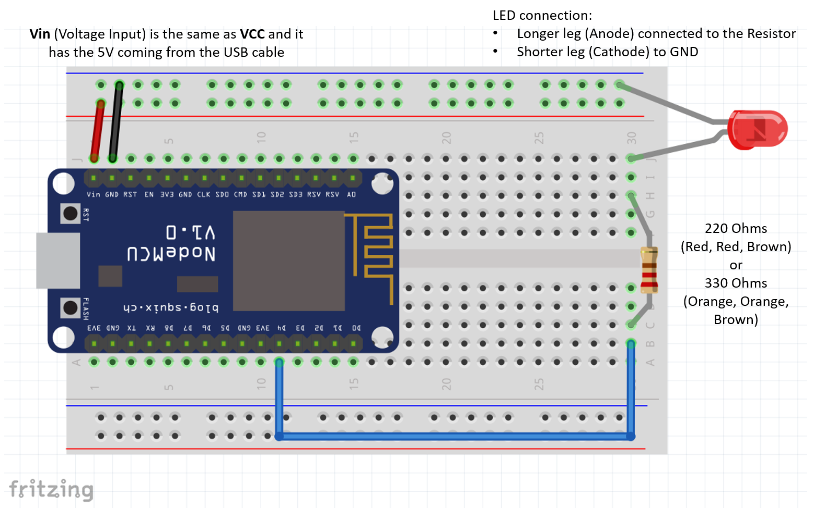
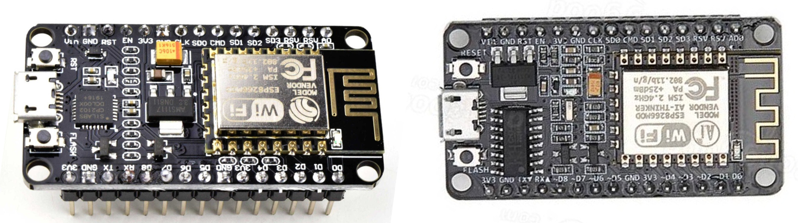

# Embedded Development IoT - Setup Instructions

## Add ESP8266 board support to the Arduino IDE

1. Open Arduino IDE  File/Preferences
1. Find a text box called “Additional board manager URLs”. Copy and paste the string below:
```
http://arduino.esp8266.com/stable/package_esp8266com_index.json

```
1. Click OK
1. Go to menu Tools/Board/Boards Manager
1. Type ESP8266 in the search box and wait until the board manager finds “esp8266 by ESP8266 Community”
1. Select the latest version (currently 3.0.2)
1. Click “Install”
1. Be patient, this process can take several minutes under slower connections

## Breadboard setup

Parts needed:

1. Node-MCU ESP8266
1. Jumper Wires
1. LED
1. Resistor 220 Omhs (red, red, beown) or 330 Ohms (orange, orange, brown)
1. USB **data** cable.

Picture below shows the connections for the first test:



## Testing the IDE support

1. Open the blink example (file/examples/basic/blink) 
1. Replace the LED_BUILTIN for the GPIO pin 4 (just type 4)
1. Plug your ESP8266 using an USB **DATA cable**
1. Select the correct COM port (under Tools/Port)
1. Select the NODE MCU 1.0 under EP8266 (Tools/Board/ESP8266 Boards/Node MCU 1.0 (ESP-12E module)
1. Upload your code to the board.

How to find the right COM port?

1. On Windows, open the Device manager and expand Ports (COM & LPT)
1. If you have the driver correctly installed, you should see the CP210x showing up.
1. Use the COM port asigned to your device. 
1. Remember to check this often because Windows might assign different COM Port numbers when you plug and unplug the device.

## CP2102 x CH340G (and why should you care)

Both parts refer to the USB to Serial chip onboard on your Node MCU Dev Kit. 

It works as a bridge between the ESP8266 (which has NO USB support)  and your computer, so you can program it. 




Board to the left has the CP2102 (square chip), and nomrally its driver is installed with the Arduino IDE so you probably won’t need to do anything for it to work.

Board to the right has the CH340G (rectangular chip) which requires an additional driver, so don’t throw away your device. It might not be defective; it only misses the driver. 

**How to install the CH340G driver** The team at Sparkfun created an amazing tutorial explaining the details here: https://learn.sparkfun.com/tutorials/how-to-install-ch340-drivers/all 


