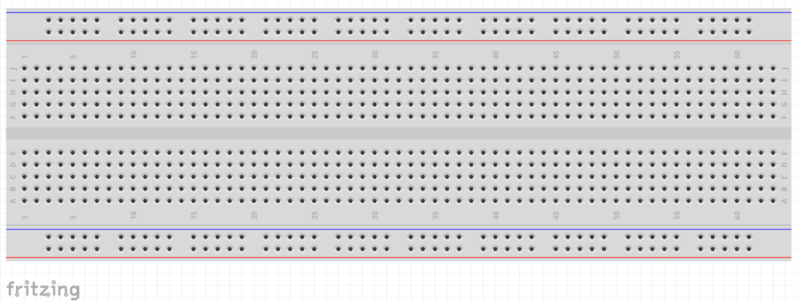
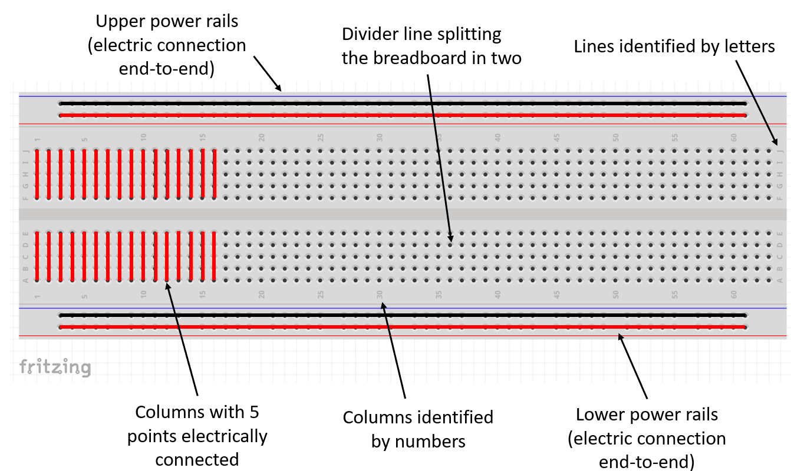
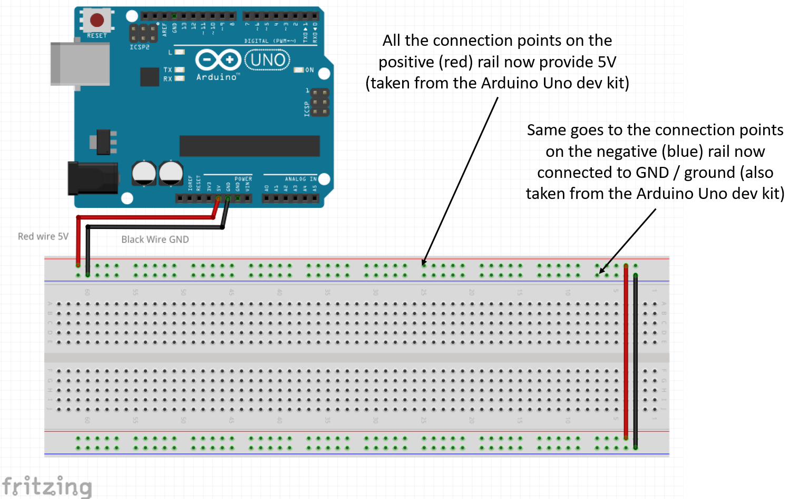
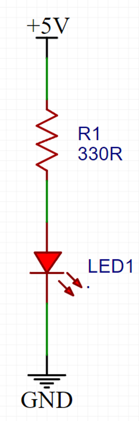
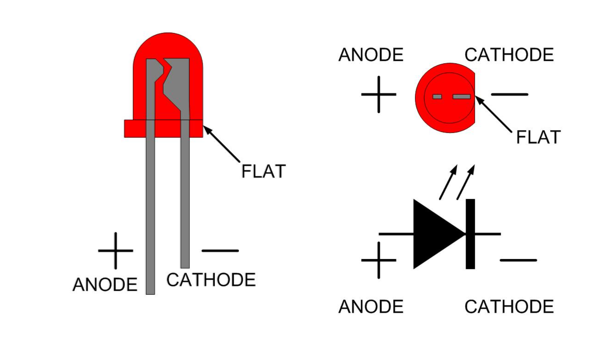
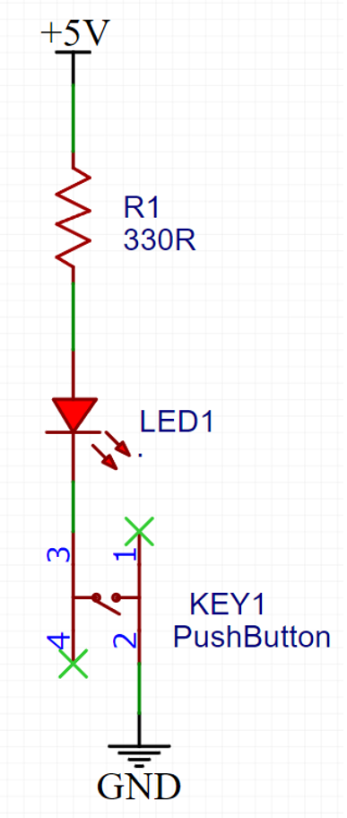
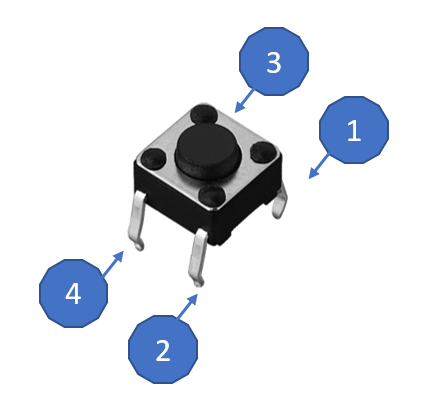
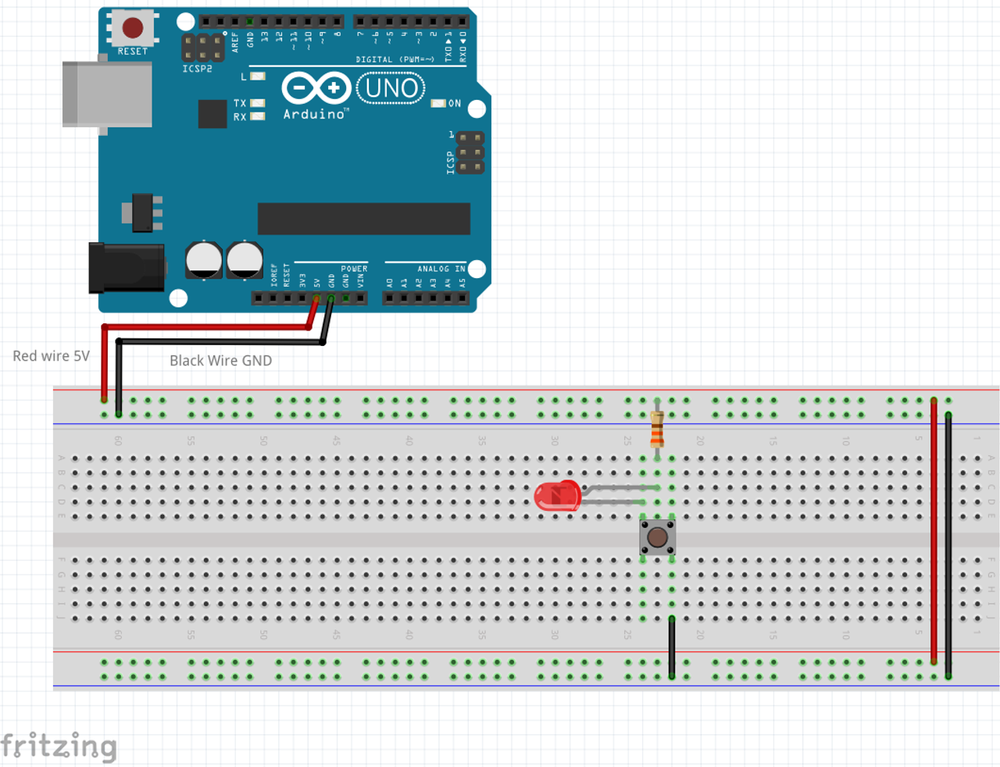

## Using Breadboards

A breadboard is a prototyping tool used in electronics to build and test circuits. It allows you to easily connect electronic components together using wire.

One of the main advantages of using a breadboard is that it allows you to easily change the circuit by simply moving the components around or removing them. This can be useful for testing different configurations or for making changes to the circuit.

Additionally, breadboards are useful because they do not require any soldering, which can be time-consuming and difficult for those who are new to electronics. Overall, breadboards are a useful tool for quickly prototyping and testing electronic circuits.

Below is the picture of a full size breadboard (it has 840 connection points):

These connection points are connected together in a specific pattern, which allows you to create circuits by connecting the components in a particular way. For example, you might connect a battery to an LED, which would cause the LED to light up. The pattern of connections on the breadboard makes it easy to create a wide range of different circuits, depending on your needs.

Below is the picture of the pattern of a 840 pin breadboard:

### Powering your breadboard

In this workshop we'll be using the power provided by the Arduino Uno board, via its 5V and GND pins.

Please follow the illustration below to bring 5V to your breadboard's power pins:

### Ligthing up an LED in the breadboard

We want to light up an LED using 5V from the breadboard in a circuit like this:

An LED is a light-emitting diode. It is a type of semiconductor device that is commonly used in a wide range of electronic devices, including TVs, computers, and smartphones, as well as in various types of lighting systems.

LEDs are known for their energy efficiency, long lifespan, and fast switching times, which make them an attractive alternative to traditional incandescent and fluorescent light sources. They are also very durable and resistant to damage, which makes them suitable for use in a variety of applications.

Please notice the LED is a polarized component, meaning it needs to be placed in the correct way:

Please, unplug your Arduino from USB and follow the illustration below to power an LED using the 5V from your breadboard's power pins:

Plug your Arduino to the USB cable again and the LED should light up.

### Controlling the LED with a push button

Now, as fun as it is to look at an LED, we want control the LED using a push button in a circuit like this:

This circuit is very similar to the previous one, but in this case the current will only flow through the LED if the button is pressed.

A tactile push button is a type of switch that is activated by pressing down on it with a finger or other object. It is a common type of input device used in a wide range of electronic devices, including computers, phones, and appliances. Tactile push buttons are often used to initiate an action, such as starting a program or making a selection.

They are usually accompanied by a visual indicator, such as an LED, to show that the button has been pressed. Some tactile push buttons also provide haptic feedback, such as a vibrating sensation or a "click" sound, to confirm to the user that the button has been pressed.

The position of the button in the breadboard is not as critical as the LED, and the pin identification is in the illustration below:

Please, unplug your Arduino from USB and follow the illustration below to power an LED using the push button:

Plug your Arduino to the USB cable again and the LED should light up when the button is pressed.