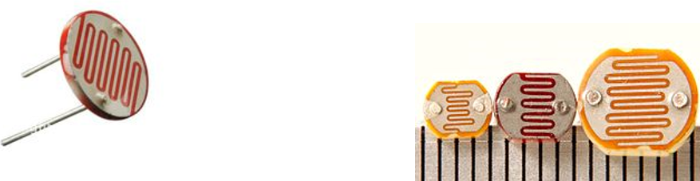
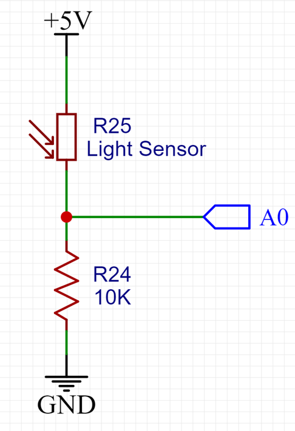
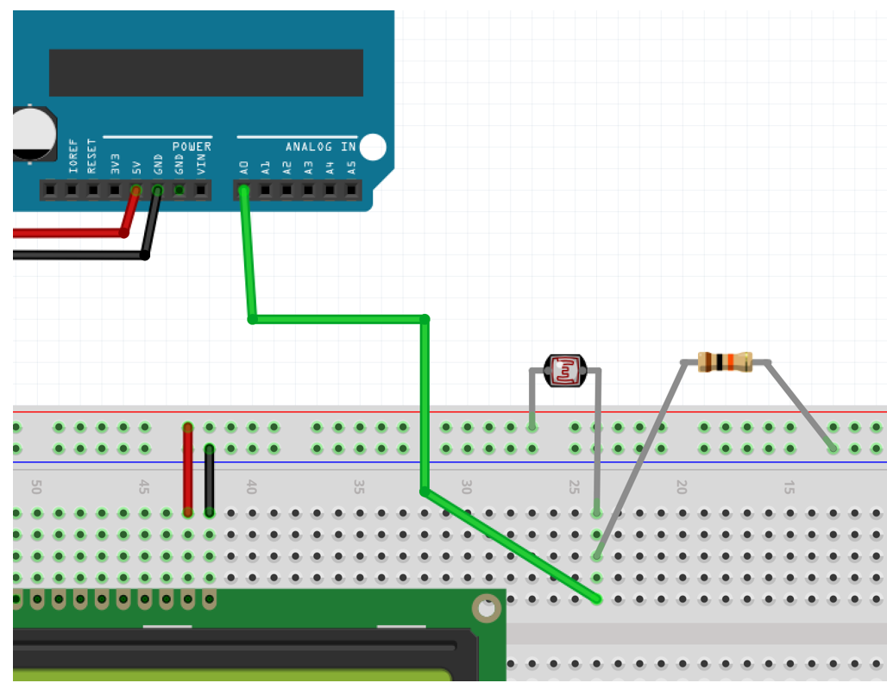

## LCD Display with the Light Sensor

The light sensor we’ll be using is a LDR (light dependent resistor) or photoresistor. The resistance in the LDR varies according to the light level: As more light hits the LDR, the smaller the resistance and higher the voltage in the pin A0. As less light hits the LDR, the resistance increases and drops the voltage in the pin A0.

LDRs are inexpensive but have some lag between light changes and its response making it a bad choice to detect quick light transitions. In this case photo diodes or photo transistors are preferable.  



Below is the schematic version of the LDR connection, for reference. (the 10K Ohm resistor is brown, black, orange)



The illustration below shows how to wire the LDR to the Arduino:



### LDR code

```c
#include <LiquidCrystal.h>  

// initialize the library by associating any needed LCD interface pin
LiquidCrystal lcd(12, 11, 10, 9, 8, 7);

int light = 0;

void setup() {
  pinMode(3, OUTPUT);
  lcd.begin(16, 2);
  lcd.print("*** Embedded ***");
  lcd.setCursor(0, 1);
  lcd.print("* Development  *");
  delay(5000);
  lcd.clear();
}

void loop() 
{
    light = analogRead(A0);
    
    lcd.setCursor(0, 0);
    lcd.print("Light Val:");
    lcd.setCursor(12,0);
    lcd.print(light);
     
    //adding a little delay so the readings won't go crazy
    lcd.setCursor(15, 1);
    lcd.print(char(165));
    delay(800);
    lcd.setCursor(15, 1);
    lcd.print(" ");
    delay(800);

    if(light<700)
      digitalWrite(3,LOW);
    else
      digitalWrite(3,HIGH);
}

```