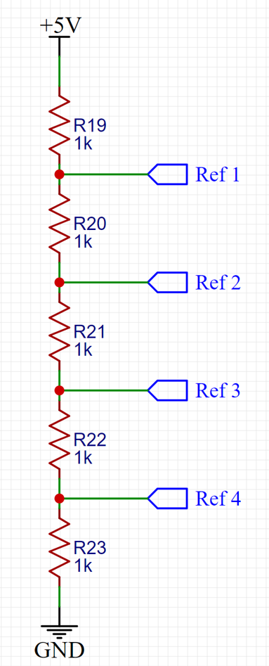
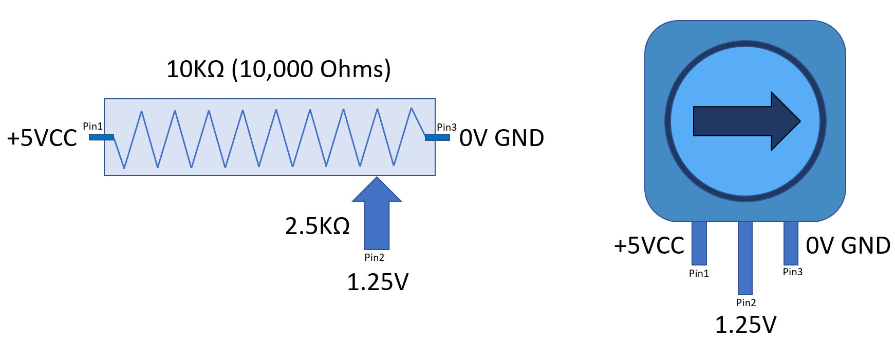

# Voltage Divider

A voltage divider is a simple circuit that can be used to reduce the magnitude of an input voltage. It consists of at least two resistors connected in series, with the output voltage taken across one of the resistors. The output voltage is equal to the input voltage multiplied by the ratio of the resistance of the resistor that the output is taken across to the total resistance of the resistors.

Voltage dividers are often used to reduce the magnitude of high voltages to a level that can be safely measured or used by other circuits. They can also be used to set a reference voltage for other circuits, or to provide a voltage drop in a circuit to compensate for voltage drops in other parts of the circuit.

In the circuit below, what is the reference voltage across Ref1 to Ref 4?



In this case, all these resistor have a fixed value then, given the same 5V input, the reference voltages will be: Ref 1 = 4V, Ref 2 = 3V, Ref 3 = 2V and Ref 4 = 1V. 

Unless we use a variable resistor, or a potentiometer.

## Potentiometers

A potentiometer is a type of electrical component that functions as a adjustable resistor. It consists of a resistive element, a sliding contact (wiper), and two fixed contacts. The position of the wiper determines the resistance between the two fixed contacts. Potentiometers are often used to control the volume of an audio device, the brightness of a lamp, or the angle of a motor. They can also be used as a voltage divider to measure an unknown voltage.


### Voltage Variation

Note in this series, how the voltage changes in the center element as we turn the potentiometer counterclockwise:

**Initial State = 0V**


**Intermediate State = 1.25V**



**Intermediate State = 2.5V**


**Intermediate State = 3.75V**


**Final State = 5V**


Below is the schematic version of the potentiometer, for reference.


The illustration below shows how to wire the potentiometer to the Arduino:
S


### Potentiometer code

```c
#include <LiquidCrystal.h>  

// initialize the library by associating any needed LCD interface pin
LiquidCrystal lcd(12, 11, 10, 9, 8, 7);

int light = 0;

void setup() {
  // set up the LCD's number of columns and rows:
  lcd.begin(16, 2);
  lcd.print("*** Starting ***");
  lcd.setCursor(0, 1);
  lcd.print("  Potentiometer ");
  delay(4000);
  lcd.clear();
  lcd.setCursor(0, 0);
  lcd.print("Value:");
}

void loop() 
{

    light = analogRead(A0);

    //need to check the number of digits to correctly display values
    if(light>1000)
    {
      lcd.setCursor(8,0);
      lcd.print(light);
    }
    else if(light<100)
    {
      lcd.setCursor(9,0);
      lcd.print(light);
      lcd.setCursor(11,0);
      lcd.print(" ");
    }    
    else
    {
      lcd.setCursor(8,0);
      lcd.print(" ");
      lcd.setCursor(9,0);
      lcd.print(light);
    }   
     
    //adding a little delay so the readings won't go crazy
    lcd.setCursor(15, 1);
    lcd.print(char(165));
    delay(200);
    lcd.setCursor(15, 1);
    lcd.print(" ");
    delay(200);
}
```