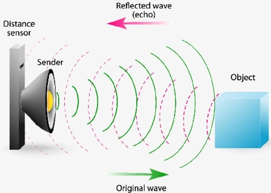
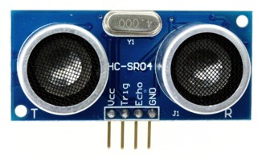
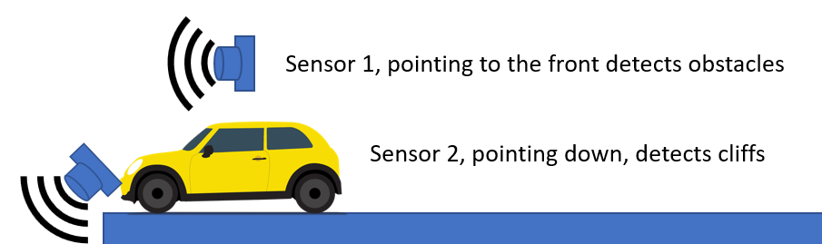

# Using the HC-SR04 Distance Sensor

The HC-SR04 ultrasonic sensor uses SONAR to determine the distance of an object just like the bats do. It is based on having both an ultrasound emitter and a receiver so it can detect the sound as it bounces of objects or other surfaces.

the illustration below shows this behavior:

 

The HC-SR04 offers excellent non-contact range detection with high accuracy and stable readings in an easy-to-use package from 2 cm to 400 cm or 1” to 13 feet, small package and low cost.

The operation is not affected by sunlight or black material, although acoustically, soft materials like cloth can be difficult to detect. It comes complete with ultrasonic transmitter and receiver module.

**Source**: [https://www.tutorialspoint.com/arduino/arduino_ultrasonic_sensor.htm
](https://www.tutorialspoint.com/arduino/arduino_ultrasonic_sensor.htm
)

## Using the sensor

The sensor, as seen in the illustration below, has 4 pins:
- VCC: connect to a 5V source
- Trig: connect to a digital pin for operation as the trigger
- Echo: connect to a digital pin for operation as the echo detection
- GND: connect ot the ground on the circuit

It does not require any special library to be used with an Arduino Uno or similar.

 

The [sample](LCD-with-distSensor.ino) has two functions: one to populate a variable with the distance in centimeters and another one for distance in inches. Feel free to use whichever you prefer.

```c
   inches = microsecondsToInches(duration);
   cm = microsecondsToCentimeters(duration);
```

The Echo and Trigger pins can be connected to **any** digital pin available on the Arduino board. In the code snippet below, we used Pin 3 connected to Trigger and Pin 4 connected to Echo.

```c
const int pingPin = 3; // Trigger Pin of Ultrasonic Sensor
const int echoPin = 4; // Echo Pin of Ultrasonic Sensor
```

## Sample usage: Obstacle avoiding car

In this example, the car uses 2 distance sensors the first one points ahead to detect obstacles and objects. The second one points down to detect edges and stop the vehicle before is fall of edges.


