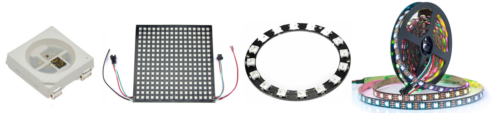
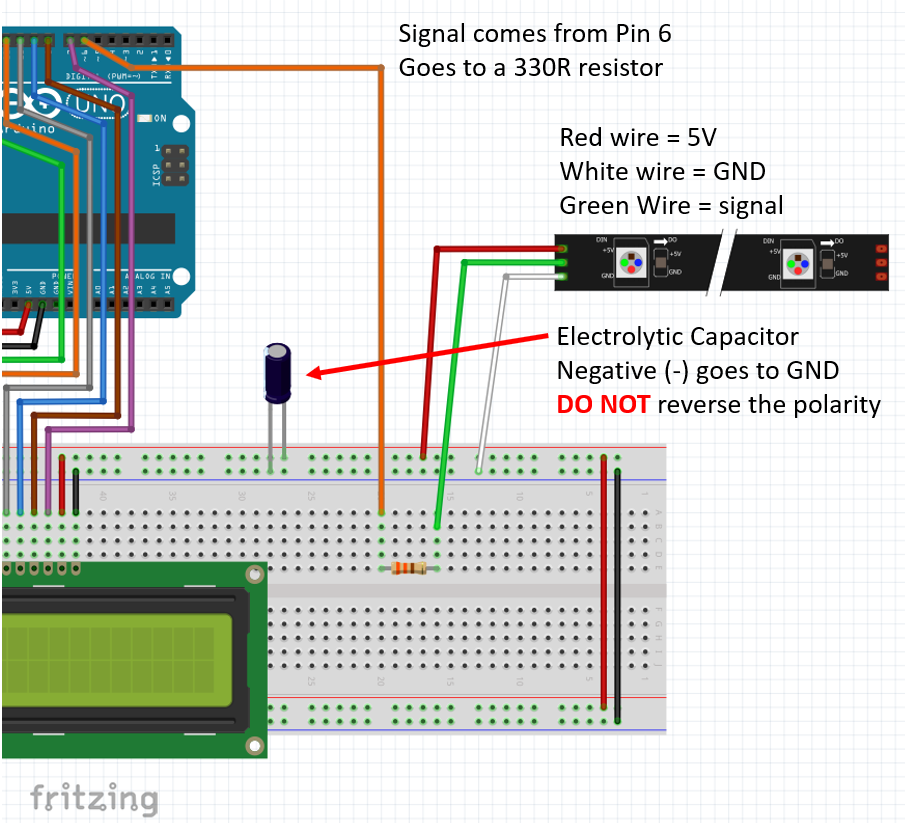

# Using NeoPixels

NeoPixels are a type of individually addressable RGB LED that can be controlled with a microcontroller. They are often used to create colorful lighting displays or to add an element of interactivity to an electronic project. The term "NeoPixel" is trademarked by [Adafruit Industries](https://www.adafruit.com), which produces a line of NeoPixel products.

NeoPixels are Red, Green and Blue LEDs integrated in a single package that are normally used in a sequence in various formats.

The most interesting characteristic of a Neopixel is the fact we can determine is color and brightness individually, even if we have hundreds of them in a panel or strip.



Before we can use the Neopixels we’ll need to get an external library that enables it in the Arduino IDE.

**Installing the library**:
- Select `Sketch/Include Library/Manage Libraries`
- Type `neopixel` (wait to results to load)
- Select `Adafruit NeoPixel by Adafruit`
- Hit install

Source: [Adafruit NeoPixel Uber Guide](https://learn.adafruit.com/adafruit-neopixel-uberguide?view=all)

## Connecting NeoPixels

The NeoPixel strip you’ll be using in the workshop has 30 LEDs. It has connector on both sides for daisy chaining.

There are little triangles across the strip to let you  know what is the data direction.

The strip can be cut down to a single NeoPixel if needed **(please don’t cut it)**. 

Current capacity is the major issue when using NeoPixels. The 30 LED strip you have can draw up to 1.8A, but the Arduino can provide no more than 500mA (less than a 1/3 of the total) otherwise you can destroy either the Arduino or the PC’s USB port or both.  
We work around that issue by setting the brightness to a maximum of 50. 
**Attention**: Never change this value during this class. 



## NeoPixels Library

To start using NeoPixels on your project, you first need to add a reference to the library you installed:

```c
#include <Adafruit_NeoPixel.h> 
```

Define which pin will be used as the Signal to the NeoPixels:

```c
#define LED_PIN 6
```

Define how many LEDs we have in the strip (limited by the amount of RAM and current capacity of the power adapter):

```c
#define LED_COUNT 30
```

Create and initialize an object called strip which will be used in your code to represent the NeoPixels:

```c
Adafruit_NeoPixel strip(LED_COUNT, LED_PIN, NEO_GRB + NEO_KHZ800); 
strip.begin();           // INITIALIZE NeoPixel strip object (REQUIRED)
strip.show();            // Turn OFF all pixels ASAP
strip.setBrightness(50);  //Set BRIGHTNESS to about 1/5 (max = 255)
```

Inside your code, you can define the color for each individual LED (pixel) in the matrix, where:
- X is the number of the LED we want to control starts from 0 until the last LED in the strip (in our case is 29)
- R is the amount of Red light we want on. Vary from 0 (OFF) to 255 (maximum)
- G is the amount of Green light we want on. Vary from 0 (OFF) to 255 (maximum)
- B is the amount of Blue light we want on. Vary from 0 (OFF) to 255 (maximum)

```c
strip.setPixelColor(X,R,G,B);  
```

Finally, once the color for each LED in the strip has been defined and stores in RAM, it is time to send this information to the strip, which is when the color of the LED will actually take effect:

```c
strip.show(); 
```