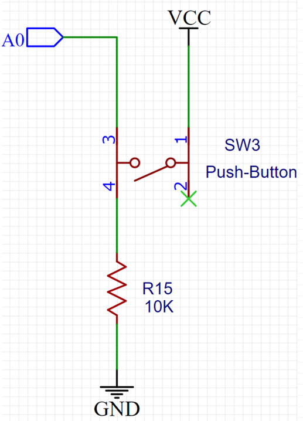
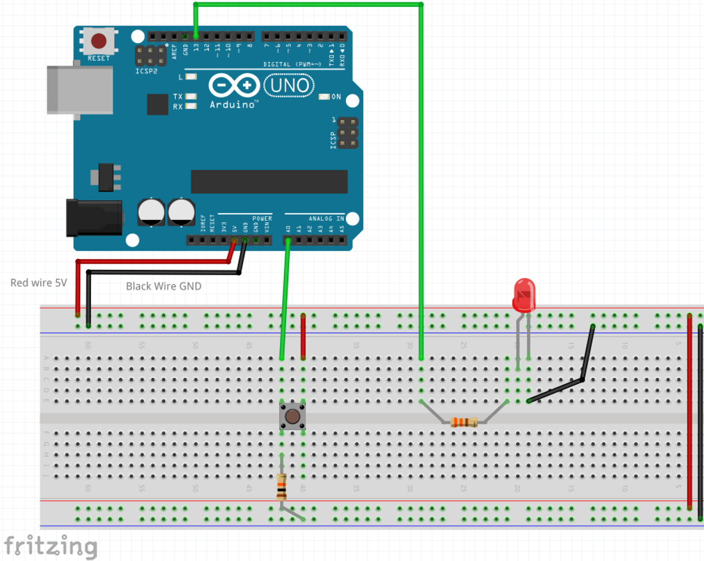

## Controlling the Breadboard LED with the Arduino and a button

In this experiment we'll control the Breadboard LED using the 5 Volts from the Arduino an a button in a circuit like this:



Please, unplug your Arduino from USB and follow the illustration below to power an LED using the 5V from your breadboard's power pins and a button:

**Important** The resistors in this circuit are very different so they need to be placed in the correct place:

- **330 Ohms (orange, orange, brown)** should be placed with the LED
- **10K Ohms (brown, black, orange)** should be placed with the button



Once the circuit above is completed, click `file/new` and type the following code:

```c
void setup() {
  pinMode(A0, INPUT);
  pinMode(13, OUTPUT);
}
void loop() {
if(digitalRead(A0)==HIGH)
   {digitalWrite(13,HIGH);}
   else
   {digitalWrite(13,LOW);}
}
```

In this sample, the **setup()** function is called once when the Arduino board is powered on or reset. In this function, the pinMode function is called to set digital pin A0 as an input pin, and digital pin 13 as an output pin.

The **loop()** function is called repeatedly after the setup() function has completed. In the loop() function, the digitalRead function is called to read the state of digital pin A0. If the state of pin A0 is HIGH, the digitalWrite function is called to set the state of digital pin 13 to HIGH, which will turn on the LED connected to pin 13. If the state of pin A0 is LOW, the digitalWrite function is called to set the state of digital pin 13 to LOW, which will turn off the LED.

This code will continuously check the state of pin A0 and turn the LED on or off accordingly. If the state of pin A0 changes, the LED will turn on or off accordingly as well.

**To test at home** what if we wanted the opposite result? having the LED on at all times, except when the button is pressed?