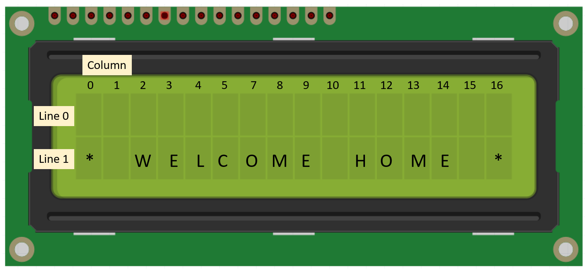
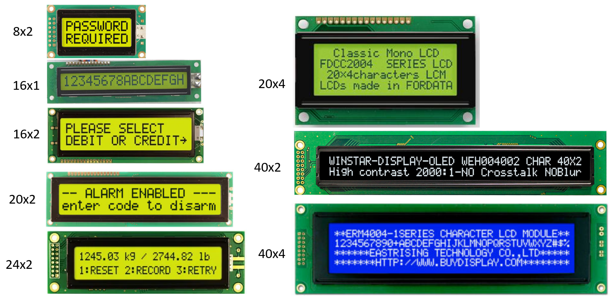
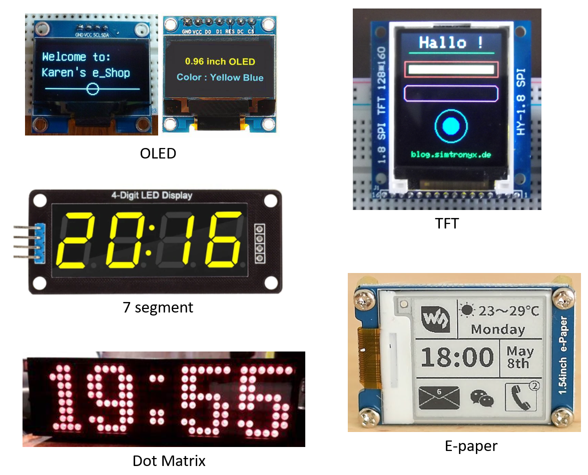
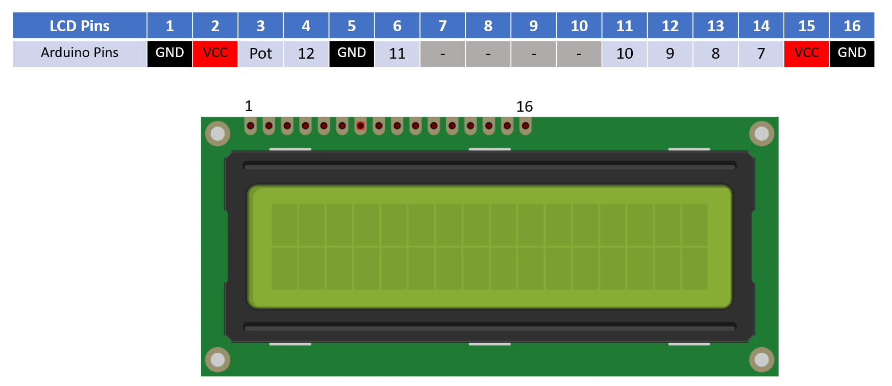
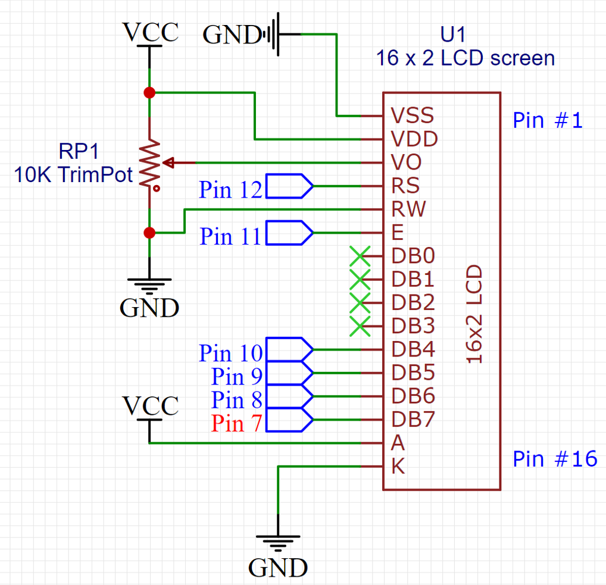
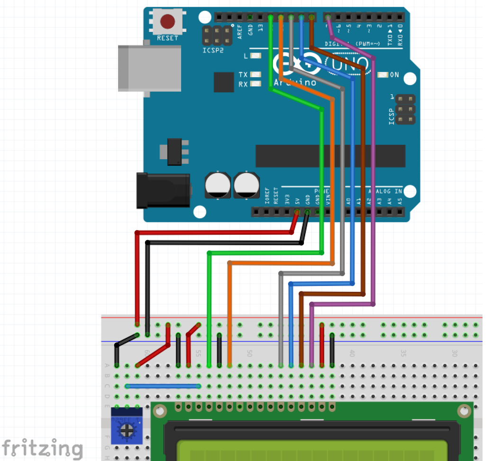
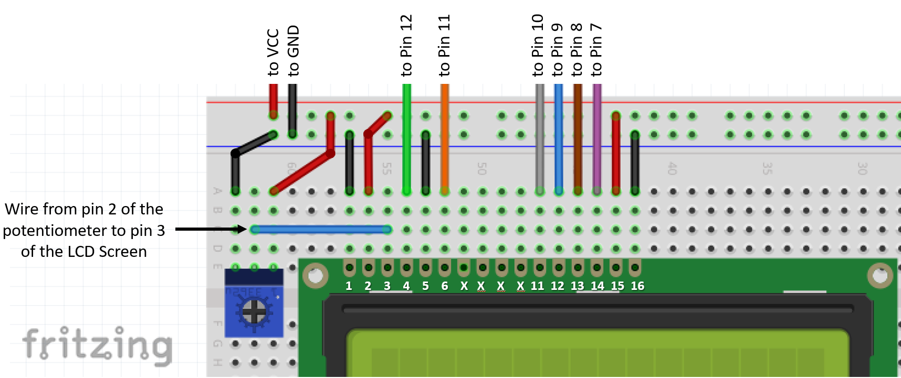

## LCD Displays

An LCD (liquid crystal display) display is a type of flat panel display that uses liquid crystals to produce an image. It is a thin, lightweight and power-efficient display that is commonly used in a wide range of consumer electronics, including laptops, smartphones, and television sets.

In an LCD display, the image is created by applying an electric current to the liquid crystals, which causes them to align and allow light to pass through in specific patterns. The resulting image is then displayed on the screen.

Due to its low cost and ease to use, LCD screens are used in many electronics products. In this workshop we'll be using a simple 16x2 LCD display, meaning it has 16 characters and 2 lines.



While the 16x2 is one of the most commonly used, there are several other similar LCD models:



Displays are not limited to these simple LCDs and there are other models like:



By searching on the web you can find Arduino samples for almost all of them.

### Using the 16x2 LCD display

Connecting this LCD display involves several wires, but if you follow this guide it should work just fine. Be patient, and careful when wiring. 

**LCD Pinout**: the 16x2 LCD has 16 pins and the table below shows which Arduino Pin should be connected to each one of them. Please not that pins 7 to 10 are not supposed to be connected.



Below is the schematic version of the LCD connection, for reference:



### Wiring the 16x2 LCD display to the Arduino

The illustration below shows how to wire the LCD display and the Potentiometer (the blue component) to the Arduino:



Let's take a closer look at the connections:



### Testing the LCD

To test the LCD, open `file/examples/Liquid Crystal/Hello World`

Change line 49 as shown below:

```c
LiquidCrystal lcd(12, 11, 10, 9, 8, 7);

```

Adjust the screen contrast by changing the trim-pot position (also if you can’t see anything on the screen)

### Some LCD functions

Below are some of the functions you can use with the LCD display:

**lcd.begin(16,2)** – initialize the LCD with 16 characters and 2 lines

**lcd.print(“test”)** – prints the expression “test” wherever the cursor is

**lcd.setCursor(0,1)** – set the cursor position to the first column (column 0) of the second line (first line is line 0)

**lcd.clear()** – erase the display
