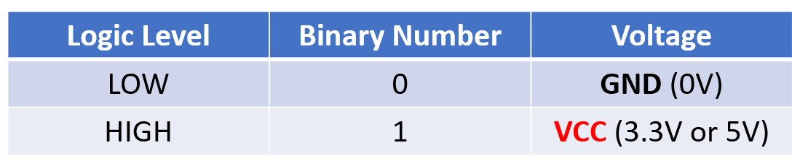
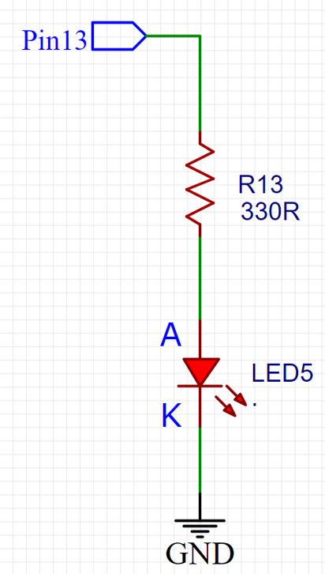
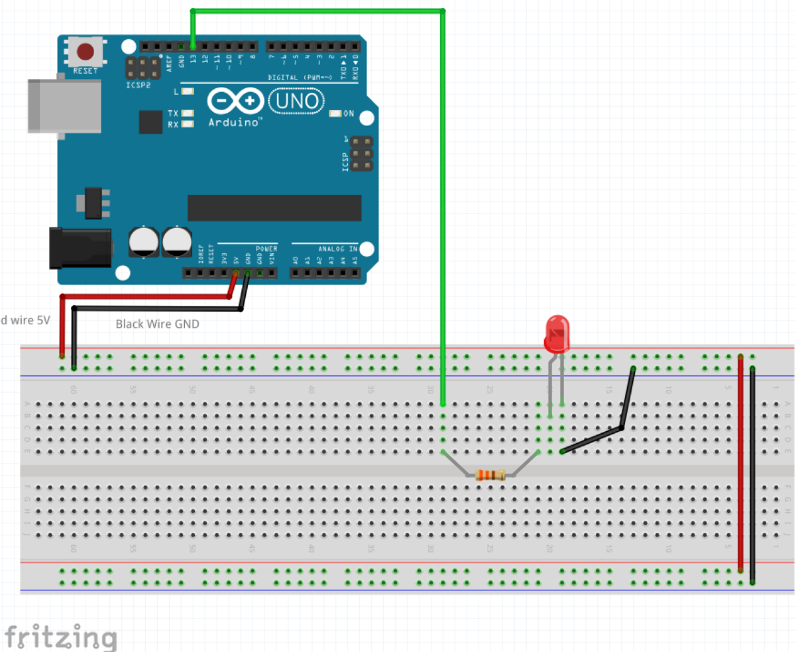
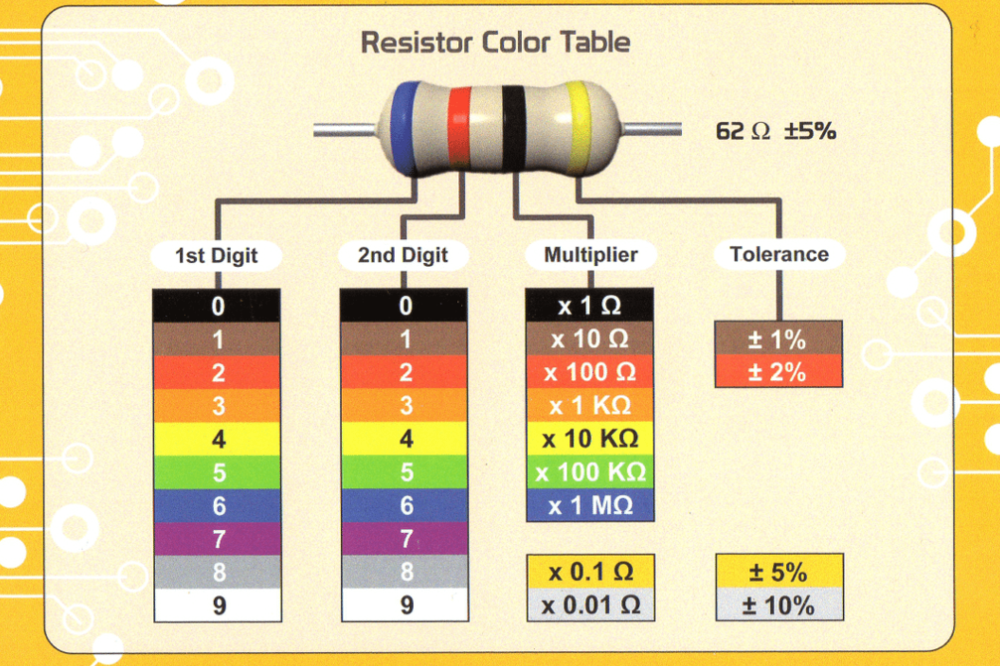

## Microcontrollers and Logic Levels

In the context of microcontrollers, a logic level is a digital signal that is used to represent a binary value of 0 or 1. The logic level of a signal can be either high (1) or low (0). The voltage level of the signal is used to represent the logic level. For example, a logic level of 0 might be represented by a voltage of 0V, while a logic level of 1 might be represented by a voltage of 3.3V or 5V. The specific voltage levels that are used to represent the logic levels depend on the microcontroller and the circuit it is being used in.

MCUs uses binary logic which has two levels:
 - Logical High (correspond to binary number 1)
 - Logical Low (correspond to binary number 0)

The two logical states are usually represented by two different voltages: 
 - Zero Volts or GND (ground) 
 - **VCC** (VCC might vary, but for MCUs is normally 5V or 3.3V)
  
 

Going back to the blink example:

`digitalWrite(13,HIGH)` Sets the Logic Level HIGH, or binary 1, turn the pin on the Arduino ON, which makes that pin have 5V output. An equivalent command is `digitalWrite(13,1)`.

Likewise, `digitalWrite(13,LOW)` Sets the logic Level LOW, or binary 0, turn the pin on the Arduino OFF, which makes that pin have 0V output. An equivalent command is `digitalWrite(13,0)`.

### Controlling the Breadboard LED with the Arduino

In this experiment we'll control the Breadboard LED using the 5Volts from the Arduino in a circuit like this:

**Important** remember the LED need to be place in the correct way. **Tip**: the longer lead is the one which should be connected to VCC or the positive side.

Once the circuit above is completed, the LED should be blinking along with the onboard LED since they bot share connected to the same digital Pin 13.

**Question** what if we wanted to blink an LED connected to Pin 9?

**To test at home** with the LED connected to Pin 9, use the `file/examples/01.basics/fade` and see what happens to the LED.

### Resistors: Color code table

