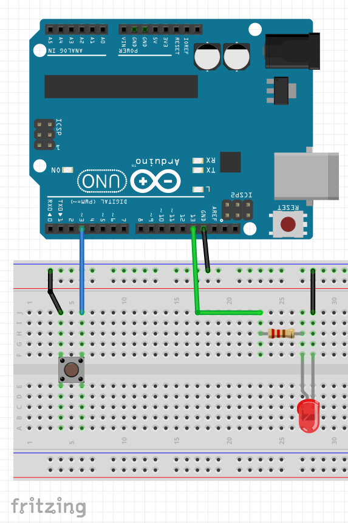

## Pulling a Digital Input Up

The samples in this repo will often a pull-down configuration to give the input digital pin a reference to work with.

In order to achieve this, we add a resistor between the pin and GND, pulling it down.

A different way to achieve the same results and eliminating the need for the resistor, is to enable and use an internal Pull_Up resistor, which is a feature several microcontrollers have. The ATMega328P is not an exception.

The breaboard shown below illustrate how the pullup would look like:



Also, when you need to use a pulled-up pin, you need to define it as such `pinMode(3,INPUT_PULLUP)`, in this case Pin 8 will be defined as an input and an internal resistor will be connected to VCC. 1

Sample code below shows how you would control an LED on Pin 13 with a button connected to Pin 3:

```c
void setup() 
{
    pinMode(3,INPUT_PULLUP);
    pinMode(13,OUTPUT);
}
void loop() 
{
    if(digitalRead(3)==LOW)
        {digitalWrite(13,HIGH)}
    else
        {digitalWrite(13,LOW)}
}
```