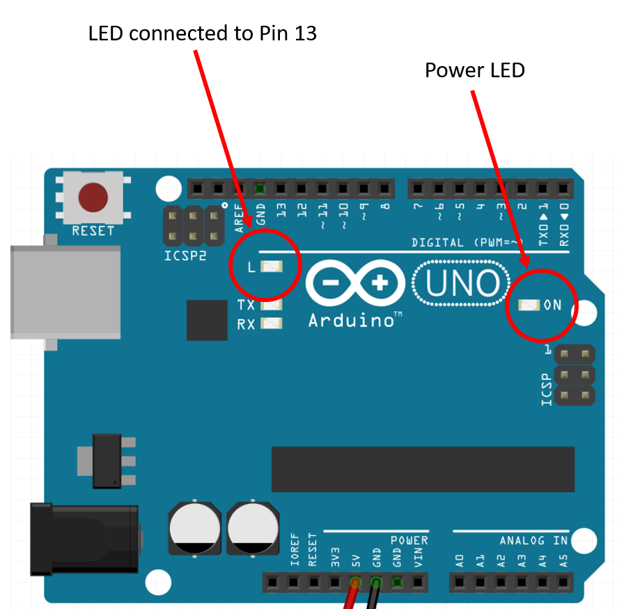

## Poway Adult School class

These pages were created to support the Internet of Things class at the [Poway Adult School](https://www.powayusd.com/en-US/Departments/CareerTechnicalAdultEd/PAS/Home). They're not intended for self-study but feel free to use it and any of its resources to learn.

## Embedded Development

**What is Embedded development?**

It reefers to the use of programming languages and software tools to create software for small, often single-purpose, devices that are embedded in other products. Some examples of embedded systems include the control systems in automobiles, the software that runs household appliances like washing machines and refrigerators, and the firmware that controls the functionality of consumer electronics like phones and computers.

**What are the advantages of studying embedded development?**

1. **Career opportunities**: Embedded programming is a growing field with a wide range of career opportunities, including positions in industries such as automotive, aerospace, consumer electronics, and industrial automation.
1. **Versatility**: Embedded programming skills can be applied to a wide variety of projects and industries, making it a versatile field to work in. 
1. **Demand for skilled workers**: There is a high demand for workers with skills in embedded programming, as more and more products are being developed with embedded systems.
1. **The ability to create new products and solutions**: With the skills to program embedded systems, you can create innovative new products and solutions that solve real-world problems.
1. **Job security**: The demand for skilled workers in embedded programming is expected to continue to grow in the coming years, providing job security for those with these skills.

**How to get started with Embedded development?**

There are several things you can do to start learning and creating your own solutions. Consider:

1. **Learn a programming language**: There are many programming languages that are commonly used for embedded programming, such as C, C++, and Python. It's a good idea to start by learning one of these languages and becoming proficient in it.
1. **Learn about embedded systems**: It's important to understand the basic concepts and technologies involved in embedded systems, such as microcontrollers, real-time operating systems, and communication protocols.
1. **Get hands-on experience**: The best way to learn is by doing, so it's a good idea to start working on some small projects to get hands-on experience with embedded programming. This could involve using a microcontroller development board and programming it to control LEDs or sensors.
1. **Consider taking a course or earning a degree**: There are many online courses and degree programs available that can help you learn more about embedded programming and gain valuable skills and experience.

## Hands-on Setup

The PCs on the lab already have [Arduino IDE installed](https://www.arduino.cc/en/software), but you can refer to this link to install it at home if needed. Please notice that Arduino recently released the IDE 2.0, but for now, we'll still be using and referring to the Arduino 1.8.19 with all instructions and screenshots using that version.

### Arduino IDE Setup

1. Open Arduino IDE
1. Go to `file/preferences`
1. Check the following boxes: `compilation`, `upload`,`display line number`
1. Click ok

### Your first code

1. Open Arduino IDE
1. Go to `file/new`
1. Type the following code:

```c
void setup() 
{
pinMode(13, OUTPUT);
}

void loop() 
{
digitalWrite(13, HIGH);
delay(1000);
digitalWrite(13, LOW);
delay(1000);
}

```
Once you finish typing:
1. Plug your Arduino Uno to the computer using the UB cable
1. Click `tools/board` and select `Arduino AVR Boards` and `Arduino Uno`
1. Click `tools/port` and select whichever port shows `COM X (Arduino Uno)`, where X is the number of the COM port assigned by Windows to your device. This will vary according to the machine and the USB por used.
1. Click `sketch/upload` or any of the shortcuts like using `CTRL+U` or clicking on the top left button with a left arrow.
1. WAIT. Arduino IDe will compile your code and upload it to the Arduino board.

#### Did it work?

Once the upload is complete, check the onboard LED (ilustration below) to see if it is blinking once every second.



**Code Explained**

The **setup()** function is called once when the Arduino board is powered on or reset. In this function, the pinMode function is called to set digital pin 13 as an output pin.

The **loop()** function is called repeatedly after the setup() function has completed. In the loop() function, the digitalWrite function is called to set the voltage on digital pin 13 to either HIGH or LOW. When the voltage on pin 13 is set to HIGH, the LED connected to pin 13 will turn on. When the voltage is set to LOW, the LED will turn off.

The **delay** function is called between each digitalWrite function to pause the program for 1000 milliseconds (1 second). This results in the LED turning on for 1 second, turning off for 1 second, and then repeating this pattern indefinitely.

#### Another Blink Sample

Arduino IDE has several examples of code for you to use. The one we just created is there too.

Check: `file\examples\01.basics\blink`

### A blink sample in 2 lines

There are several ways to get LEDs blinking, and one of the shortest ones is the following: 

```c
void setup() 
{
pinMode(13, OUTPUT);
}

void loop() 
{
digitalWrite(13, !digitalRead(13));
delay(1000);
}

```

#### Important to Notice:

- Arduino uses a mix of C, C++ and device specific code
Almost all microcontrollers can run C code (portability)
- C programming language is case sensitive (upper-case and lower-case matters): “A” and “a” are different.
- Every statement must be terminated by a semicolon “;”
- Statements of a function must be enclosed in braces “ {  } ”
- Comments might be added to your code to make it easier to understand later. Comments start with “//”