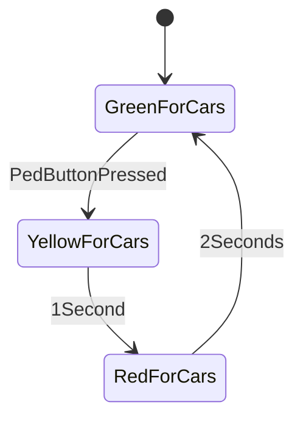
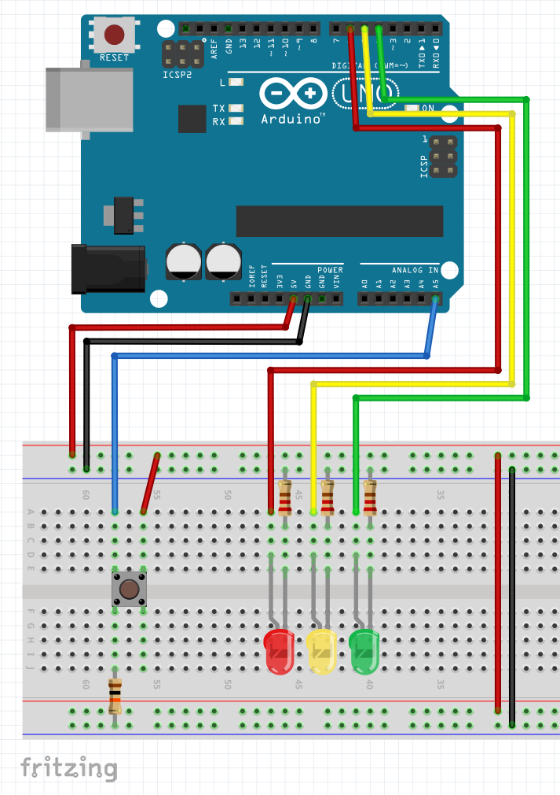
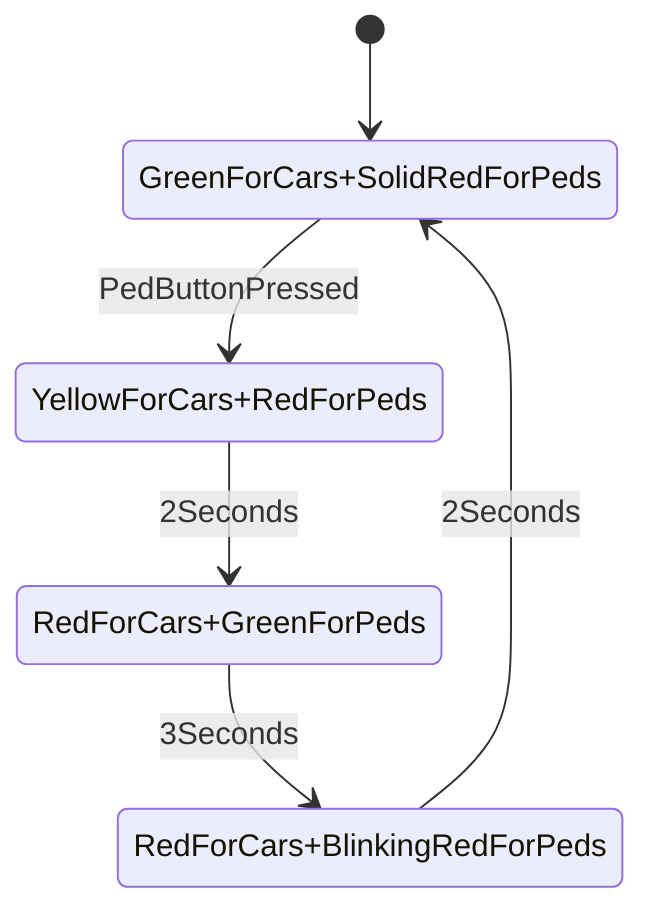
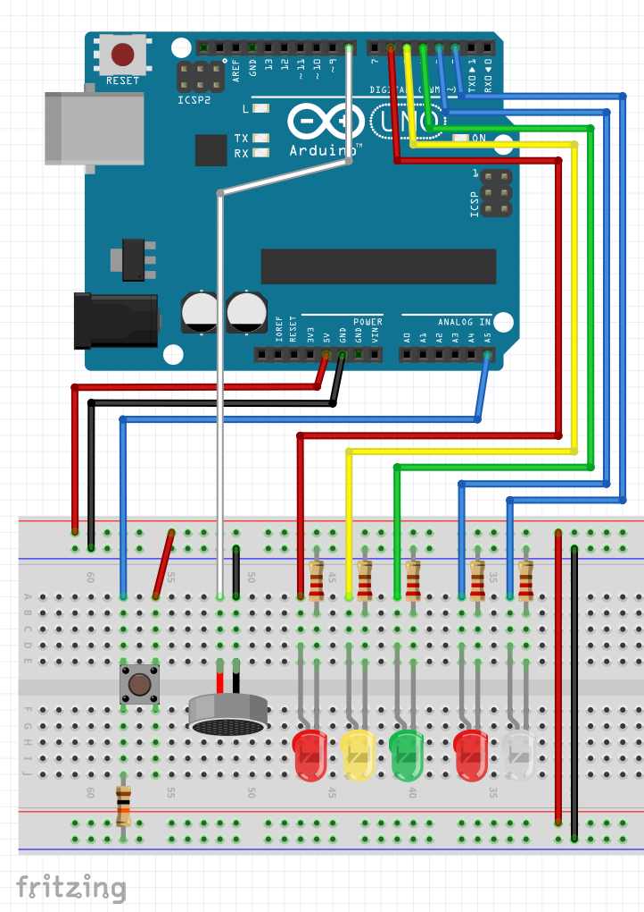

# Simple traffic light

This sample shows the implementation of a traffic light: it has a semaphore for cars with red, yellow and green lights.

The illustration below shows this state machine:



## Version 1 - Breadboard setup

In this setup you'll need 3 LEDs representing the car semaphore. You'll also need a button for pedestrians to push when they wish to cross the street. The illustration below shows the breadboard connections:

 

Code for this version, is very straightforward, since it involves:
1. Turning the Green LED on
1. Wait for the button to be pressed
1. Once this happens, cycle through the other LEDs (yellow and red)
1. Go back to step 1.

```c
//Let's create an "alias" for the pins
#define GREEN   4 
#define YELLOW  5
#define RED     6

void setup() {
  pinMode(GREEN,OUTPUT); 
  pinMode(YELLOW,OUTPUT); 
  pinMode(RED,OUTPUT); 
  pinMode(A5,INPUT); //Button
}

void loop() {
  digitalWrite(GREEN,HIGH);
  if(digitalRead(A5)==HIGH){
    digitalWrite(GREEN,LOW);
    digitalWrite(YELLOW,HIGH);
    delay(1000);
    digitalWrite(YELLOW,LOW);
    digitalWrite(RED,HIGH);
    delay(2000);
    digitalWrite(RED,LOW);
  }  
}
```
## Version 2 - A more advanced Semaphore

In this version, we'll add the pedestrian lights and  a buzzer, making it look closer to the real thing.

Below is the state machine representing it:



## Version 2 - Breadboard setup

In this setup you'll need 5 LEDs representing the car and pedestrian semaphores. You'll also need a button for pedestrians to push when they wish to cross the street. The illustration below shows the breadboard connections:

 

This version of the traffic light is a bit longer than the previous one. It also uses macros to create aliases for the parts and also functions to be called and perform actions instead of having them all under the loop, which makes it harder to read and maintain.

```c
#define CARGREEN   4 
#define CARRED     6
#define CARYELLOW  5
#define PEDGREEN   2
#define PEDRED     3
#define PEDBUTTON  A5
#define BUZZER     8

#define INTERVAL_MESSAGE1 5000
unsigned long time_1 = 0;
bool state1 = 0;

bool ped = false;

void setup() {
  pinMode(CARGREEN,OUTPUT);
  pinMode(CARRED,OUTPUT);
  pinMode(CARYELLOW,OUTPUT);
  pinMode(PEDGREEN,OUTPUT);
  pinMode(PEDRED,OUTPUT);
  pinMode(BUZZER,OUTPUT);
  pinMode(PEDBUTTON,INPUT);
}

void GreenToCars(){
    //turn Red light off and green light on
    digitalWrite(CARRED,LOW);
    digitalWrite(CARGREEN,HIGH);
}

void YellowToCars(){
    //turn green light off and yellow light on. Waits for 2 seconds on that state
    digitalWrite(CARGREEN,LOW);
    digitalWrite(CARYELLOW,HIGH);
    delay(2000);
}

void RedToCars(){
    //turn red light on and yellow light off
    digitalWrite(CARRED,HIGH);
    digitalWrite(CARYELLOW,LOW);
}

void GreenForPed(){
    //turn green light for pedestrians on and the red light off 
    // it also beeps for 3 seconds to let pedestrians know it is safe to cross
    digitalWrite(PEDGREEN,HIGH);
    digitalWrite(PEDRED,LOW);
    for(int i=0;i<6;i++)
    {
      tone(8,400,100);
      delay(400);
    }
}

void RedForPed(){
  //turn red light for pedestrians on and the green light off 
  digitalWrite(PEDGREEN,LOW);
  digitalWrite(PEDRED,HIGH);
}

void BlinkForPed(){
  //turn green light for pedestrians off 
  // and blinks the red light for 2 seconds
  //then waits for additional 1/2 second before opening to cars for safety  
  digitalWrite(PEDGREEN,LOW);    
  for(int i=0;i<6;i++)
  {
    digitalWrite(PEDRED,LOW);
    delay(200);
    digitalWrite(PEDRED,HIGH);
    delay(200);
  }
  delay(500);
}

void loop() {

  //checks for pedestrian button pressed
  if(digitalRead(PEDBUTTON)==HIGH)
  {
    ped = true;
    tone(8,1000,100);
  }

  //if ped button has been pressed, checks to see if the minimum interval for cars has been achieved
  if(ped)
  {  
    if(millis() > time_1 + INTERVAL_MESSAGE1){
      //state machine
      YellowToCars();
      RedToCars();
      GreenForPed();
      BlinkForPed();
      ped = false;
      time_1 = millis();
    }
  }
  //if the button is not pressed, it will be always green for cars and red for peds. 
  else
  {
    RedForPed();
    GreenToCars();
  }
}
  
```

Homework: Code above is far from being perfect!! What would you do to make it better?