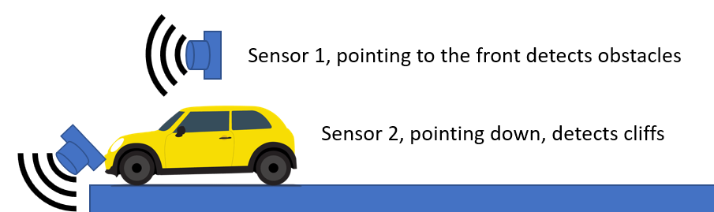

# Simple traffic light

This sample shows the implementation of a traffic light: it has a semaphore for cars with red, yellow and green lights.


The illustration below shows this state machine:

 

## Breadboard setup:

In this setup you'll need 5 LEDS, 3 of them representing the car semaphore and 2 for the pedestrian semaphore. You'll also need a button for pedestrians to push when they wish to cross the street an a buzzer for sound alerts. 

 

## State machine 

In this example, the car uses 2 distance sensors the first one points ahead to detect obstacles and objects. The second one points down to detect edges and stop the vehicle before is fall of edges.

```c
YellowToCars();
RedToCars();
GreenForPed();
BlinkForPed();
```


