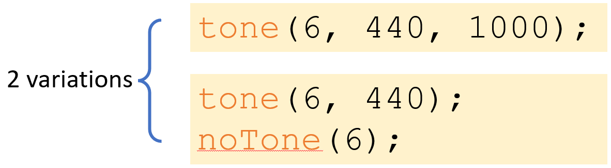
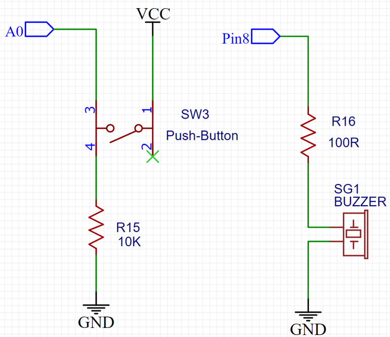
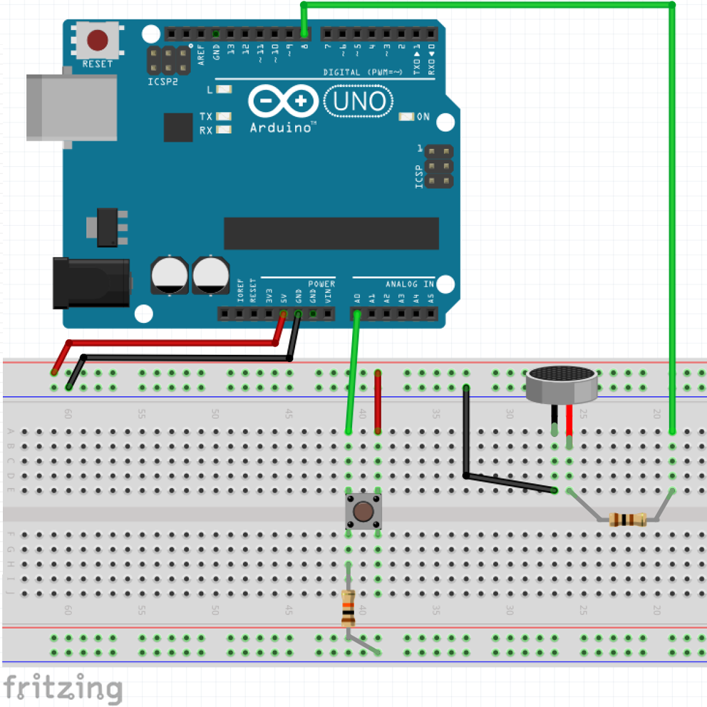

## Play a tune with the Arduino

The **tone** function in Arduino is used to generate a continuous square wave of a specific frequency on a specified pin. This can be used to produce sound by connecting a speaker to the pin.

This function expects 2 parameters:

1. Pin number (any digital pin on the Arduino board),
1. Frequency-in-Hertz (any frequency from about 300hz to 3000hz),
1. [optional parameter] Duration in milliseconds. This can be any duration from about 50ms to several seconds. In this case if you decide not use the time, you need to call the **noTone** function otherwise it will beep continuously.



The circuit we'll create is the following:



**Attention**: the buzzer also has a correct way to be plugged. Note a **+** sign at the top of it, and the positive lead is longer (just like the LED and many other components).

Please, unplug your Arduino from USB and follow the illustration below:



Once the circuit above is completed, click `file/new` and type the following code:

```c
int button =0;
void setup() 
{
	pinMode(A0,INPUT);
}
void loop() 
{
	button = digitalRead(A0);
	if(button==HIGH)
   		{tone(8, 440);}
	else
		{noTone(8);}
}
```

The **setup()** function is called once when the Arduino board is powered on or reset. In this function, the pinMode function is called to set digital pin A0 as an input pin.

The **loop()** function is called repeatedly after the setup() function has completed. In the loop() function, the digitalRead function is called to read the state of digital pin A0. If the state of pin A0 is HIGH, the **tone** function is called to generate a 440 Hz square wave on digital pin 8. If the state of pin A0 is LOW, the noTone function is called to turn off the square wave on digital pin 8.

This code will continuously check the state of pin A0 and turn the tone on or off accordingly. If the state of pin A0 changes, the tone will turn on or off accordingly as well.

**To test at home** 
1. Use the sample at `file/example/02.Digital/toneMelody` 