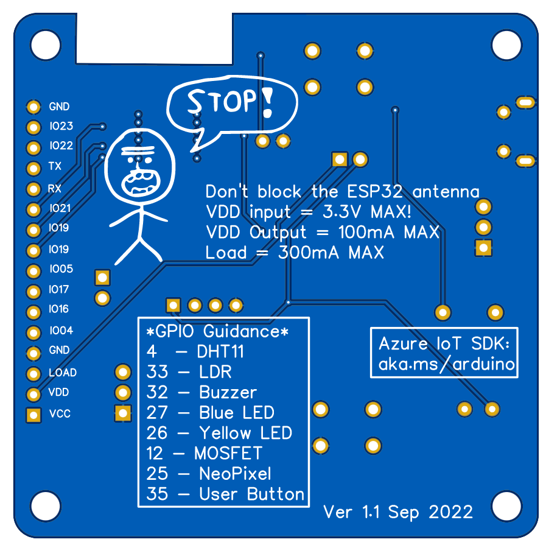

## Designing the PCB

As I mentioned previously, I used EASY EDA for this design, and I followed the rough design from the prototype to make the final board. Illustrations below show the top and the bottom of the PCB. This is teh second version of the PCB design and there are several things I'd like to call out in this design:

1. Note the cut in the board to keep the ESP32 module antenna free. This is not as wide as the hardware reference requires, but it works really well in the tests.
1. Still on the ESP32 module note I added several vias close to the GND pad to help with the module thermal dissipation.
1. Power traces are 0.512 wide while all other are 0.254.

Improvements from version 1:

1. Improved the thermal relief of all connections to GND; in the previous version, these pins had 4 x 0.512 traces to ground, which made soldering them very difficult since the soldering iron heat would dissipate through those pads, so version 2 has now 4x 0.254 traces.

All improvements below were made to the silk layer (both top and bottom):
1. Added a large white label at the lower left corner of the board, so that users and write things there like "Device 1", "Living Room", etc.
1. Added GPIO labels to the bottom of the board (before we only had the labels at the top)
1. Added GPIO guidance to the bottom of the board, so anytime I need to use any of the peripherals I'll know which GPIO pin is meant for that.
1. Added an asterisk to the Neopixel to help aligning the part before soldering
1. Added a couple of warnings regarding power consumption and voltage.
1. Added a link to the Azure IoT libraries which can be used with this board.
1. Added a + sign on the buzzer

Future improvements:

1. Mode headers away from ESP module to have a hat that won't cover the antenna
1. Fix D1 package or remove the part altogether
1. Add a missing decoupling 100nF capacitor close to the Neopixel

**PCB top view**

**PCB bottom view**

