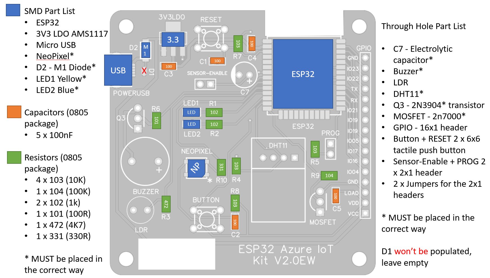

## Assembly Guidance

**BOM - Bill of materials**

The table below has all the parts used in this project. **All SMD parts are 0805**

| Package | **Quantity** | **Name** | **** | Package | **Quantity** | **Name** |
|---|---|---|---|---|---|---|
| SMD | 1 | ESP32 |  | THC | 1 | 10uF Electrolytic Capacitor |
| SMD | 1 | AMS1117 3V3 |  | THC | 1 | 5V Buzzer |
| SMD | 1 | Micro USB connector |  | THC | 1 | LDR |
| SMD | 1 | WS2812 NeoPixel |  | THC | 1 | DHT11 |
| SMD | 1 | Shottky Diode |  | THC | 1 | 2n3904 NPN transistor |
| SMD | 2 | LED |  | THC | 1 | 2n7000 mosfet |
| SMD | 5 | 100nF Capacitor |  | THC | 1 | 16x1 Male Header |
| SMD | 4 | 10K Resistor |  | THC | 2 | 6x6 Tactile Button |
| SMD | 1 | 100K Resistor |  | THC | 1 | 2x1 Male Header |
| SMD | 2 | 1K Resistor |  | THC | 2 | Jumper |
| SMD | 1 | 100R Resistor |  |  | |   |
| SMD | 1 | 4k7 Resistor |  |  |  |   |
| SMD | 1 | 330R Resistor |  |  | |   |

1. Start by applying solder paste to the SMD parts pads. If you're using the solder mask, this should be easier and faster.
1. Place all SMD parts following guidance below.
1. Reflow ("Bake") the board.
1. Check for any bridges in the solder before continuing.
1. Place through hole components and solder them. the order is not important.

