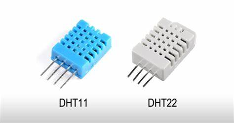

## Parts and tradeoffs

The choices I made when selecting the parts for this device were based on the features above but, above all, it should be simple to understand, simple to assemble, have low cost and readily available libraries (based on the arduino IDE).

### Choosing the ESP32 module

The first step is to define which of the currently available ESP32 modules I would use. [Espressif website](https://www.espressif.com/en/products/modules/esp32) has plenty information to help on the decision. For this design I'll be using the ESP32 module and not SoC (System on a Chip): I'd rather have the complete module with all parts needed to make the SoC work and certifications regarding RF. Also, soldering the SoC is not as easy as soldering the module.

Espressif has the ESP32S and C series but I'm sticking to the very popular ESP32 for now, since I'm not interested in onboard USB for this design.

The [ESP32](https://www.espressif.com/en/products/modules/esp32) has 3 base devices: WROOM, WROVER (which has SPIRAM as well as flash) and Mini (which has less flash memory, but it is integrated with the SoC so it makes a smaller footprint). Even narrowing it down to the ESP32 WROOM, we still face 3 choices: 32E, 32UE and DA.

* **32E** is the traditional module with an integrated PCB antenna we see on Node-MCU types of development kits
* **32UE** has a smaller form factor and has an U.FL antenna connector
* **DA** is the dual-antenna version and it looks like a tiny t-shirt

I got all my ESP32 from [Digi-key](https://www.digikey.com/), but **obviously** there are more choices after the ESP32-WROOM-32E, so I went with the [ESP32-WROOM-32E-N4](https://www.digikey.com/en/products/detail/espressif-systems/ESP32-WROOM-32E-N4/11613125) which has 4MB of Flash (there are 8 and 16MB options as well, but they were out of stock).

With that in mind, and the order created, all I had to do was to save the link for two very important documents:

1. [ESP32 Datasheet](https://www.espressif.com/sites/default/files/documentation/esp32-wroom-32e_esp32-wroom-32ue_datasheet_en.pdf)
2. [ESP32 Hardware Design Guidelines](https://www.espressif.com/sites/default/files/documentation/esp32_hardware_design_guidelines_en.pdf)

We'll get to those files later on this page.

### Choosing the Neopixel

I like neopixels better than RGB LEDs because I can control them using only one digital pin, instead of 3 for the RGB LED. The tradeoff here is the complexity, since driving the RGB LED with 3 PWM pins is very simple, no additional library needed, but I wanted to save my digital pins, and went with the [WS2812B](https://www.digikey.com/en/datasheets/parallaxinc/parallax-inc-28085-ws2812b-rgb-led-datasheet) NeoPixel.

This makes an excellent visual indicator, so I can use it to show different states like "blinking red" not connected to Wi-Fi, "blinking yellow" connected to wi-fi but not to Azure, "solid blue" connected to Azure, "blinking blue" downloading an update, and so forth.

**Additional LEDs** note that I also added 2 regular LEDs because I wanted more visual indicators on board. They're also very useful for the simplest validation test, when you get one of them to blink.

### Choosing the Light Sensor

The choice for light sensor was an [LDR (light dependent resistor)](https://en.wikipedia.org/wiki/Photoresistor), a through hole component which is cheap and simple to solder by hand.

I like the [TEMT7000](https://www.vishay.com/docs/81961/temt7000x01.pdf) series of photo transistors which tend to be much faster in reacting to light transitions, but this SMD part can be a bit tricky to solder by hand. Also, is can cost several timer more than a simple LDR.

The LDR choice also makes it easier to remove the part from the PCB, and have it placed elsewhere far from the device connecting it back to the PCB with wires. I tested and, even with 10 meters long wires, the sensor still works as expected.

### Choosing the Temperature Sensor

The choice in this case was the impossible-to-beat-cheap [DHT11](https://www.circuitbasics.com/wp-content/uploads/2015/11/DHT11-Datasheet.pdf) (the blue one), a through hole component which is simple to solder by hand and which provides not only temperature but also humidity readings. This component is not recommended to scenarios in which precision is key, but for generic tests and sending telemetry to the cloud, this is enough. Should we needed a little more precision but still wanted the through hole aspect, a simple upgrade would be to use the [DHT22](https://www.sparkfun.com/datasheets/Sensors/Temperature/DHT22.pdf).

Both DHT11 and DHT22 sensors use one digital pin on the ESP32 and a timing pattern to communicate back and forth. Several libraries help building solutions but you should not attempt to read temperature and humidity too often, since this will increase the sensor temperature thus affecting significantly its results. Based on my tests, a good ballpark I use is to read the DHT data once per second at most.

Also, there are the **very frequent** bad data readings, in which we read for the sensor and get only garbage. This requires the code to always check for the data coming from the DHT to ensure it is usable before sending it as telemetry (the `isNaN` should do the trick most of the time).

Should we want to use an SMD part, there are several alternatives most of them using an I2C bus like the [BME280](https://www.bosch-sensortec.com/media/boschsensortec/downloads/product_flyer/bst-bme280-fl000.pdf) from Bosch.

Adafruit created [this awesome reference](https://learn.adafruit.com/modern-replacements-for-dht11-dht22-sensors) explaining the advantages of using more modern sensors instead of the DHT11/22.

### Choosing the Power Circuitry

According to the ESP32E datasheet it requires a voltage range of 1.8 V ~ 3.6 VDC to operate. Give this device operates with 5 to 12V we need a voltage regulator, be that an LDO (Low Drop Output), a DC-DC converter, or an equivalent circuit. In this case, for simplicity and cost I chose the [AMS117 3.3V](http://www.advanced-monolithic.com/pdf/ds1117.pdf). While this is an SMD component, the SOT223 package chosen makes it really simple to solder by hand.

the device can also be powered with a micro USB power supply, which can be a computer so I also added a shottky diode to prevent any current to make its way back to the USB port.

The header pin has power inputs of both 5-12VDC which goes to the LDO, but also a 3.3VDC rail that goes straight into the ESP32, so beware that any extra voltages there will damage your ESP32.

### Choosing the Programming Method

An onboard programmer chip (USB to Serial) makes the programming / reprogramming simpler, but it will also be in the dev kit forever, taking up space and - most importantly - consuming battery, which can be really bad depending on the scenario.

This device does not have an USB to Serial chip, requiring one of the following:

1. [CH340G](https://learn.sparkfun.com/tutorials/how-to-install-ch340-drivers/all): cheap and esy to use, it might require installing additional drivers to work properly on your PC.
2. [CP2102](https://www.adafruit.com/product/5335): same, but in this case the correct drivers are installed along with Arduino IDE.
3. [FT232](https://www.adafruit.com/product/2264): another choice of a good quality USB to serial chip.
4. OTA: Regardless of the above methods, the plan is to do it only once. Program the ESP32 with a firmware which will allow it to get updates over the air (OTA) so the an USB to Serial chip won't be missed.

I know this approach might seem a bit radical, but the goad is to discourage manual intervention on the device. We need to plan for remote updates from the start as the main way to keep the device running the latest firmware and security patches. My recommendation is: even if your device is sitting on your bench, avoid - at all costs - touching it for updates so you can practice this remote update mindset.

### Choosing the MOSFET

This device also includes a N-channel Mosfet, the [2N7000](https://www.digikey.com/en/products/detail/onsemi/2N7000BU/976604). This will allow for controlling of DC loads like drive small DC motors and other loads. The TO-92 package is a through hole component very similar to an ordinary transistor and, according to its [datasheet](https://rocelec.widen.net/view/pdf/orqxwkxkq1/ONSM-S-A0003544006-1.pdf?t.download=true&u=5oefqw), it can drive 400mA or pulses of up to 2A.

### Choosing the Buzzer

Lastly, I want the device to have a buzzer to generate those loud beeps in case we need to catch users attention. The choice in this case was a 5V 2KHz buzzer like [this one](https://www.adafruit.com/product/1536). It is loud and allow for some modulation with PWM meaning you can generate some different tones if needed.

This part is another through hole component, but should you prefer, there are alternatives like [this one](https://www.digikey.com/en/products/detail/mallory-sonalert-products-inc/AST0927MW-03TRQ/11568847) an SMD and low profile part.
