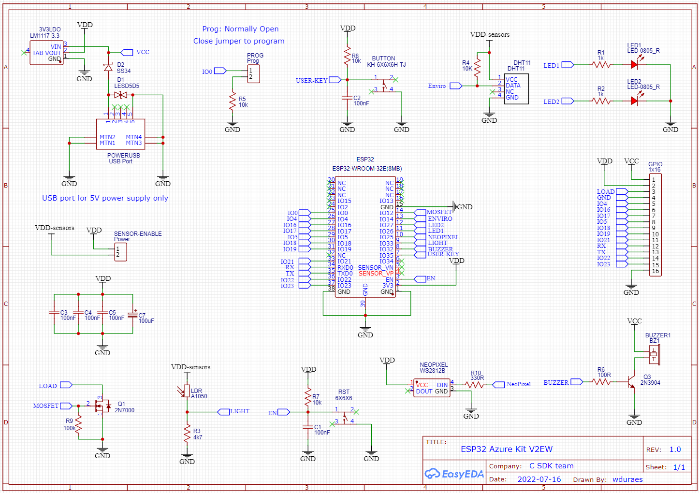

## Getting started with the design

Now that we know the requirements and the choice of sensors and other parts, it is time to read the ESP32 datasheet, hardware design guidelines and ESP32 Azure Kit docs for guidance and ideas.

From the hardware design guidelines, I found these important points:

1. On section 2.1.1 Power Supply there is a recommendation to add a 100nF capacitor close to the power pin
1. On section 2.1.2 analog power supply another recommendation to add a 10uF capacitor to the power trace. It also mentions the need for an LC filter which I chose to ignore.
1. On section 4 under the notes on using modules, it mentions 3 important points:
    1. The module has a single pin as the power supply to be connected to 3.3V
    1. EN pin is used to enable the chip. Set the EN pin high for normal operation. They also recommend adding an RC delay circuit to the module which I added to the final design.
    1. GND, RXD and TXD should be connected to the USB to UART module, but since we don't have one onboard, these pins are exposed through the header pins.
1. Section 3.1.2 mentions the correct placement of the ESP32 module in the PCB which I follow (to an extent).
1. Programming setup: in order to set the module to UART download mode we must:
    1. Pull IO0 (which is pulled up by default) down - achieved in my design with a jumper users need to close to pull it down
    1. Pull IO2 (which is pulled up by default) down - I just left this pin disconnected since is pulled down internally
    1. Download the firmware to Flash memory
    1. Pull IO0 high again, or just leave it floating (I chose the latter)
    1. Reboot the device by hitting the reset button (by pulling the EN pin low via Reset button)

Besides these guidelines, I used the [ESP32 Azure Kit docs](https://www.espressif.com/sites/default/files/documentation/esp32-azure_iot_kit_hardware_design_guide__en.pdf) a lot for inspiration on things like the button debounce, RC delay to the EN pin, and many others. I also choose to ignore things that would be nice to have but too much for a device that should be simple, like controlling power to the sensors via one digital pin connected to a mosfet (I used a simple jumper for that) and mosfet drivers for LEDs (which I'm driving directly from the IO pin, since I added large 1K resistors to them).

## Designing the Device (schematics)

Illustration below was taken directly from EASY EDA, the online tool I used to design this circuit. As you can see, I reused several concepts from the Espressif Azure Iot kit.

## Validating the design (prototype)

//TODO add my prototype
