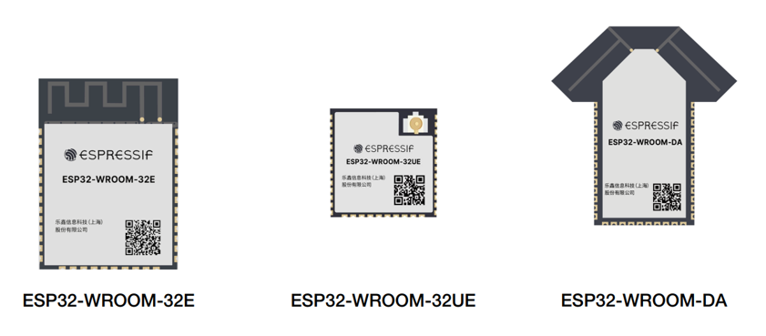
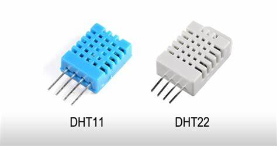
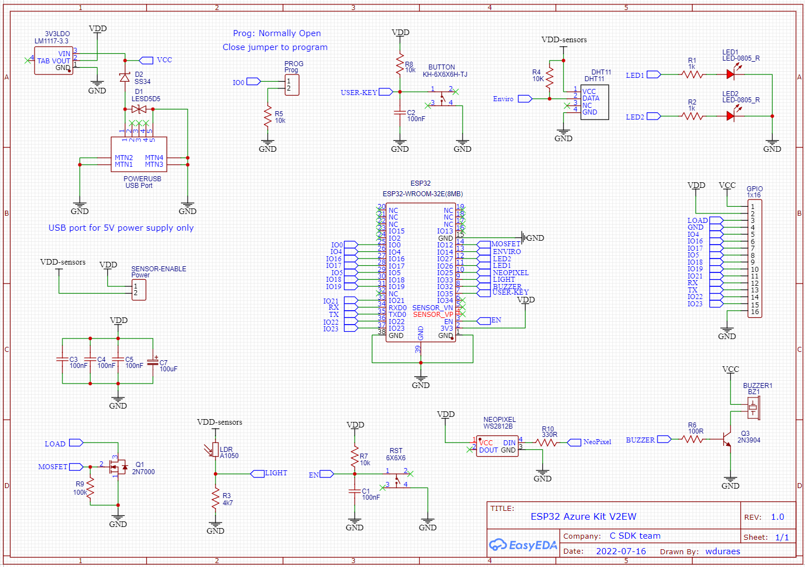
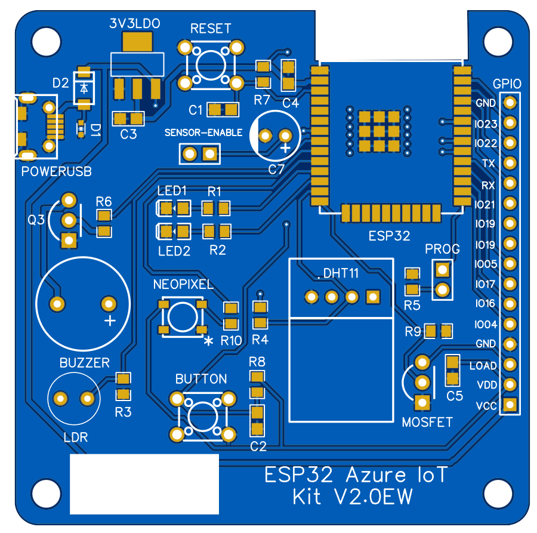
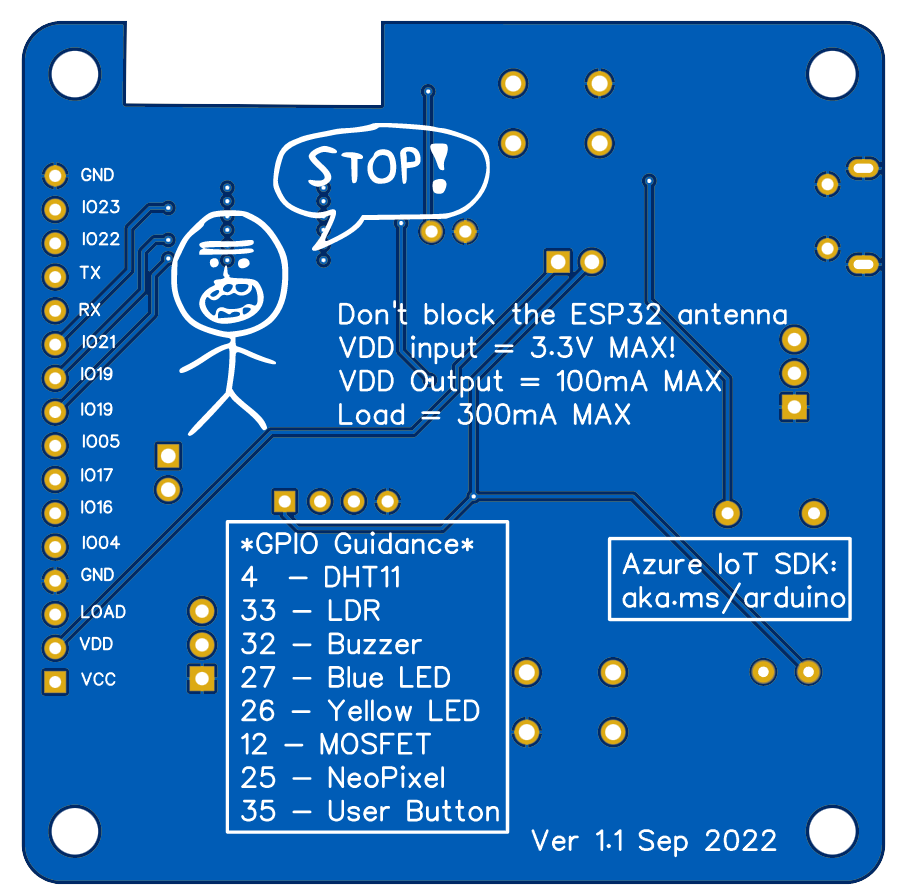
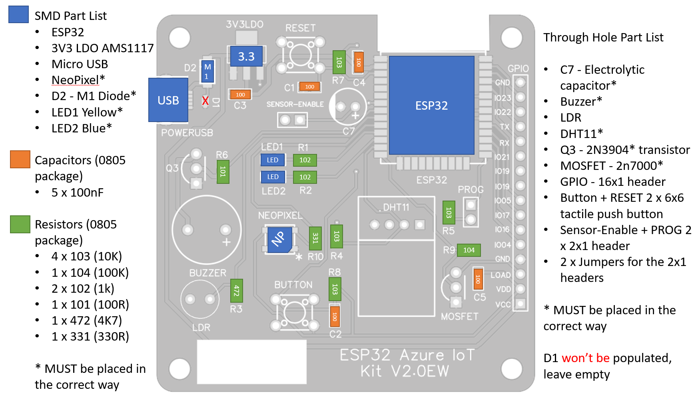
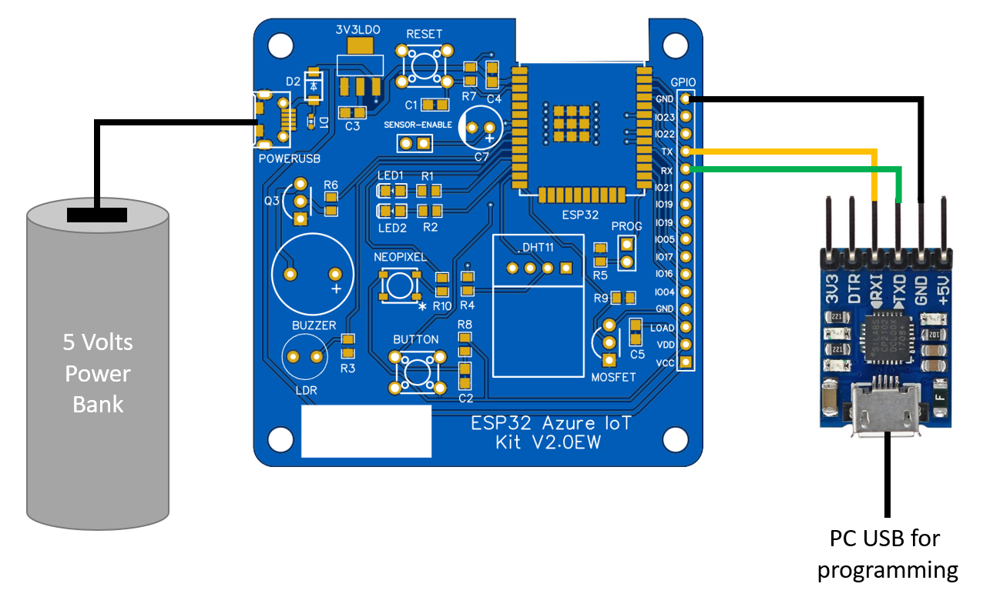

# How to build an IoT device from scratch

## Why build a new IoT Dev Kit?

I'm part of the Azure IoT team responsible for Device SDKs to simplify the connection of IoT devices to the Azure cloud. One of the devices, for which we create and maintain samples, is the very popular ESP32. The ideal development kit to test an IoT device capabilities must have several onboard sensors - so we don't need to send fake telemetry - and some actuators like LEDs, an OLED screen, buzzer and so on. I only use fake telemetry if I have no other choice...  

As it turns out, Espressif used to manufacture the amazing [ESP32 Azure IoT kit](https://www.espressif.com/en/products/devkits/esp32-azure-kit/overview), which had all the above and I was very happy with it. However, the ESP32 module part of that dev kit became obsolete and with it the whole dev kit. With no replacement in sight, I decided to design and build one myself. Also, by having my own dev kit, I could share blank PCBs with the parts so that software engineers on the team and other folks could practice building an IoT device themselves.

## Device Features

This IoT device was made to fulfill several requirements:

1. Based on the latest [ESP32 module](https://www.espressif.com/en/products/modules/esp32) (currently the ESP32-WROOM-32E)
2. Simple to assemble and solder even for people with little experience
3. Minimize use of SMD parts whenever possible, preferring larger SMD packages (no smaller than 0805) to allow manual soldering
4. Have onboard sensors: light, temperature, humidity
5. Have a user button connected to a GPIO pin for later use
6. Have onboard: 2 LEDs, neopixel, buzzer, N-channel MOSFET
7. Power input via micro USB connector, since these power adapters are very easy to find
8. Allow for 5 to 12VDC power to be provided via header pins
9. No onboard programming chip to simplify the design and save power later (requires an external UART programmer)
10. Have a reset button
11. Have a programming jumper, instead of a button, to simplify programming
12. Expose as many GPIO as possible via standard header pins
14. Compact size PCB but shouldn't require fine pitch SMD parts
15. Have round corners (just for aesthetics) and mounting holes in the PCB
17. Have hardware debounce on the user button
18. Have simple to solder parts, which requires adjust on thermal relief pads connected to GND

## Parts and tradeoffs

The choices I made when selecting the parts for this device were based on the features above but, above all, it should be simple to understand, simple to assemble, have low cost and readily available libraries (based on the arduino IDE).

### Choosing the ESP32 module

The first step is to define which of the currently available ESP32 modules I would use. [Espressif website](https://www.espressif.com/en/products/modules/esp32) has plenty information to help on the decision. For this design I'll be using the ESP32 module and not SoC (System on a Chip): I'd rather have the complete module with all parts needed to make the SoC work and certifications regarding RF. Also, soldering the SoC is not as easy as soldering the module.

Espressif has the ESP32S and C series but I'm sticking to the very popular ESP32 for now, since I'm not interested in onboard USB for this design.

The [ESP32](https://www.espressif.com/en/products/modules/esp32) has 3 base devices: WROOM, WROVER (which has SPIRAM as well as flash) and Mini (which has less flash memory, but it is integrated with the SoC so it makes a smaller footprint). Even narrowing it down to the ESP32 WROOM, we still face 3 choices: 32E, 32UE and DA.

* **32E** is the traditional module with an integrated PCB antenna we see on Node-MCU types of development kits
* **32UE** has a smaller form factor and has an U.FL antenna connector
* **DA** is the dual-antenna version and it looks like a tiny t-shirt

I got all my ESP32 from [Digi-key](https://www.digikey.com/), but **obviously** there are more choices after the ESP32-WROOM-32E, so I went with the [ESP32-WROOM-32E-N4](https://www.digikey.com/en/products/detail/espressif-systems/ESP32-WROOM-32E-N4/11613125) which has 4MB of Flash (there are 8 and 16MB options as well, but they were out of stock).

With that in mind, and the order created, all I had to do was to save the link for two very important documents:

1. [ESP32 Datasheet](https://www.espressif.com/sites/default/files/documentation/esp32-wroom-32e_esp32-wroom-32ue_datasheet_en.pdf)
2. [ESP32 Hardware Design Guidelines](https://www.espressif.com/sites/default/files/documentation/esp32_hardware_design_guidelines_en.pdf)

We'll get to those files later on this page.

### Choosing the Neopixel

I like neopixels better than RGB LEDs because I can control them using only one digital pin, instead of 3 for the RGB LED. The tradeoff here is the complexity, since driving the RGB LED with 3 PWM pins is very simple, no additional library needed, but I wanted to save my digital pins, and went with the [WS2812B](https://www.digikey.com/en/datasheets/parallaxinc/parallax-inc-28085-ws2812b-rgb-led-datasheet) NeoPixel.

This makes an excellent visual indicator, so I can use it to show different states like "blinking red" not connected to Wi-Fi, "blinking yellow" connected to wi-fi but not to Azure, "solid blue" connected to Azure, "blinking blue" downloading an update, and so forth.

**Additional LEDs** note that I also added 2 regular LEDs because I wanted more visual indicators on board. They're also very useful for the simplest validation test, when you get one of them to blink.

### Choosing the Light Sensor

The choice for light sensor was an [LDR (light dependent resistor)](https://en.wikipedia.org/wiki/Photoresistor), a through hole component which is cheap and simple to solder by hand.

I like the [TEMT7000](https://www.vishay.com/docs/81961/temt7000x01.pdf) series of photo transistors which tend to be much faster in reacting to light transitions, but this SMD part can be a bit tricky to solder by hand. Also, is can cost several timer more than a simple LDR.

The LDR choice also makes it easier to remove the part from the PCB, and have it placed elsewhere far from the device connecting it back to the PCB with wires. I tested and, even with 10 meters long wires, the sensor still works as expected.

### Choosing the Temperature Sensor

The choice in this case was the impossible-to-beat-cheap [DHT11](https://www.circuitbasics.com/wp-content/uploads/2015/11/DHT11-Datasheet.pdf) (the blue one), a through hole component which is simple to solder by hand and which provides not only temperature but also humidity readings. This component is not recommended to scenarios in which precision is key, but for generic tests and sending telemetry to the cloud, this is enough. Should we needed a little more precision but still wanted the through hole aspect, a simple upgrade would be to use the [DHT22](https://www.sparkfun.com/datasheets/Sensors/Temperature/DHT22.pdf).

Both DHT11 and DHT22 sensors use one digital pin on the ESP32 and a timing pattern to communicate back and forth. Several libraries help building solutions but you should not attempt to read temperature and humidity too often, since this will increase the sensor temperature thus affecting significantly its results. Based on my tests, a good ballpark I use is to read the DHT data once per second at most.

Also, there are the **very frequent** bad data readings, in which we read for the sensor and get only garbage. This requires the code to always check for the data coming from the DHT to ensure it is usable before sending it as telemetry (the `isNaN` should do the trick most of the time).

Should we want to use an SMD part, there are several alternatives most of them using an I2C bus like the [BME280](https://www.bosch-sensortec.com/media/boschsensortec/downloads/product_flyer/bst-bme280-fl000.pdf) from Bosch.

Adafruit created [this awesome reference](https://learn.adafruit.com/modern-replacements-for-dht11-dht22-sensors) explaining the advantages of using more modern sensors instead of the DHT11/22.

### Choosing the Power Circuitry

According to the ESP32E datasheet it requires a voltage range of 1.8 V ~ 3.6 VDC to operate. Give this device operates with 5 to 12V we need a voltage regulator, be that an LDO (Low Drop Output), a DC-DC converter, or an equivalent circuit. In this case, for simplicity and cost I chose the [AMS117 3.3V](http://www.advanced-monolithic.com/pdf/ds1117.pdf). While this is an SMD component, the SOT223 package chosen makes it really simple to solder by hand.

the device can also be powered with a micro USB power supply, which can be a computer so I also added a shottky diode to prevent any current to make its way back to the USB port.

The header pin has power inputs of both 5-12VDC which goes to the LDO, but also a 3.3VDC rail that goes straight into the ESP32, so beware that any extra voltages there will damage your ESP32.

### Choosing the Programming Method

An onboard programmer chip (USB to Serial) makes the programming / reprogramming simpler, but it will also be in the dev kit forever, taking up space and - most importantly - consuming battery, which can be really bad depending on the scenario.

This device does not have an USB to Serial chip, requiring one of the following:

1. [CH340G](https://learn.sparkfun.com/tutorials/how-to-install-ch340-drivers/all): cheap and esy to use, it might require installing additional drivers to work properly on your PC.
2. [CP2102](https://www.adafruit.com/product/5335): same, but in this case the correct drivers are installed along with Arduino IDE.
3. [FT232](https://www.adafruit.com/product/2264): another choice of a good quality USB to serial chip.
4. OTA: Regardless of the above methods, the plan is to do it only once. Program the ESP32 with a firmware which will allow it to get updates over the air (OTA) so the an USB to Serial chip won't be missed.

I know this approach might seem a bit radical, but the goad is to discourage manual intervention on the device. We need to plan for remote updates from the start as the main way to keep the device running the latest firmware and security patches. My recommendation is: even if your device is sitting on your bench, avoid - at all costs - touching it for updates so you can practice this remote update mindset.

### Choosing the MOSFET

This device also includes a N-channel Mosfet, the [2N7000](https://www.digikey.com/en/products/detail/onsemi/2N7000BU/976604). This will allow for controlling of DC loads like drive small DC motors and other loads. The TO-92 package is a through hole component very similar to an ordinary transistor and, according to its [datasheet](https://rocelec.widen.net/view/pdf/orqxwkxkq1/ONSM-S-A0003544006-1.pdf?t.download=true&u=5oefqw), it can drive 400mA or pulses of up to 2A.

### Choosing the Buzzer

Lastly, I want the device to have a buzzer to generate those loud beeps in case we need to catch users attention. The choice in this case was a 5V 2KHz buzzer like [this one](https://www.adafruit.com/product/1536). It is loud and allow for some modulation with PWM meaning you can generate some different tones if needed.

This part is another through hole component, but should you prefer, there are alternatives like [this one](https://www.digikey.com/en/products/detail/mallory-sonalert-products-inc/AST0927MW-03TRQ/11568847) an SMD and low profile part.

## Getting started with the design

Now that we know the requirements and the choice of sensors and other parts, it is time to read the ESP32 datasheet, hardware design guidelines and ESP32 Azure Kit docs for guidance and ideas.

From the hardware design guidelines, I found these important points:

1. On section 2.1.1 Power Supply there is a recommendation to add a 100nF capacitor close to the power pin
1. On section 2.1.2 analog power supply another recommendation to add a 10uF capacitor to the power trace. It also mentions the need for an LC filter which I chose to ignore.
1. On section 4 under the notes on using modules, it mentions 3 important points:
    1. The module has a single pin as the power supply to be connected to 3.3V
    1. EN pin is used to enable the chip. Set the EN pin high for normal operation. They also recommend adding an RC delay circuit to the module which I added to the final design.
    1. GND, RXD and TXD should be connected to the USB to UART module, but since we don't have one onboard, these pins are exposed through the header pins.
1. Section 3.1.2 mentions the correct placement of the ESP32 module in the PCB which I follow (to an extent).
1. Programming setup: in order to set the module to UART download mode we must:
    1. Pull IO0 (which is pulled up by default) down - achieved in my design with a jumper users need to close to pull it down
    1. Pull IO2 (which is pulled up by default) down - I just left this pin disconnected since is pulled down internally
    1. Download the firmware to Flash memory
    1. Pull IO0 high again, or just leave it floating (I chose the latter)
    1. Reboot the device by hitting the reset button (by pulling the EN pin low via Reset button)

Besides these guidelines, I used the [ESP32 Azure Kit docs](https://www.espressif.com/sites/default/files/documentation/esp32-azure_iot_kit_hardware_design_guide__en.pdf) a lot for inspiration on things like the button debounce, RC delay to the EN pin, and many others. I also choose to ignore things that would be nice to have but too much for a device that should be simple, like controlling power to the sensors via one digital pin connected to a mosfet (I used a simple jumper for that) and mosfet drivers for LEDs (which I'm driving directly from the IO pin, since I added large 1K resistors to them).

## Designing the Device (schematics)

Illustration below was taken directly from EASY EDA, the online tool I used to design this circuit. As you can see, I reused several concepts from the Espressif Azure Iot kit.

## Validating the design (prototype)

//todo adicionar o meu protótipo

## Designing the PCB

As I mentioned previously, I used EASY EDA for this design, and I followed the rough design from the prototype to make the final board. Illustrations below show the top and the bottom of the PCB. This is teh second version of the PCB design and there are several things I'd like to call out in this design:

1. Note the cut in the board to keep the ESP32 module antenna free. This is not as wide as the hardware reference requires, but it works really well in the tests.
1. Still on the ESP32 module note I added several vias close to the GND pad to help with the module thermal dissipation.
1. Power traces are 0.512 wide while all other are 0.254.

Improvements from version 1:

1. Improved the thermal relief of all connections to GND; in the previous version, these pins had 4 x 0.512 traces to ground, which made soldering them very difficult since the soldering iron heat would dissipate through those pads, so version 2 has now 4x 0.254 traces.

All improvements below were made to the silk layer (both top and bottom):
1. Added a large white label at the lower left corner of the board, so that users and write things there like "Device 1", "Living Room", etc.
1. Added GPIO labels to the bottom of the board (before we only had the labels at the top)
1. Added GPIO guidance to the bottom of the board, so anytime I need to use any of the peripherals I'll know which GPIO pin is meant for that.
1. Added an asterisk to the Neopixel to help aligning the part before soldering
1. Added a couple of warnings regarding power consumption and voltage.
1. Added a link to the Azure IoT libraries which can be used with this board.
1. Added a + sign on the buzzer

Future improvements:

1. Mode headers away from ESP module to have a hat that won't cover the antenna
1. Fix D1 package or remove the part altogether
1. Add a missing decoupling 100nF capacitor close to the Neopixel

**PCB top view**

**PCB bottom view**

**BOM - Bill of materials**

The table below has all the parts used in this project. **All SMD parts are 0805**

| Package | **Quantity** | **Name** | **** | Package | **Quantity** | **Name** |
|---|---|---|---|---|---|---|
| SMD | 1 | ESP32 |  | THC | 1 | 10uF Electrolytic Capacitor |
| SMD | 1 | AMS1117 3V3 |  | THC | 1 | 5V Buzzer |
| SMD | 1 | Micro USB connector |  | THC | 1 | LDR |
| SMD | 1 | WS2812 NeoPixel |  | THC | 1 | DHT11 |
| SMD | 1 | Shottky Diode |  | THC | 1 | 2n3904 NPN transistor |
| SMD | 2 | LED |  | THC | 1 | 2n7000 mosfet |
| SMD | 5 | 100nF Capacitor |  | THC | 1 | 16x1 Male Header |
| SMD | 4 | 10K Resistor |  | THC | 2 | 6x6 Tactile Button |
| SMD | 1 | 100K Resistor |  | THC | 1 | 2x1 Male Header |
| SMD | 2 | 1K Resistor |  | THC | 2 | Jumper |
| SMD | 1 | 100R Resistor |  |  | |   |
| SMD | 1 | 4k7 Resistor |  |  |  |   |
| SMD | 1 | 330R Resistor |  |  | |   |

**Assembly Guidance**

1. Start by applying solder paste to the SMD parts pads. If you're using the solder mask, this should be easier and faster.
1. Place all SMD parts following guidance below.
1. Reflow ("Bake") the board.
1. Check for any bridges in the solder before continuing.
1. Place through hole components and solder them. the order is not important.

## Testing the final product

Once the final device has been assembled, I recommend performing a quick visual inspection has been performed for any obvious solder bridges and other issues, and checking for short circuits between VCC/VDD and GND. If you don't find any issues, it is time to power the device.

To power this device you have several options:
1. Use an external 5V power supply or one of those celullar chargers with a micro USB connector
1. Connect a 5 to 12VDC power supply to the pins VCC and GND
1. Connect **exactly** 3.3VDC to the VDD and GND pins

Most programmers can't power the device so there is a need for this external power to get the ESP32 working properly.

With the external power plugged in, it is time to setup the programmer via the header pins. Regardless of your choice of programmer, you'll connect both of them like the table below describes:

| ESP32 Device | Programmer |
|--|--|
| GND | GND |
| TX | RX |
| RX | TX |

There's no need to connect any other pins from the programmer into the ESP32.

Normally, at this point I would do a very simple test with the Blink sketch, replacing the LED_BUILTIN by the LEDs on pin 26 or 27 (there is a nice cheat sheet with all pins in the back of the board, so it is easy to refer to any of the onboard components).

Close the PROG header pins with the jumper, and push the RESET button once to get the device into programming mode. Upload your code normally and once this is finished, remove the PROG jumper and hit RESET once again.

This should be enough to get your device working properly.

In my experience I had some failures in programming due to bad / misbehaving programmers, so it was a simple matter of testing with another programmer for things to work. Don't trust blindly the first programmer you test.

## Adding IoT to the IoT device (finally!!)

Adding Iot capabilities to this device now is only a matter of getting the proper firmware installed, given the native Wi-Fi capabilities of the ESP32.

To test this board with Azure IoT, there are several possibilities:

1. How to connect the ESP32 to IoT Hub using Arduino IDE - [link](https://github.com/Azure/azure-sdk-for-c-arduino/tree/main/examples/Azure_IoT_Hub_ESP32)
1. How to connect the ESP32 to IoT Hub and Azure Device Update (OTA) using Arduino IDE - [link](https://github.com/Azure/azure-sdk-for-c-arduino/tree/main/examples/Azure_IoT_Adu_ESP32)
1. How to connect the ESP32 to IoT Hub using FreeRTOS [link](https://github.com/Azure-Samples/iot-middleware-freertos-samples/blob/main/demos/projects/ESPRESSIF/esp32)
1. How to connect the ESP32 to IoT Hub and Azure Device Update (OTA) using FreeRTOS -[link](https://github.com/Azure-Samples/iot-middleware-freertos-samples/blob/main/demos/projects/ESPRESSIF/adu/README.md)

## Closing thoughts

If you read all of the above, I'm sure you might have found several instances in which you would do things differently, and even some errors and omissions from my part. If you would be so kind as to let me know, I'll be glad to consider them for the next revision. So far this board has been working really well for all scenarios I tried so far and 8 of the devices (I made 10 total in the first batch) are running continuously as some sort of Long Haul testing. So far so good!