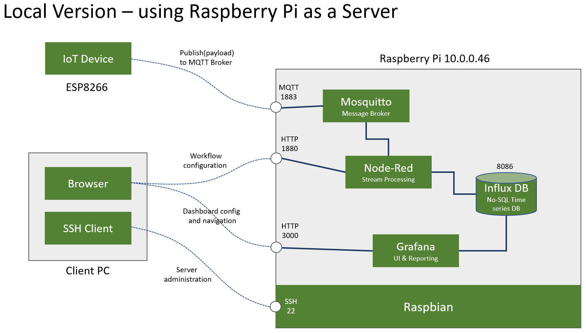
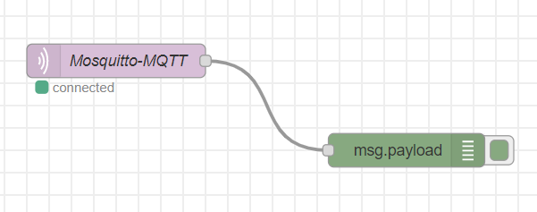
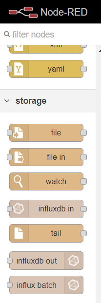

# IoT End to End 

This page was created to support the [IoT open-talk](https://www.meetup.com/SnoCo-Makers/events/271549049/) at Snoco Makerspace (not a workshop, more like a casual demo + chat) focused on people interested in learning a little more about IoT.

Our end goal with this event is to create an End-to-end Iot solution that involves an IoT device sending telemetry data to a Raspberry Pi acting as a Server. 

This content was based on the amazing work of the guy with th Swiss accent, Andreas Spiess in [this](https://www.youtube.com/watch?v=JdV4x925au0) video on [his YouTube channel](https://www.youtube.com/channel/UCu7_D0o48KbfhpEohoP7YSQ).



The picture above shows:

1. **ESP8266 Device** sending temperature and humidity payload to a MQTT broker, Mosquitto in this case, installed in the Raspberry Pi.
2. **Node-red** will then subscribe to the same topic and take the payload through formatting before inserting data into a no-SQL time series database based on the **Influx DB**
3. **Grafana** is the dashboard solution to visualize all data sent by the ESP8266.

## Part 1 Server Side - Data Ingestion

In this step we'll setup the Raspberry Pi to behave like an IoT server:

1. Connect to your Raspberry Pi via SSH
2. Update and Upgrade your Raspberry Pi

```bash
sudo apt-get update
sudo apt-get upgrade -y
```
3. Install [Mosquitto](https://mosquitto.org/) - the MQTT broker

```bash
sudo apt-get install mosquitto -y
```

Test your installation 


```bash
mosquitto
```

If everything went well, you should get an error message that says "Address is already in use", which means you can't start Mosquitto because it is **already** running (which is good!).

4. Install [Node Red](https://nodered.org/)
    - Node red requires both Node JS and NPM to be installed as a pre-requisites


```bash
sudo apt-get install nodejs -y
sudo apt-get install npm -y
bash <(curl -sL https://raw.githubusercontent.com/node-red/linux-installers/master/deb/update-nodejs-and-nodered)

```
Running Node Red as a Service (so it will start automatically after every reboot):

```bash
sudo systemctl enable nodered.service
node-red-start
```

5. Verify if both Mosquitto and Node-red are now running as services:
    -  Both must be active as services

```bash
sudo systemctl status nodered
sudo systemctl status mosquitto
```

6. Your Raspberry Pi is now ready to receive MQTT messages from the Device.

<br><br>

## Part 2 Device Side - ESP8266 Setup

**Important**: this setup steps won't cover steps we already took in the IoT 101 workshop. We'll only cover the delta. 

1. Setup your ESP8266: this workshop leverages a simple ESP8266 Dev Kit like the Node MCU and we'll add a DHT11 (or DHT22) temperature and humidity sensor to the GPIO pin 10 and also a LED to the GPIO pin 16. 

Use the image below to guide your steps:


2. Install the AsyncMqttClient library: the zip file for this library is in the Resources folder in this repo. 
    - Copy it to your computer.
    - Open Arduino IDE, select menu Sketch / Include Library / Add .zip Library
    - Select the .zip file you just downloaded and click open

3. Open the weather_station.ino file:
    - Update your WiFi credentials SSID and Password
    - Update your Raspberry Pi IP Address
    - AIO Username and Key can be blank, because Mosquitto is setup to  allow anonymous access

```C
#define WLAN_SSID "your_wifi_name"
#define WLAN_PASS "your_wifi_password"
#define AIO_SERVER "your_Raspberry_pi_IP"
#define AIO_USERNAME ""
#define AIO_KEY ""
#define AIO_SERVERPORT  1883
```

4. Upload the code to the ESP8266 and monitor the serial port to see if there is any error message.

5. Leave the device on for the duration of the workshop so you'll get plenty data in the Database.

<br><br>

## Part 3 Validate Data Flow: Device --> Server

1. In order to validate if Mosquitto is receiving the messages sent by the device we can do many things:

    - Open your browser and go to Node-Red: [IP address of your Raspberry PI]:1880, in my case 10.0.0.46:1880
    - Since node-red is configured for anonymous access, you should get an initial blank flow. 
    - Copy the JSON file below (make sure to copy the whole line, it is a long one). TIP: If you're on Windows, a triple click will select the whole line!
    - Go to the top right menu, click import and paste the JSON data into the window.
    - Select import to current flow and hit Import. 

```json
[{"id":"9827e37.2cc092","type":"tab","label":"Test Mosquitto and Device","disabled":false,"info":""},{"id":"60606fbf.e3564","type":"mqtt in","z":"9827e37.2cc092","name":"Mosquitto-MQTT","topic":"WEATHER","qos":"0","datatype":"auto","broker":"386009ad.06dbd6","x":180,"y":140,"wires":[["d33adc0a.5f606"]]},{"id":"d33adc0a.5f606","type":"debug","z":"9827e37.2cc092","name":"","active":true,"tosidebar":true,"console":false,"tostatus":false,"complete":"false","statusVal":"","statusType":"auto","x":440,"y":220,"wires":[]},{"id":"386009ad.06dbd6","type":"mqtt-broker","z":"","name":"Mosquitto-Local","broker":"10.0.0.46","port":"1883","clientid":"","usetls":false,"compatmode":false,"keepalive":"60","cleansession":true,"birthTopic":"","birthQos":"0","birthPayload":"","closeTopic":"","closeQos":"0","closePayload":"","willTopic":"","willQos":"0","willPayload":""}]
```

2. If everything went well, you should have now this flow in you Node-red:



3. This flow won't work now because it has the wrong IP address.

    - Double click the Mosquito node, and click the pencil by the server name. 
    - Update the server IP address and hit update, and done.
    - Hit Deploy.
    - If all is good, you should have the Mosquitto node to have the green icon and the message "connected:  just like the image above. 
    - Go to the debug messages window and watch for incoming messages. 

4. If you can see messages like the one below coming every 10 seconds, congratulations! Your Device to cloud - D2C telemetry messages setup is complete. 

```html
7/3/2020, 4:23:27 PMnode: d33adc0a.5f606
WEATHER : msg.payload : string[37]
"ID=6363483;LOC=1;TEMP=22.90;HUM=58.00"
```

<br><br>

## Part 4 Server Side - Database

1. Given the nature of the telemetry data we're sending to the MQTT Broker, the best way to store it is by leveraging a time series database. It provides the best approach to answer questions like:
    - What was the average temperature yesterday?
    - What was the maximum temperature over the past week?
    - What was the driest day over the past 2 months?

2. Install InfluxDB

```bash
sudo apt-get install influxdb -y 
sudo apt-get install influxdb-client -y
echo $INFLUXDB_CONFIG_PATH /etc/influxdb/influxdb.conf
sudo service influxdb start
```

3. Create a database using the InfluxDb interface (InfluxDB does NOT have a GUI, only command line interface)

```SQL
influx
CREATE DATABASE WEATHER 
SHOW DATABASES
EXIT
```     

4. Install an InfluxDB database module on Node-red
    - Open Node-Red, top-right menu, manage palette.
    - Click in the Install tab, and search for influxdb
    - Select "node-red-contrib-influxdb" and hit install
    - This will add new nodes to your left panel as shown below:



5. Import the template flow 
    - Copy the JSON file below (make sure to copy the whole line, it is a long one). TIP: If you're on Windows, a triple click will select the whole line!
    - Go to the top right menu, click import and paste the JSON data into the window.
    - Select import to a new flow and hit Import. 

```json
[{"id":"ad0979e9.e66148","type":"tab","label":"Weather Station Flow","disabled":false,"info":""},{"id":"83f67631.5a0de8","type":"mqtt in","z":"ad0979e9.e66148","name":"Mosquitto-MQTT","topic":"WEATHER","qos":"0","datatype":"auto","broker":"386009ad.06dbd6","x":160,"y":100,"wires":[["1adf46b8.b43c59"]]},{"id":"1adf46b8.b43c59","type":"function","z":"ad0979e9.e66148","name":"Parse message","func":"var msg433 = {};\nmsg.payload = msg.payload.replace(/(\\r\\n|\\n|\\r)/gm,\"\");\nvar parts433 = msg.payload.split(\";\");\n\nfor (var i=0; i<parts433.length; i++) {\n    var keyvalue = parts433[i].split(\"=\");\n    if (keyvalue.length===2) {\n        msg433[keyvalue[0]] = keyvalue[1];\n    }\n}\n\nmsg.msg433 = msg433;\nmsg.topic=\"weather\";\n\nreturn msg;","outputs":1,"noerr":0,"initialize":"","finalize":"","x":480,"y":140,"wires":[["abd71e66.50edc"]]},{"id":"abd71e66.50edc","type":"function","z":"ad0979e9.e66148","name":"TEMP conversion C to F","func":"if (msg.msg433.TEMP==undefined) \n{\n    msg.msg433.TEMP=-999.0;\n}\nelse\n{\n    msg.msg433.TEMP = msg.msg433.TEMP * 1.8 + 32\n}\nnode.status({fill:\"blue\",shape:\"ring\",text: msg.msg433.TEMP });\nreturn msg;","outputs":1,"noerr":0,"initialize":"","finalize":"","x":470,"y":240,"wires":[["22c1d328.70e4dc"]]},{"id":"22c1d328.70e4dc","type":"function","z":"ad0979e9.e66148","name":"HUM conv to rm decimals","func":"if (msg.msg433.HUM!==undefined) {\n    msg.msg433.HUM = parseInt(msg.msg433.HUM, 10);\n}\nelse msg.msg433.HUM=-999.0;\nnode.status({fill:\"blue\",shape:\"ring\",text: msg.msg433.HUM });\nreturn msg;\n","outputs":1,"noerr":0,"initialize":"","finalize":"","x":470,"y":340,"wires":[["fd0472e8.28f1e"]]},{"id":"fd0472e8.28f1e","type":"function","z":"ad0979e9.e66148","name":"ID conversion","func":"if (msg.msg433.ID==undefined) \n{\n    msg.msg433.ID=-999.0;\n}\nnode.status({fill:\"blue\",shape:\"ring\",text: msg.msg433.ID });\nreturn msg;\n","outputs":1,"noerr":0,"initialize":"","finalize":"","x":480,"y":440,"wires":[["8332ecba.6b126"]]},{"id":"8332ecba.6b126","type":"function","z":"ad0979e9.e66148","name":"LOC conversion","func":"if (msg.msg433.LOC==undefined) \n{\n    msg.msg433.LOC=-999.0;\n}\nelse\n{\n    switch(parseInt(msg.msg433.LOC))\n    {\n        case 1:\n            msg.msg433.LOC = \"Indoor\";\n            break;\n        case 2:\n            msg.msg433.LOC = \"Outdoor\";\n            break;\n        case 3:\n            msg.msg433.LOC = \"Garage\";\n            break;  \n        default:\n            msg.msg433.LOC = \"Unknown\";\n    }\n}\nnode.status({fill:\"blue\",shape:\"ring\",text: msg.msg433.LOC });\nreturn msg;","outputs":1,"noerr":0,"initialize":"","finalize":"","x":480,"y":540,"wires":[["108cfc32.c3c9e4"]]},{"id":"108cfc32.c3c9e4","type":"function","z":"ad0979e9.e66148","name":"Weather Station","func":"msg.payload = \n[\n    {\n        TEMP: msg.msg433.TEMP,\n        HUM: msg.msg433.HUM\n    },\n    {\n        ID: msg.msg433.ID,\n        LOC: msg.msg433.LOC\n    }\n];\nreturn msg;","outputs":1,"noerr":0,"initialize":"","finalize":"","x":480,"y":660,"wires":[["6e60e879.f645f8","8c312695.797178"]]},{"id":"d63f689b.f98de8","type":"inject","z":"ad0979e9.e66148","name":"Insert test payload","props":[{"p":"payload"},{"p":"topic","vt":"str"}],"repeat":"","crontab":"","once":false,"onceDelay":0.1,"topic":"WEATHER","payload":"ID=6363483;LOC=2;TEMP=22.80;HUM=57.00","payloadType":"str","x":170,"y":200,"wires":[["1adf46b8.b43c59"]]},{"id":"8c312695.797178","type":"debug","z":"ad0979e9.e66148","name":"Debug Message","active":false,"tosidebar":true,"console":false,"tostatus":false,"complete":"true","targetType":"full","statusVal":"","statusType":"auto","x":720,"y":700,"wires":[]},{"id":"6e60e879.f645f8","type":"influxdb out","z":"ad0979e9.e66148","influxdb":"e9dd8ef1.13677","name":"Influx Database","measurement":"stations","precision":"s","retentionPolicy":"","x":720,"y":600,"wires":[]},{"id":"386009ad.06dbd6","type":"mqtt-broker","z":"","name":"Mosquitto-Local","broker":"10.0.0.46","port":"1883","clientid":"","usetls":false,"compatmode":false,"keepalive":"60","cleansession":true,"birthTopic":"","birthQos":"0","birthPayload":"","closeTopic":"","closeQos":"0","closePayload":"","willTopic":"","willQos":"0","willPayload":""},{"id":"e9dd8ef1.13677","type":"influxdb","z":"","hostname":"127.0.0.1","port":"8086","protocol":"http","database":"WEATHER","name":"","usetls":false,"tls":""}]
```
6. This flow support the following steps:

    - Connect to MQTT Broker and subscribe to Weather topic
    - At every new message arriving in the MQTT Broker:
    - Call Parse message, which is a JS function that will split the payload into an object for manipulation
    - The next function will check for null and add a default value if that's the case, convert the temperature from Celsius to Fahrenheit, and show the result under the node
    - The next function will check for null and add a default value if that's the case, remove the decimal part of the humidity value, and show the result under the node
    - The next function will check for null and add a default value if that's the case, and show the result under the node
    - The next function will check for null and add a default value if that's the case, convert the ID sent by the device into an easier to understand name, also making it easier to update the name - if needed - in the future, and show the result under the node
    - The next function will take all value converted from the previous steps and create the JSON payload expected by the database, also separating the elements part of the key from the value elements.
    - The last step is the Database connection, which will be the destination of the payload after all conversion and normalization.

7. Just like before, this flow won't work now because it has the wrong IP address.

    - Double click the Mosquito node, and click the pencil by the server name. 
    - Update the server IP address and hit update, and done.
    - Double click the Influx Database node, and update the server IP and in the measurement field, type "stations" and hit done.
    - Hit Deploy.

8. Test if messages are being correctly inserted in the Database.
    - Open Influx Database CLI again

```sql
influx
USE WEATHER 
SELECT * FROM stations
select top(HUM,3) as Max_Humidity from stations
EXIT
``` 
9. We could query InfluxDB in hundreds of different ways to learn what we need form data. But this is not the focus of this workshop, so we'll stop here.


<br><br>

## Part 5 Server Side - Data Visualization - Dashboard

1. The last step in this setup is to add a nice way to display and explore the telemetry data sent by the devices
2. Install Grafana

```bash
sudo apt-get install -y adduser libfontconfig1
wget https://dl.grafana.com/oss/release/grafana-rpi_7.0.5_armhf.deb
sudo dpkg -i grafana-rpi_7.0.5_armhf.deb
### Please execute the following statements to configure grafana to start automatically using systemd
sudo /bin/systemctl daemon-reload
sudo /bin/systemctl enable grafana-server
### You can start grafana-server by executing
sudo /bin/systemctl start grafana-server
```

3. Test your Grafana installation (be patient, the first execution can take some time)
    - Open your browser and go to GRAFANA: [IP address of your Raspberry PI]:3000, in my case 10.0.0.46:3000
    - Use admin as username and password. Grafana will ask you to update the password in this first use. 

4. Add a datasource
    - On the home page, click on "Add your first datasource"
    - Select InfluxDB
    - Update the URL under HTTP to your Raspberry Pi IP, like http://10.0.0.15:8086
    - Under database, type WEATHER
    - At the bottom of the page, hit Save & Test (you should get a green signal that everything worked)

5. Add a Dashboard
    - Go back to the Welcome page by clicking on the Grafana logo (top left)
    - Click on "create your first dashboard"
    - You'll get an empty dashboard
    - Click in the dashboar settings icon (it looks like a gear at the top right menu)
    - Click on Add a new panel
    - On "select measurements" select stations
    - On "value" select HUM
    - Hit Save and save again.