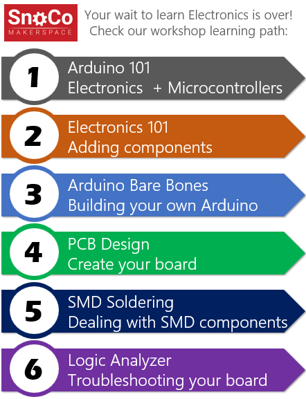

# WD Workshops Repo

Hello, here you'll find all my workshop collateral. As a volunteer workshop host I get to create some content that might be useful not only to people attending these workshops but rather the larger community. While most of this content was not created to support self learning, feel free to reuse whatever is useful for you.

### Snoco Makers Space

Previously I taught most of this classes at the Snoco Maker Space in Everett-WA. I was proudly part of that amazing group of people for almost 5 years, and I couldn't recommend it more: friendly people and packed with tools. What more could we want??

Check their workshops at: [https://www.meetup.com/SnoCo-Makers/events/](https://www.meetup.com/SnoCo-Makers/events/)

### Microsoft Garage

I also led several workshops at the Garage in building 27, Redmond-WA. Amazing space available to all Microsoft FTE.

Here you'll find the [Arduino Barebones](Arduino%20Barebones/readme.md) which is a great class to learn how to build an Arduino from scratch and then use it to build a product. 

### Poway Adult School class

I did some volunteering with the [Poway Adult School](https://www.powayusd.com/en-US/Departments/CareerTechnicalAdultEd/PAS/Home) in Sand Diego-CA for a year. Classes were open to everyone living in the region and while I'm not teaching there anymore, they're still active with several other accessible trainings for the general population.

## List of Workshops I host

- Arduino 101
- Arduino 102
- Arduino Baremetal (Barebones)
- Electronics 101
- IoT 101
- IoT 102 - MQTT
- IoT 103 - end to end
- PCB 101
- SMD Soldering
- Logic Analyzer
- VS Code + Git for Makers

## Which workshop should I attend first?

You may attend workshops in any order, however, to maximize your learning experience some workshops should be taken in a specific order and others have pre-requisites. It all depends on your previous knowledge and interest for some specific topic.

One suggestion would be to take the workshops in the following sequence:

 

## Arduino 101

This is where everything starts! In the first workshop you’ll learn how to connect an Arduino board to your PC, basics of C++ to program it and control electronic components using code (a.k.a. blinking an LED).

Impossible not to fall in love.

## Electronics 101

Learn basic usage of a multimeter to measure power and components, a breadboard, the process to add new modules and components to the Arduino and expand the complexity of your projects.

## Arduino Baremetal

How about creating your own project, without having to use an Arduino board? In this workshop you’ll learn how to take an ATMega328P (brain of the Arduino Uno) and get it to work in a breadboard.

## PCB Design

Got your project up and running in a breadboard? This workshop is all about making it look professional and get a PCB (printed circuit board) done. Includes the schematics, the PCB design and good practices.

## SMD Soldering

Once you decide to move away from the breadboard, and design your own PCB, it is very likely you’ll use SMD components. In this workshop you’ll learn how to solder SMD parts using the oven, a soldering iron and a SMD rework station. You'll also learn how to replace SMD components in a board

## Logic analyzer

Testing and troubleshooting more advanced circuits is hard. Buying an Oscilloscope might be an overkill, so come and learn how a Logic Analyzer can help you to understand, study and fix your projects!

## Visual Studio Code + Arduino

This is a workshop where you'll learn how to use the free VS Code to work with Arduino boards, replacing Arduino IDE. By adding free extensions on top of VS Code, writing C++ code was never that easy.

## IoT 101

You heard of it, but what is IoT anyway and how can you, as a maker, benefit from it? In this workshop we cover the basics of IoT, then we take an inexpensive ESP8266 set it up on Arduino IDE, setup an online service for MQTT and get the device to send telemetry data and get commands from the cloud.

## IoT 201

Create and end to end solution based on Mosquitto (MQTT Broker), Node-Red (Workflow automation), InfluxDB (No SQL time series DB) and Grafana (UI and data visualization). All of them configured and installed in a Raspberry Pi computer!
